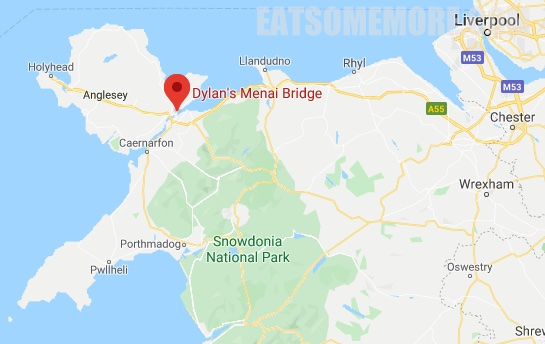

>安格尔西岛上的Dylan‘s分店，正对着梅奈海峡的港口景观。

>前菜蘑菇浓汤，在凉凉的天气喝，暖身一流。

>油封带子，食材新鲜，火候正好，黄油香、海鲜甜、口感嫩滑，除了好吃还是好吃。海鲜意面的评价参见 Criccieth Dylan's，但是有一说一这家分店的面条好像没有那么的入味。

网站：https://www.dylansrestaurant.co.uk/locations/menai-bridge

地址：St. George's Road, Menai Bridge, Anglesey, LL59 5EY

