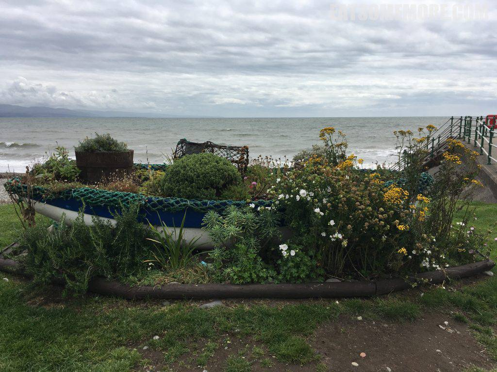
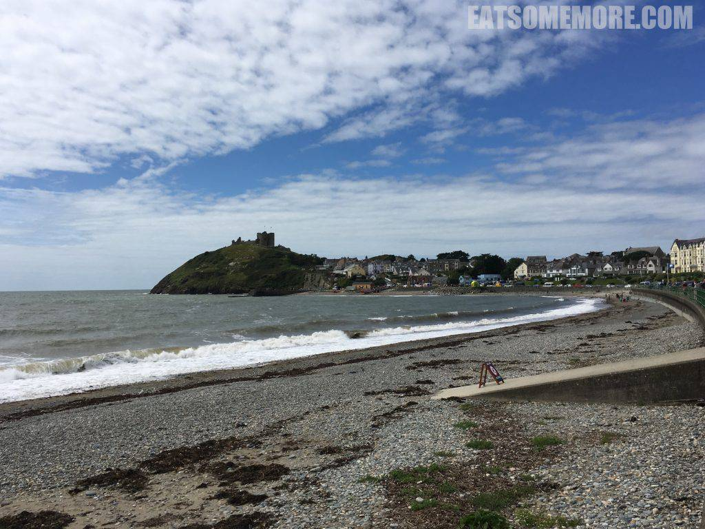
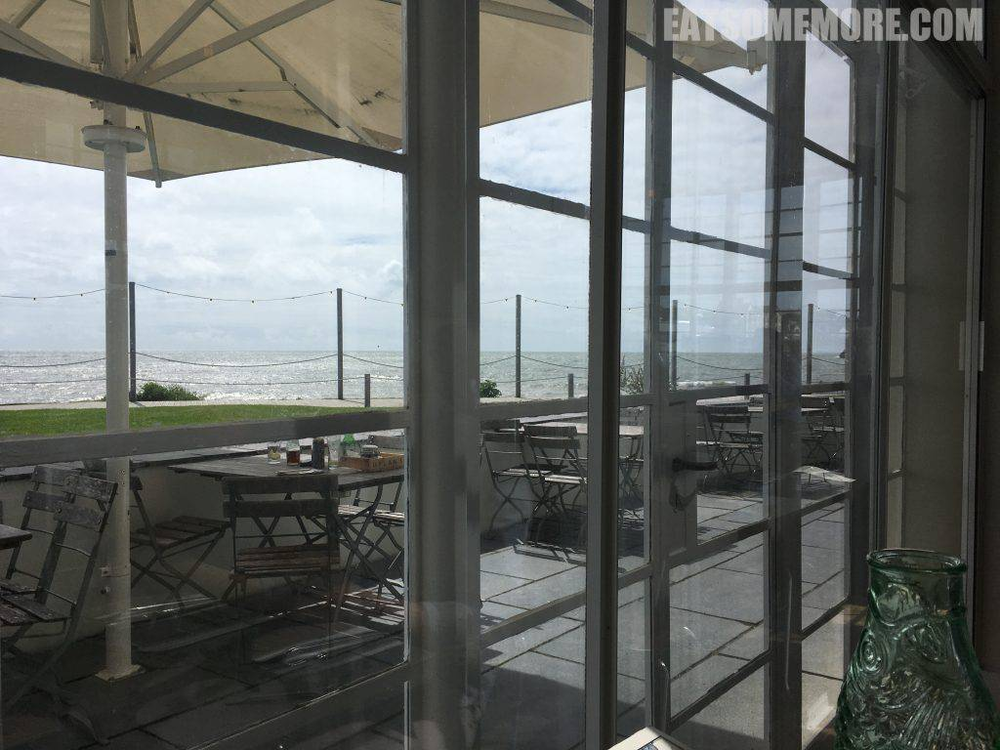
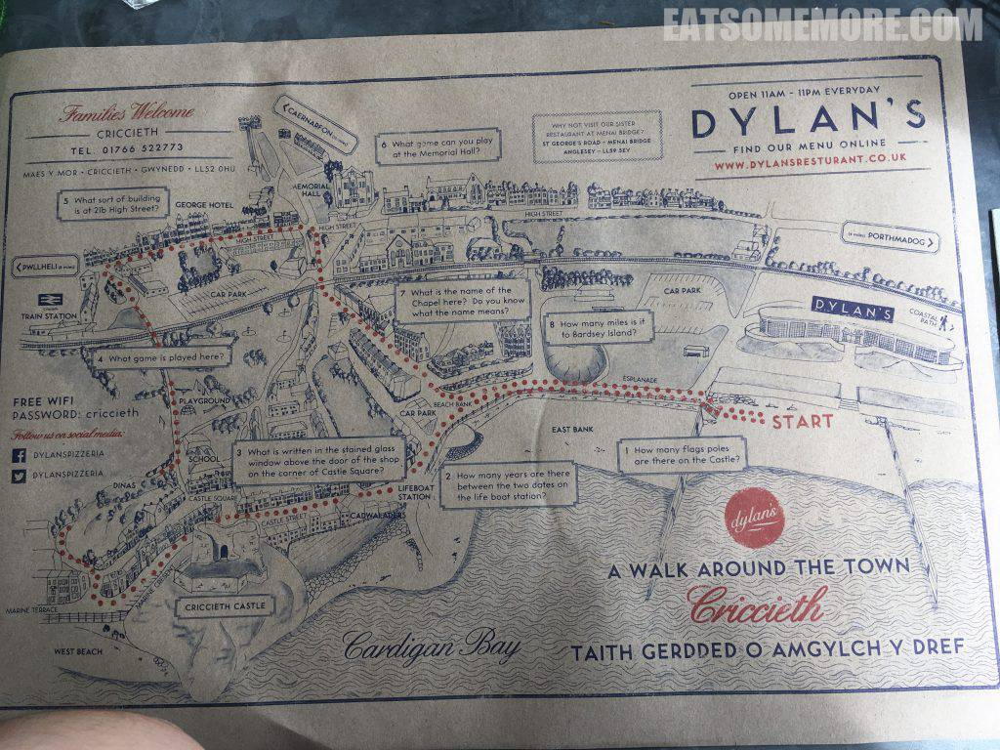
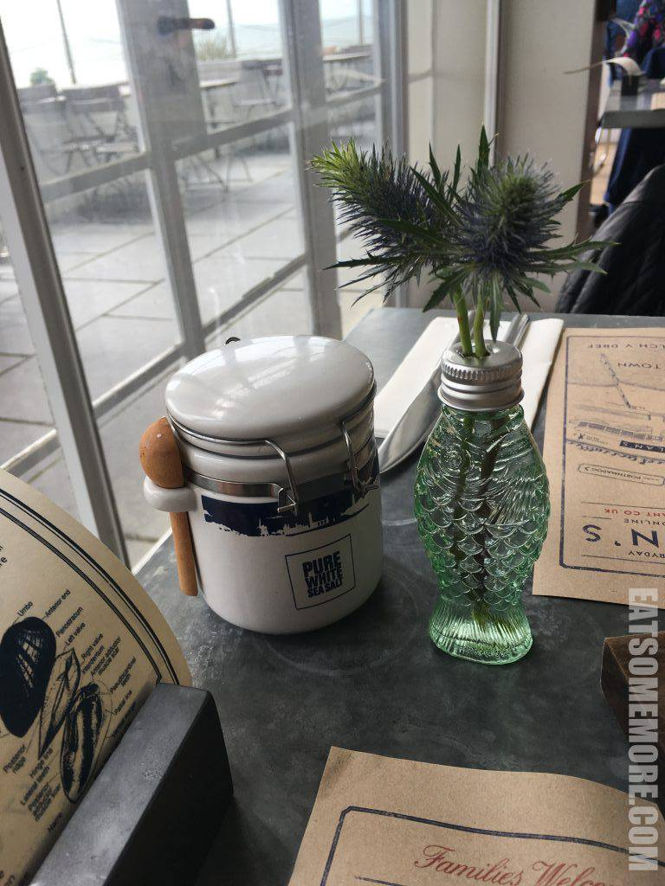
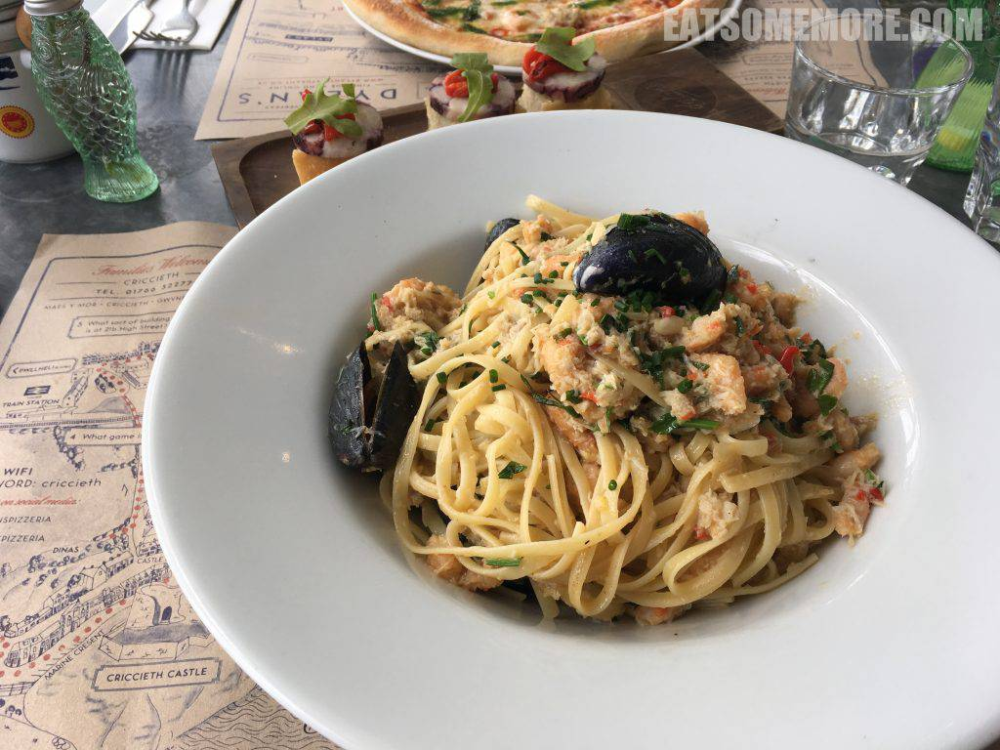
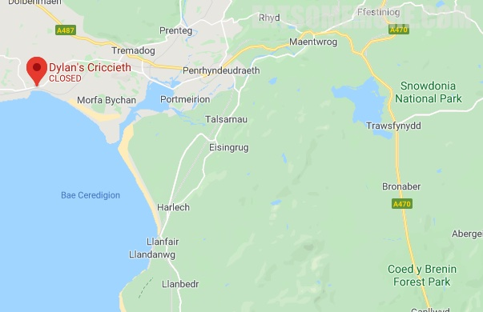

>Criccieth海滩上以渔船、渔网为坛展现的乡野小花，可爱自然得不得了！

>从沙滩西望，是俯瞰大西洋的Criccieth城堡。如此海景相伴的午餐好幸福！

>如此海景相伴的午餐好幸福！

>餐厅还提供小镇的游览地图，贴心又实用。

>盐罐和花瓶都很别致。

>前菜是章鱼吐司，章鱼少、面包硬、整个冷冷的，无法给好评。

>然而，海鲜意面倒是极美味的，里面有满满的蟹肉、虾仁、鱿鱼、青口，而且面条筋道入味，不愧是三届猫途鹰Tripadvisor网站卓越奖的得主。

>头一遭尝到海鲜披萨，传统的番茄芝士底搭配蟹肉、虾仁和海藻，是个很棒的惊喜。

网站：https://www.dylansrestaurant.co.uk/locations/criccieth

地址：Maes y Mor, Criccieth, Gwynedd, LL52 0HU

