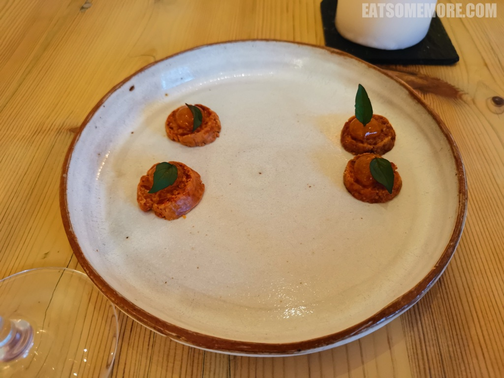
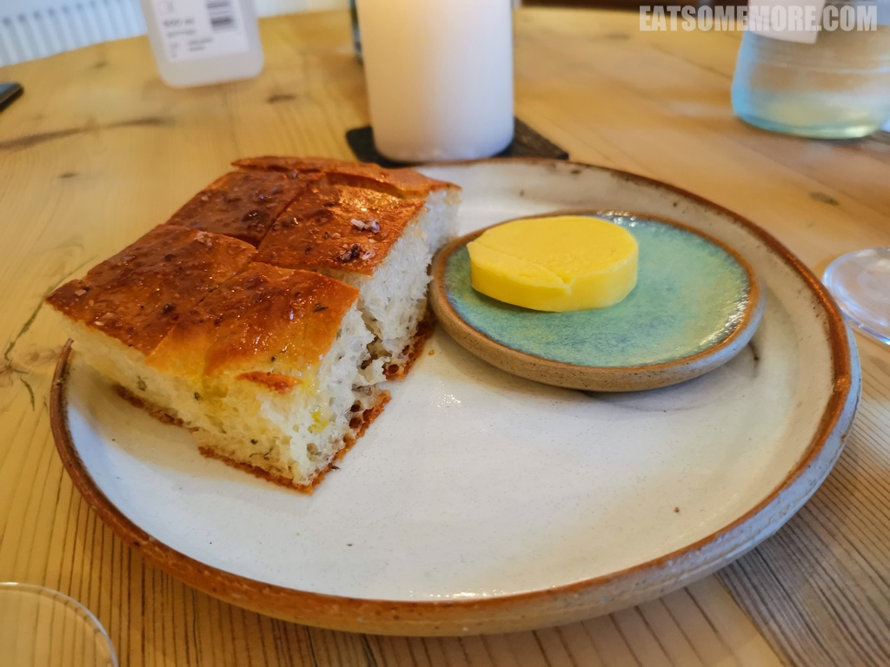
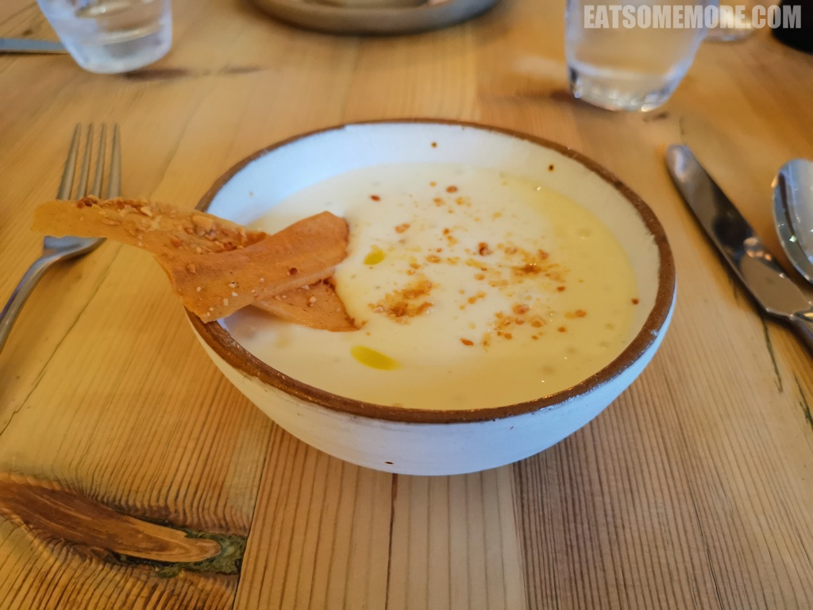
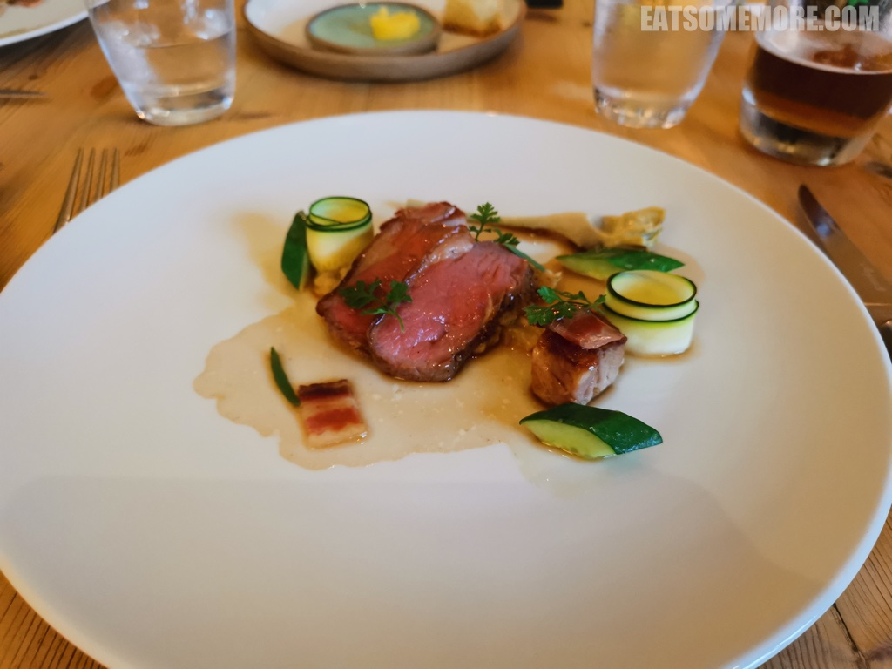
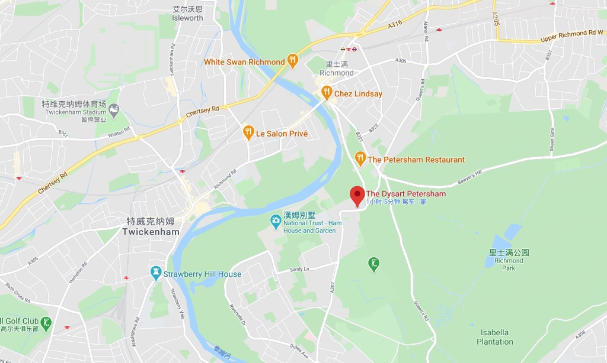

>里士满公园附近有一幢美得朴实的小洋楼。

>洋楼里是一间米其林一星的家族餐厅，一花一木、一画一窗之间，装饰得颇具艺术气息。

>透明的花瓶里插满了新鲜的花草，在烛光当中影影绰绰。

>菜单里有单点或者套餐的选择。

>餐前小点是香草叶果酱芝士奶油酥饼，辛香咸甜，雨露均沾，激活味蕾，一击即中。

>佐餐面包是现烤佛卡夏面包和盐味黄油。热乎乎的面包里冒着香草香，流出橄榄油，香味出众，湿度适中。

>前菜是腌鳕鱼牛津土豆汤。浓稠清甜的汤头里不仅有杏仁碎和橄榄油的香气，还徜徉着几块咸鲜的腌鳕鱼，质朴的美味动人心弦。

>威尔特郡羊肉两吃，以油封火腿、茴香、柠檬和迷迭香汁调味：慢炖羊肩香酥软糯；香煎羊臀肥瘦相间，肥肉甘香油润，瘦肉软嫩鲜香。配菜种类多样，清新解腻：洋蓟芯鲜嫩可口，黄瓜块爽脆多汁，青瓜片软薄弹嫩。

>覆盆子焦糖布蕾凉凉的，除了一般布蕾的蛋奶香，还带有覆盆子酸甜的独特味道，搭配本地玫瑰奶油酥饼，两样都清甜不腻，在英国可谓非常难得了。

>主厨特赠的餐后小甜点有生津李子啫喱和迷你蔓越莓杯子蛋糕。刚出炉的杯子蛋糕的表皮竟然是焦香酥脆的。更妙的是，蔓越莓的浓缩单宁酸与蛋糕的香甜味道简直是天作之合。一套组合拳下来，不得不承认这家家常餐厅无论是对于食材创意的掌握，还是烹制调味的控制都非常的出色，这颗米其林星星当之无愧！

>饭后经过里士满公园的时候，遇见了两头欢脱的小鹿。它们和刚刚的美餐一起，成就了我的一段快乐时光。

网站：[http://www.thedysartpetersham.co.uk/](http://www.thedysartpetersham.co.uk/)

价格：套餐£40.50起。

地址：135 Petersham Rd, Richmond TW10 7AA

