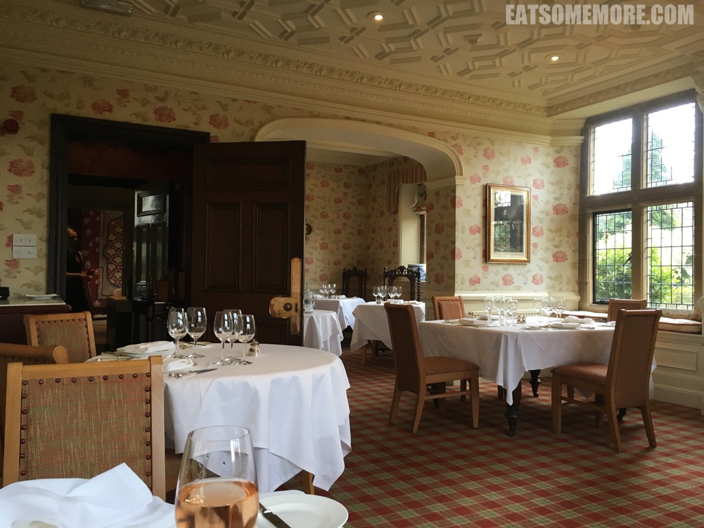
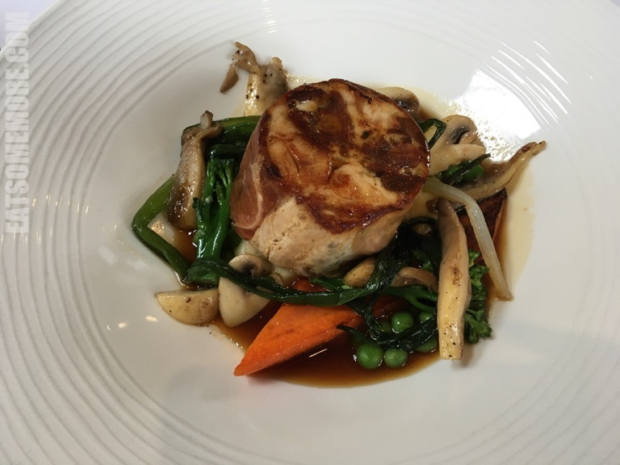

>德比郡爱德华乡村风格的巴斯洛庄园里的餐厅，在其总厨于2019年离职后，失去了其米其林的星级认证，但仍然是米其林指南的推荐餐厅。

>餐厅在复活节期间的布置十分应景。

>等待的时候，餐厅提供了一些香酥的小点心。

>整个餐厅采光充足，布置优雅，装饰得很有田园气息。

>餐前汤的味道均衡。

>煎鱼皮脆肉嫩，调味也很讲究。

>猪肉肥瘦相间，搭配蘑菇、青豆、胡萝卜等各色蔬菜，是丰富而和谐的复合滋味。

网站：[https://www.fischers-baslowhall.co.uk/](https://www.fischers-baslowhall.co.uk/)

地址：Calver Road, Baslow, Derbyshire, DE45 1RR

