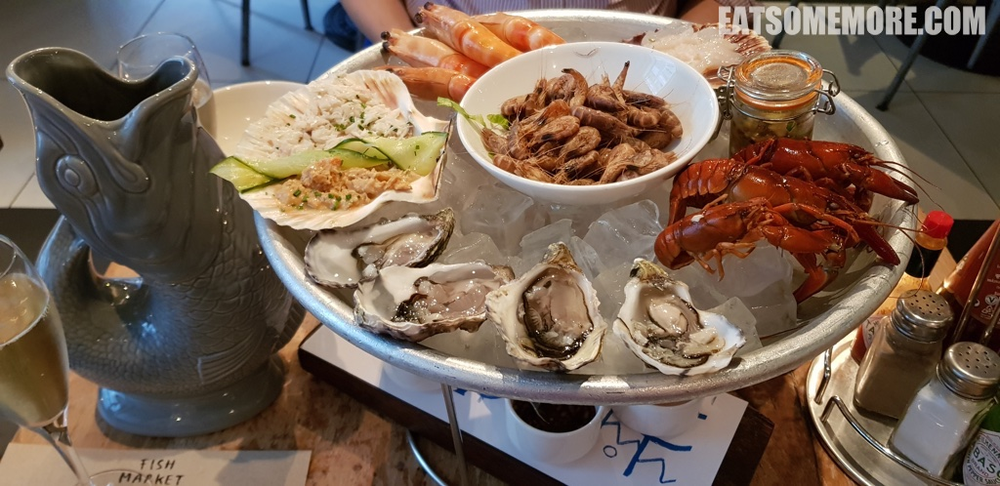

---
title: "伦敦海鲜餐厅 Fish Market"
author: "九姨"
date: "2022-10-23"
categories: "美食"
tags: "英国,英格兰,推荐,伦敦"
coverImage: "images/20180831_181612.jpg"
---

>海鲜餐厅的海鲜拼盘种类丰富，质量过硬。从十二点方向顺时针顺序，内容有带壳大虾、马尔岛扇贝刺身、苏格兰三文鱼塔塔、Kennet 河小龙虾、泽西岛生蚝和东海岸蟹肉，中间的是褐虾沙拉。

网站：[https://www.fishmarket-restaurant.co.uk/](https://www.fishmarket-restaurant.co.uk/)

地址：16B New Street, London, EC2M 4TR

