>肯特郡坎特伯雷东北方斯陶尔河 (River Stour) 上的福特威奇 (Fordwich)小镇里有一间非常值得一去的米其林一星餐厅 The Fordwich Arms。

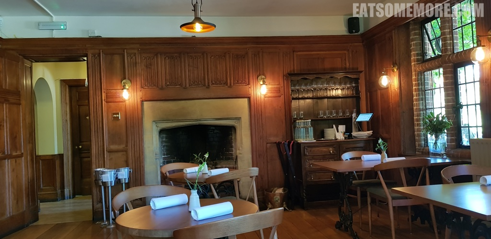

>餐厅的花园打理得错落有致、缤纷多彩。

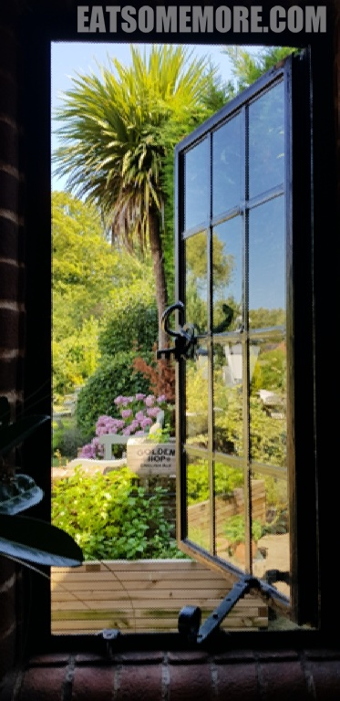

>看着兴匆匆的孩子们从花园回来，有一种怡然自得的惬意感觉。

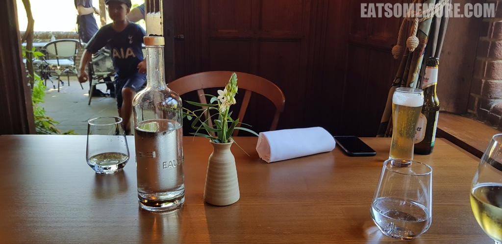

>餐前小点芝士薄片，用不同类型、不同形态的芝士混搭出咸香开胃的味道。

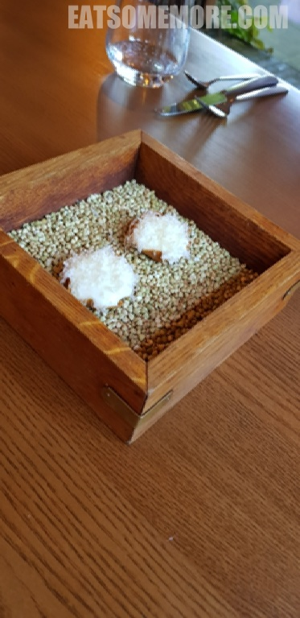

>松软的全麦面包和咸吐司搭配普通黄油、炸蒜黄油和焦糖洋葱。

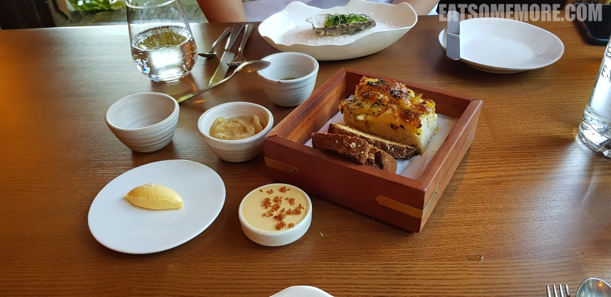

>爱尔兰西岸水质清澈的高威湾铜蚝肉质饱满、鲜甜爽脆、余韵悠长。

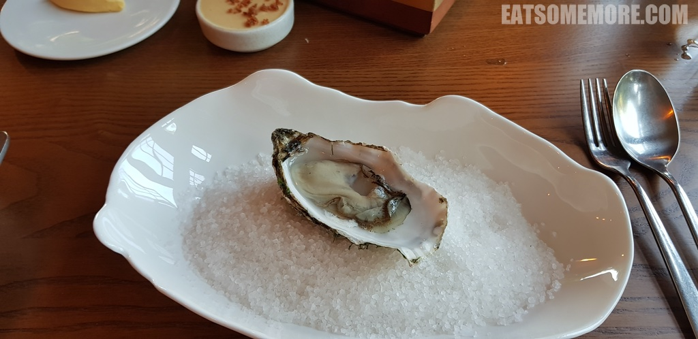

>不吃生食的朋友可以选择煮得半熟的高威湾铜蚝，点缀以康沃鱼子酱和葱丝，口感柔滑软糯，鲜味层层递进。

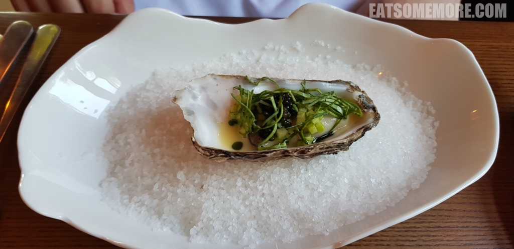

>苏格兰奥克尼群岛扇贝刺生软嫩甘鲜。

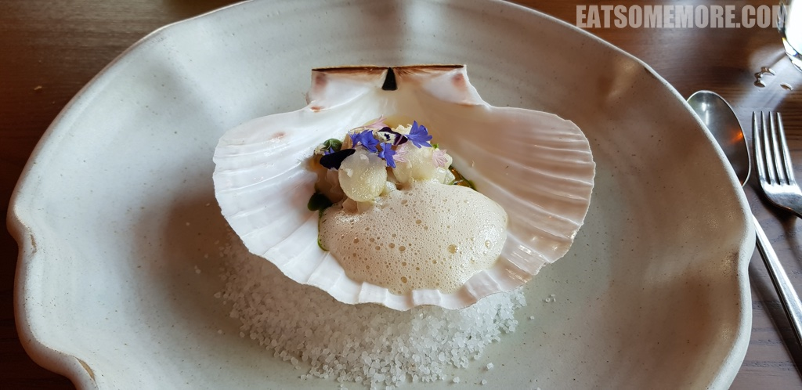

>工作人员在苹果木上现烤的惠斯塔布 (Whistable) 本地龙虾鲜香Q弹、肉质紧致、肉汁甘甜，堪称本场最佳。

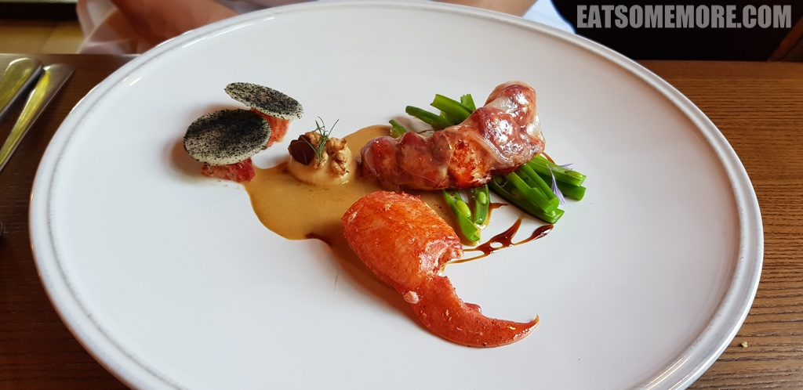

>周日烤肉用的是黑脸羊肉两吃，分别是烤羊臀和油封羊胸，肉鲜味美，各有千秋。

>另一道鱼肉主菜也是两吃，鱼鳍炸得金黄酥脆，鳍肉弹牙鲜嫩。

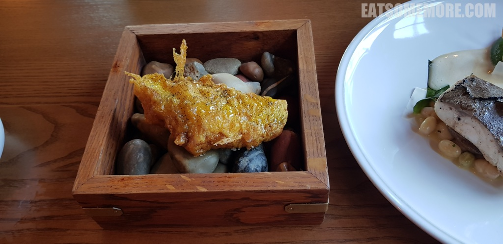

>另外一吃在鱼肉上铺了满满一层黑松露，激发了海鲜与陆鲜氨基酸之间的强强碰撞。

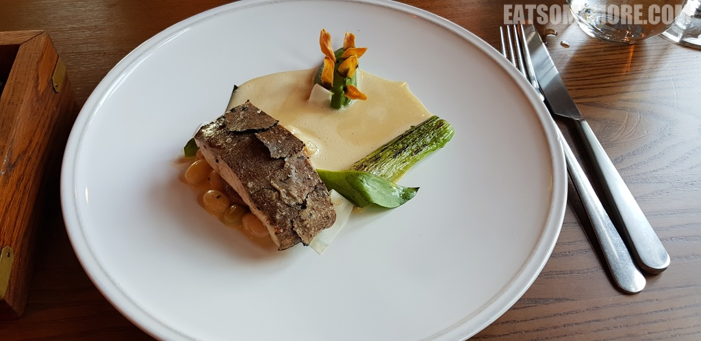

>最后以古董糖果罐里的两颗朱古力结束了这一餐高潮迭起、值得强烈推荐的美食。

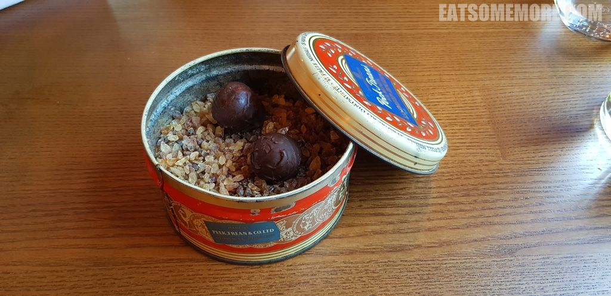

网站：[https://www.fordwicharms.co.uk/](https://www.fordwicharms.co.uk/)

地址：King St, Fordwich, Canterbury CT2 0DB

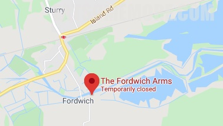