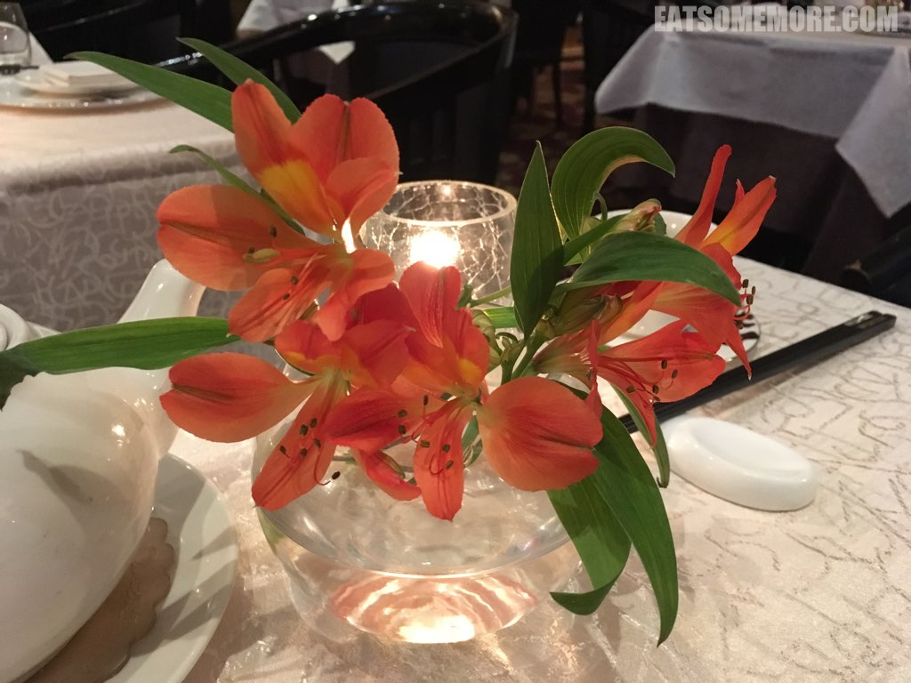
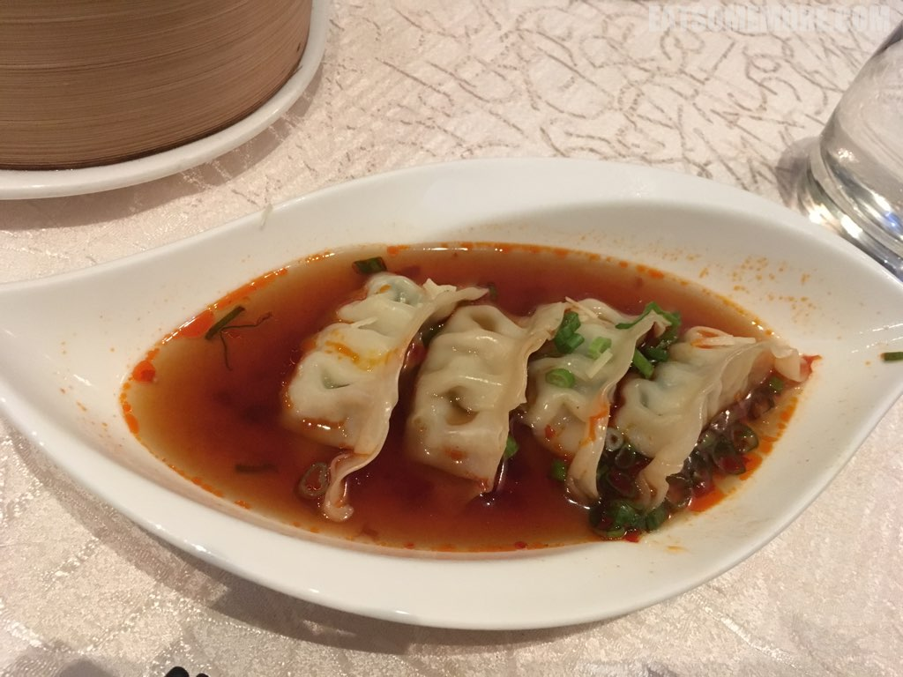
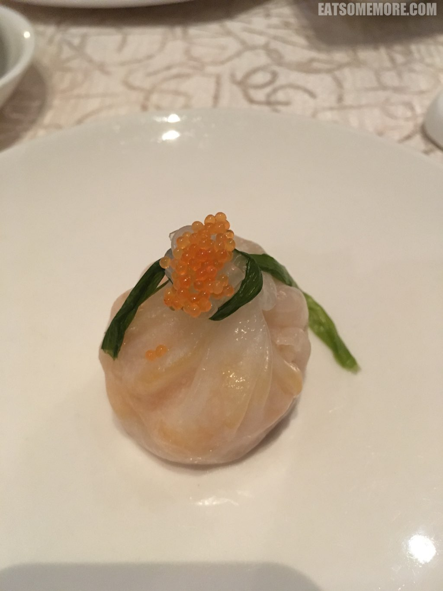
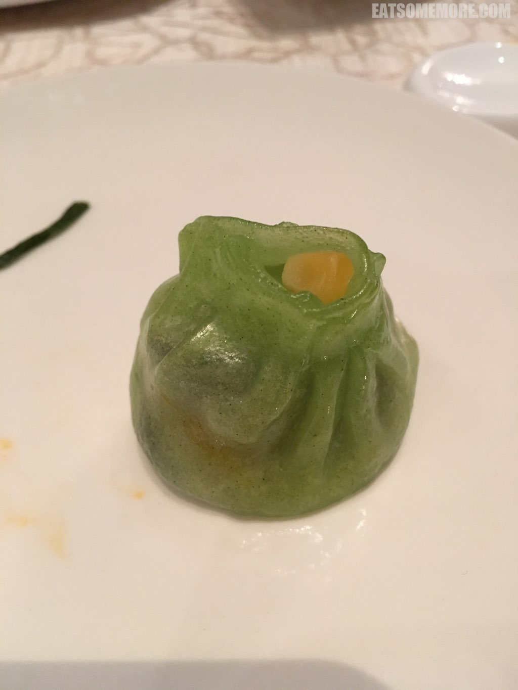
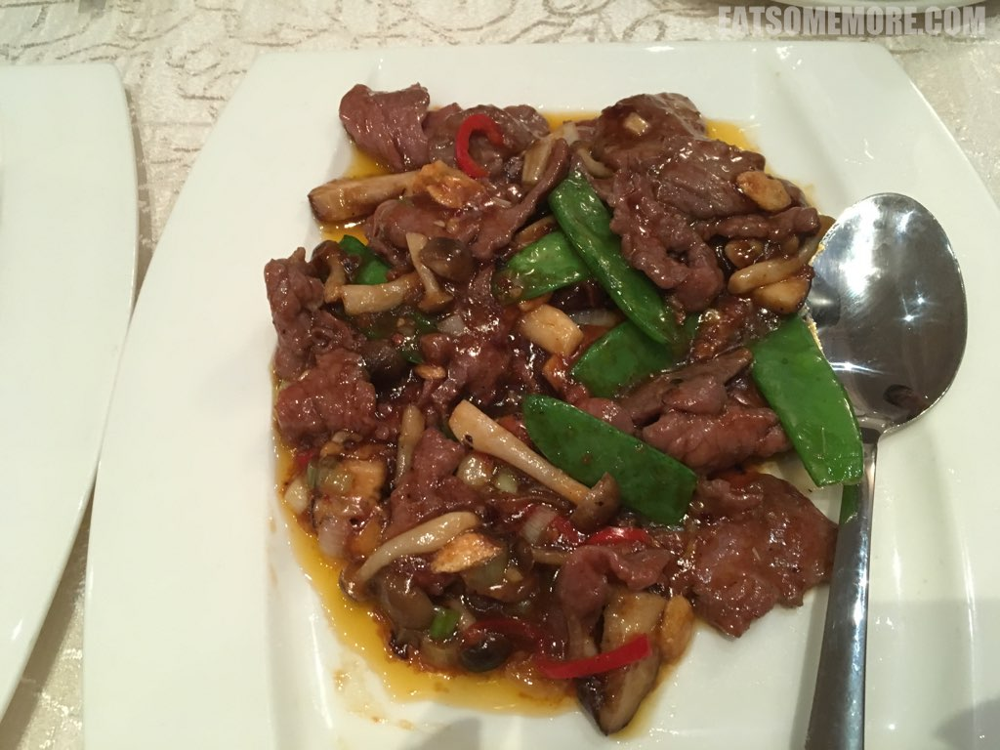
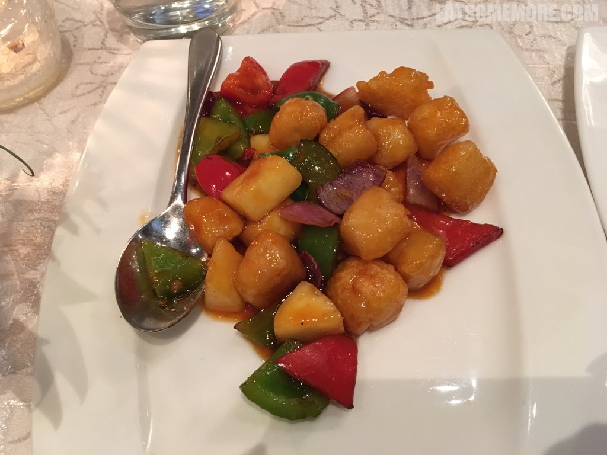
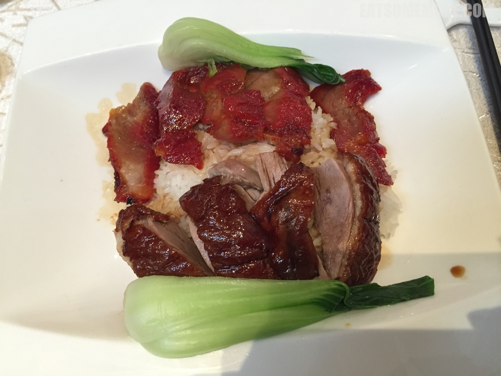
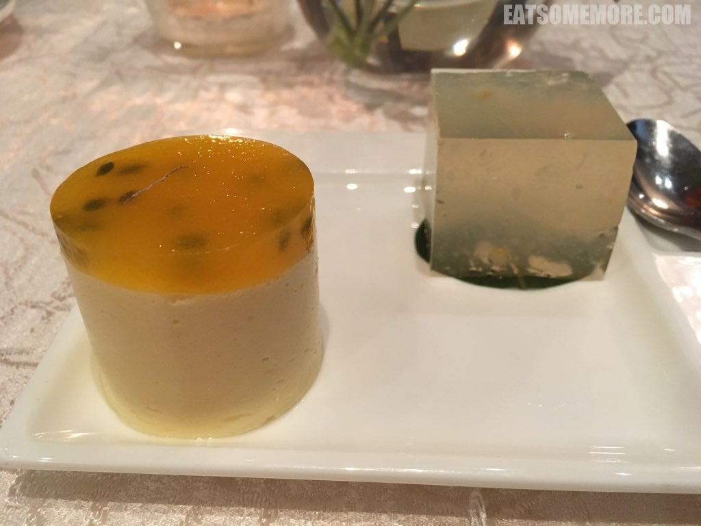
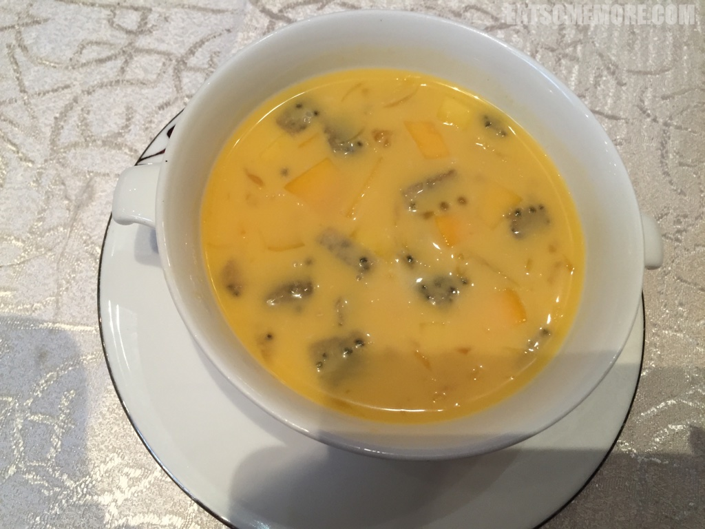

---
title: "米其林推荐的伦敦喜粤饭店［已关闭］"
author: "九姨"
date: "2020-05-17"
categories: "美食"
tags: "英国,英格兰,精选,粤菜,伦敦"
coverImage: "IMG_20171107_161859.jpg"
---

>在伦敦的粤菜馆，我最喜欢喜粤。它有个霸气的英文名字，叫做Grand Imperial，来自马来西亚的酒店集团。它的用餐氛围带着复古的港风，菜式和口味十分正点，位于伦敦维多利亚火车站外，交通非常便利。叫人扼腕痛惜的是，在写这篇食记的时候，伦敦喜粤已经停业了。即使这样，我也要写下这篇，青睐有加可见一斑。

>半干半湿红油饺子，皮薄馅大。

>水晶虾饺晶莹剔透，虾仁脆弹鲜甜，系以小葱增香，缀以飞鱼籽提鲜。粤式点心当中最广受欢迎的当数虾饺了。

>带子饺由带有蔬菜香的水晶皮软滑薄韧,裹着软嫩甘鲜的带子馅，是与娇俏虾饺截然不同的温柔口味。

>主菜当中我最喜欢XO酱鲜菌羊肉片。XO酱是典型的粤式调味料，大多并不含干邑白兰地，也没有既定的原料标准，一般来说包括瑶柱、虾米、金华火腿和辣椒。新鲜食材的菌香、肉香和酱香组成了3D的美味，咸鲜之中还有些微甜。

>宫保鳕鱼丁简直是典型中餐的宫保系列和典型英国菜的炸鱼薯条的跨界合作，食材好，手艺好，味道当然好。

>吃粤菜怎么能错过烧味双拼盖饭呢！叉烧肥瘦相间，香甜弹嫩；烧鸭皮脆肉香，咸甜适中。

>百香果慕斯有点甜，不过马蹄啫喱不论是口感还是味道都很清爽。

>然而港式甜品中的小公主当属杨枝甘露，除了芒果、西柚和西米外，还加入了火龙果颗粒，清新甘冽，酸甜可口。

网站：[https://grandimperial.com.my/london-united-kingdom/](https://grandimperial.com.my/london-united-kingdom/)

地址：101 Buckingham Palace Road, London, SW1W 0SJ