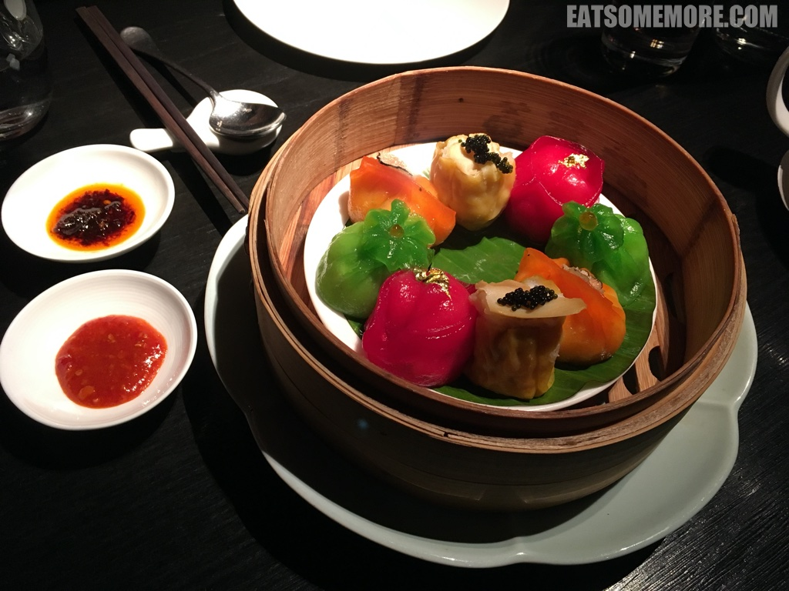

>在广式点心风靡全球的浪潮下，米其林都拜服了在它的石榴裙下。图片及菜名足以为自己代言的点心拼盘——金箔荔枝龙虾饺、鱼籽酱鲍鸡烧卖、帝王蟹翠玉饺、黑松露鱼饺。咂咂嘴吧！

>龙虾玉米浓汤的搭配挺特别的。

>石榴咕噜肉在别处也没有见过。石榴的酸甜果味更突出了肉的鲜味。

>黑松露烤鸭兼有豆荚的甜和蟹腿菇的鲜。

网站：[https://hakkasan.com/hanway-place/](https://hakkasan.com/hanway-place/)

地址：8 Hanway Place, London W1T 1HD

