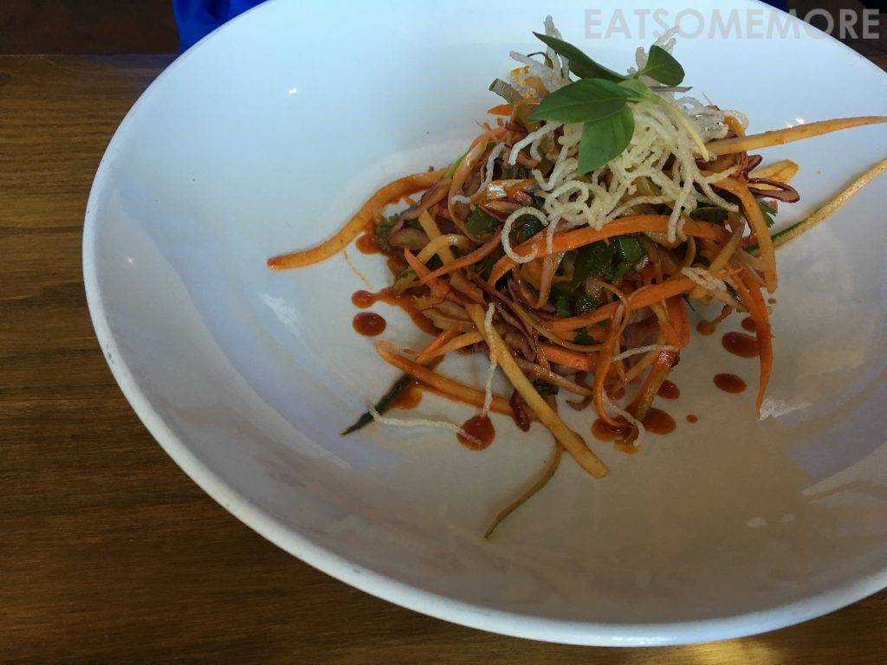
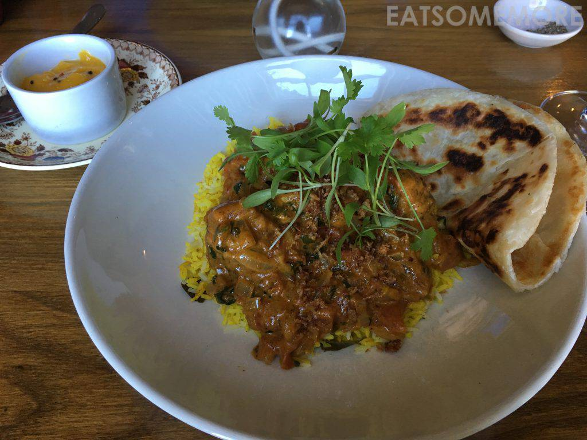
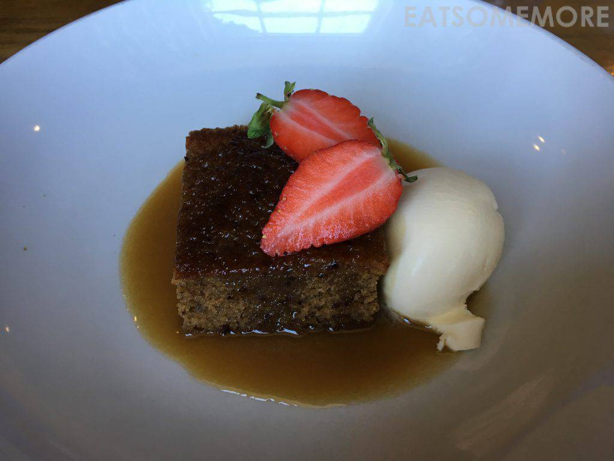

>蓝天上飘着白云，希望的田野里嵌着美味的小酒馆。

>小酒馆是复古的风格，桌上摆了鲜花。玫瑰葡萄酒果味芬芳、冰凉清新。

>祖籍塞浦路斯的干酪哈鲁米，在英国广受欢迎。夏季烧烤的必备之一就是烤哈鲁米，炙手可热、供不应求。这干酪之深入人心，连乡村酒馆也有它。油炸哈鲁米，外脆内软有嚼头，口感弹牙、滋味咸鲜、奶香四溢，搭配甘甜可口的新鲜无花果，令人食指大动。

>韩国辣酱拌牛肉丝沙拉，风格实在另类。

>芝士汉堡采用6盎司肉饼、碱水奶油包、烟熏切达干酪、红葱头、西红柿、宝石生菜、腌黄瓜，搭配手工薯条，浓浓乡村风味，好吃得又很接地气。

>油炸节瓜丸子搭配咖喱饭，中东风情极盛，在下不懂欣赏，不过印度烤饼外脆内软、焦香弹牙、甚是美味！

>焦糖太妃布丁配上凝脂奶油和新鲜草莓，还是有点过甜了。

网站：[https://www.halsetowninn.co.uk/](https://www.halsetowninn.co.uk/)

地址：Halsetown, Saint Ives TR26 3NA

