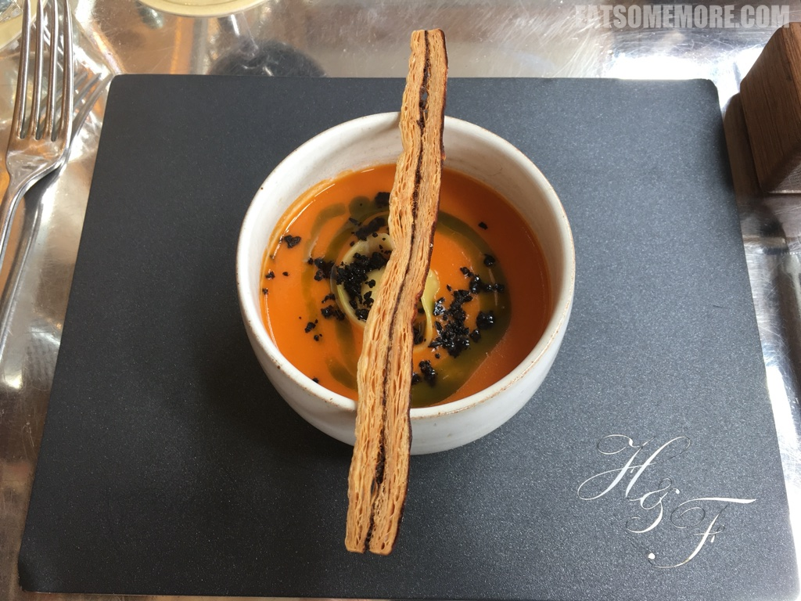

>白金汉郡的马洛镇上有一间米其林二星餐厅。

>开胃小点当中，油炸魩仔鱼鲜香得非常令人惊艳。

>迫不及待地想向大家介绍我至今喝过最好喝的番茄汤，中间有一粒帕马森乳酪意大利馄饨，罗勒油更是给这道汤增添了与众不同的风味，碗上还架着一根黑橄榄酥皮脆条。总的来说，各个味道的融合非常的棒！

>油封羊肩搭配孜然酸奶，非常美味。配菜酸甜茄子竟有些中式鱼香茄子的味道。

>草莓萨瓦兰蛋糕的口味就重一些，而最上面的咸杏仁冰激凌既特别又好吃。

网站：[https://www.thehandandflowers.co.uk/](https://www.thehandandflowers.co.uk/)

价格：平日午餐定食两道菜£25，三道菜£29.5，炸鱼薯条£17.5。

地址：126 West Street, Marlow, Bucks SL7 2BP

