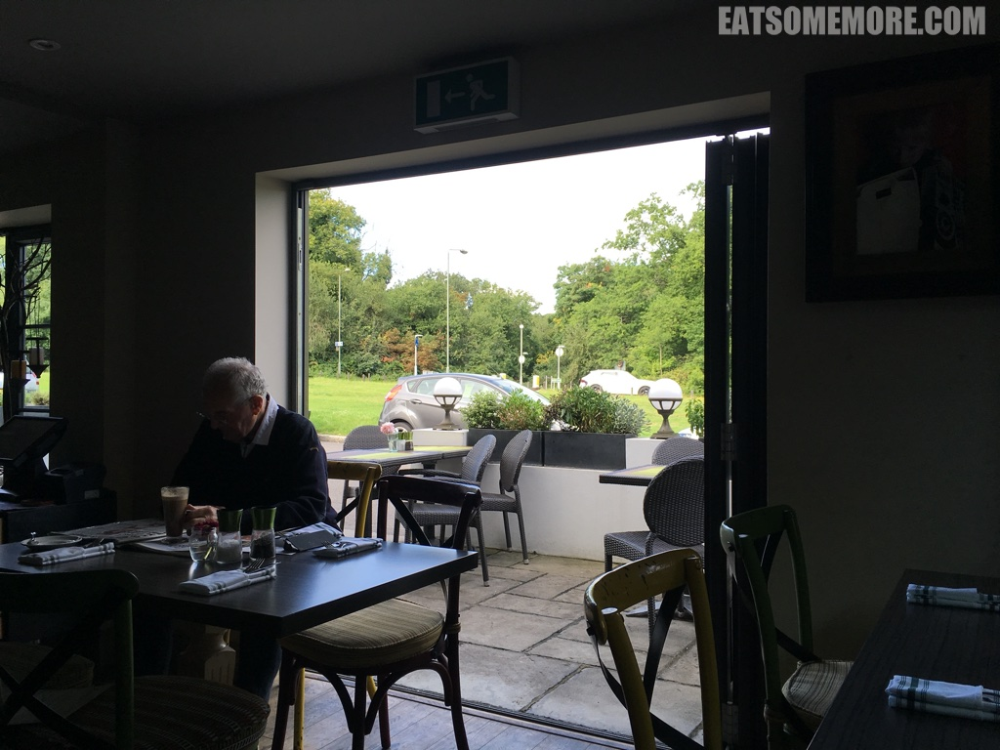
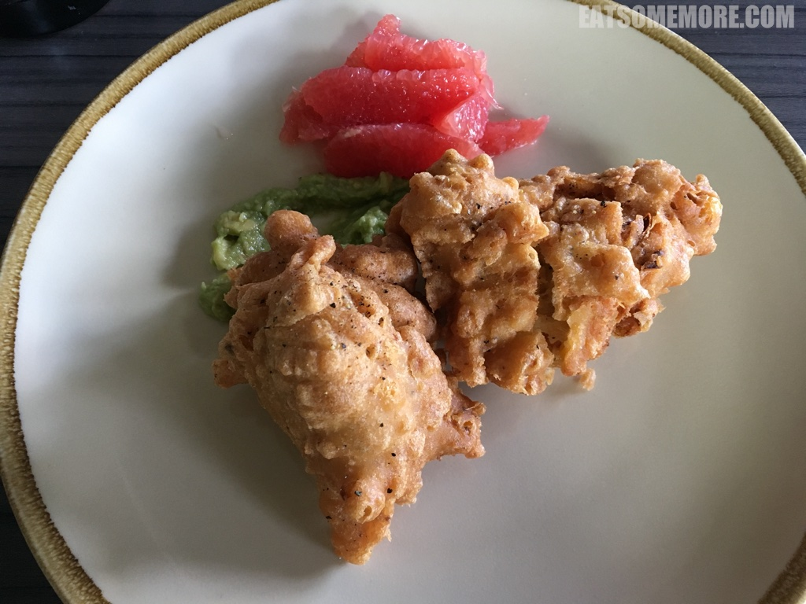
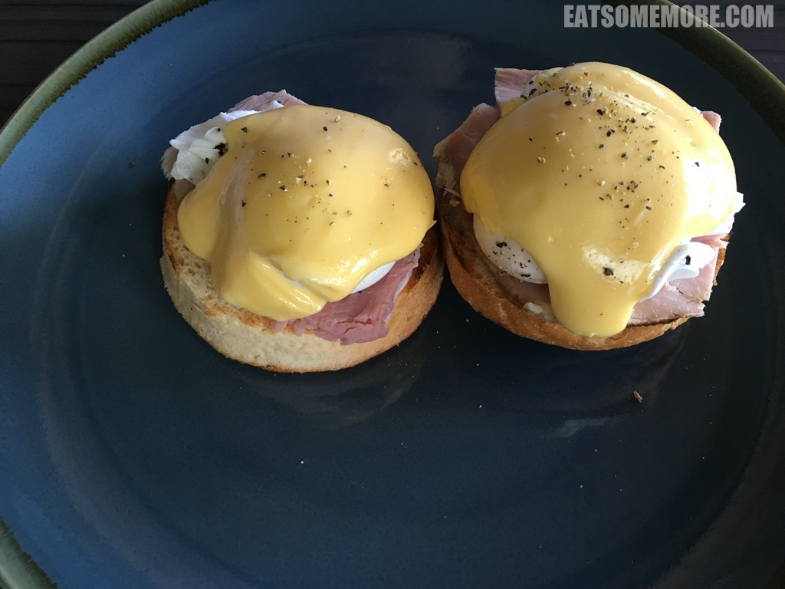

---
title: "米其林推荐的伦敦早午餐 Herbert's［已关闭］"
author: "九姨"
date: "2022-08-21"
categories: "美食"
tags: "英国,英格兰,伦敦,推荐"
coverImage: "images/IMG_20170819_101440.jpg"
---

>周六的早晨，在公园的对面，吃早午餐，也太令人高兴了吧！

>玉米炸饼表面酥脆、内里蓬松、玉米脆甜，搭配清新柔滑的牛油果泥，香而不腻，叫人食指大动！

>火腿蛋松饼是早午餐当中的翘楚。火腿咸鲜，松饼松软，荷兰酱酸甜，鸡蛋黄流香溢，是点睛之笔无疑。

