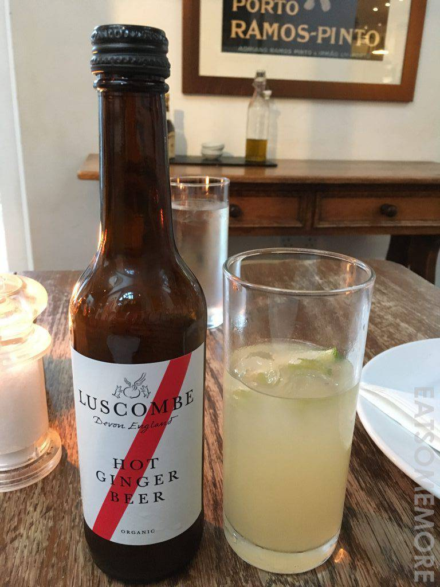
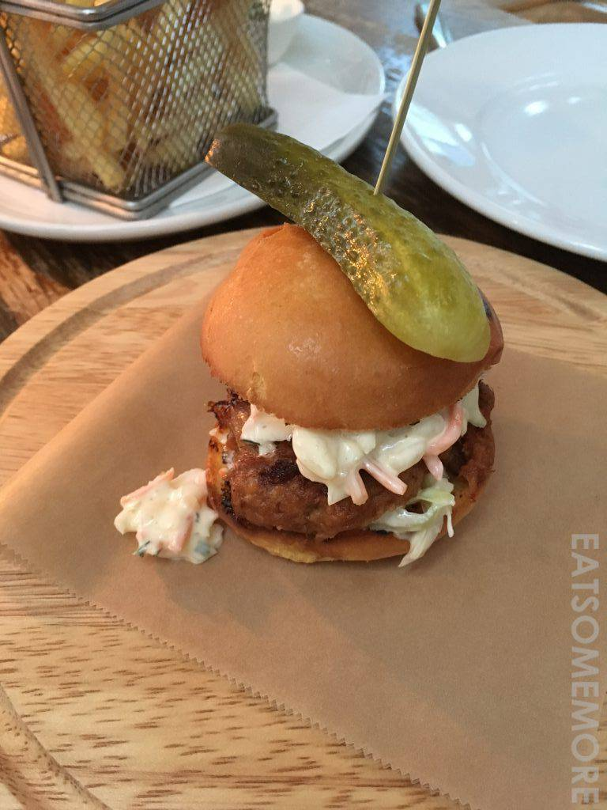
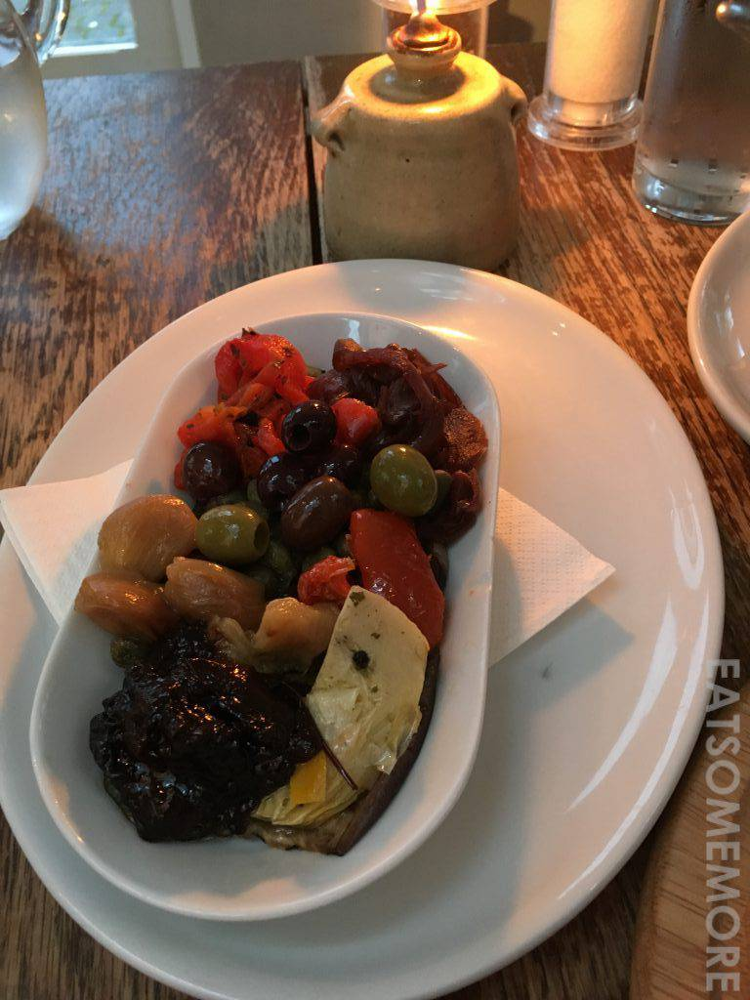
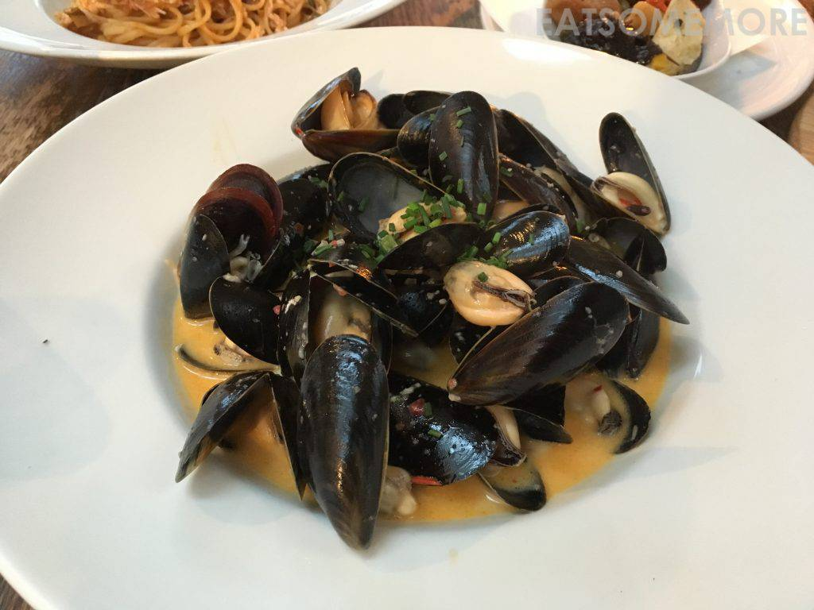
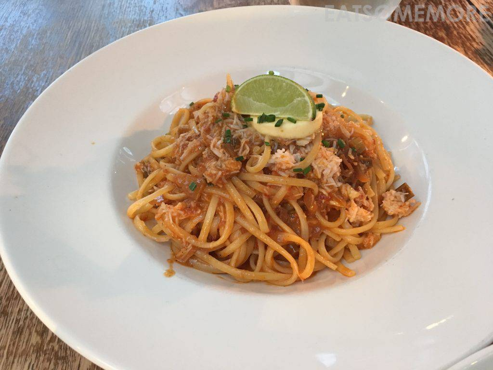
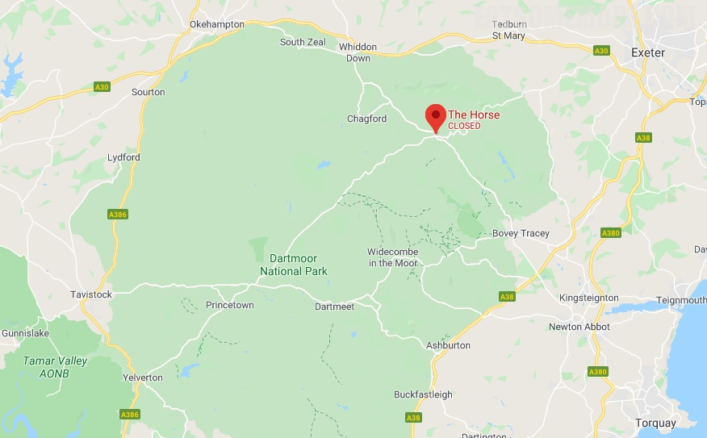

>德文郡连姜汁汽水都是有机的，并不很辣，但姜味的浓郁程度远超其他同类产品。在德文郡喝这些玻璃瓶汽水，很有童年的感觉。

>迷你汉堡的肉饼烤得弹性十足、肉汁四溢，面包也烤得微微有些酥脆焦香，高丽菜沙拉和酸黄瓜清新解腻。

>烤蔬菜拼盘，与我的期待稍有不符。

>艾克斯河里现捞的青口用德文郡的苹果酒煮了，加少许甜辣、香蒜奶油调味，来自本地的新鲜美味总是出类拔萃。

>前文提到过的超群蟹肉扁意面在此。私以为其成功之处有三：酸柑生津汁鲜挤，牛油始融裹蟹酱，蟹肉量足鲜甜浓。

网站：[https://www.thehorsedartmoor.co.uk/](https://www.thehorsedartmoor.co.uk/)

地址：7 George St, Moretonhampstead, Newton Abbot TQ13 8PG

