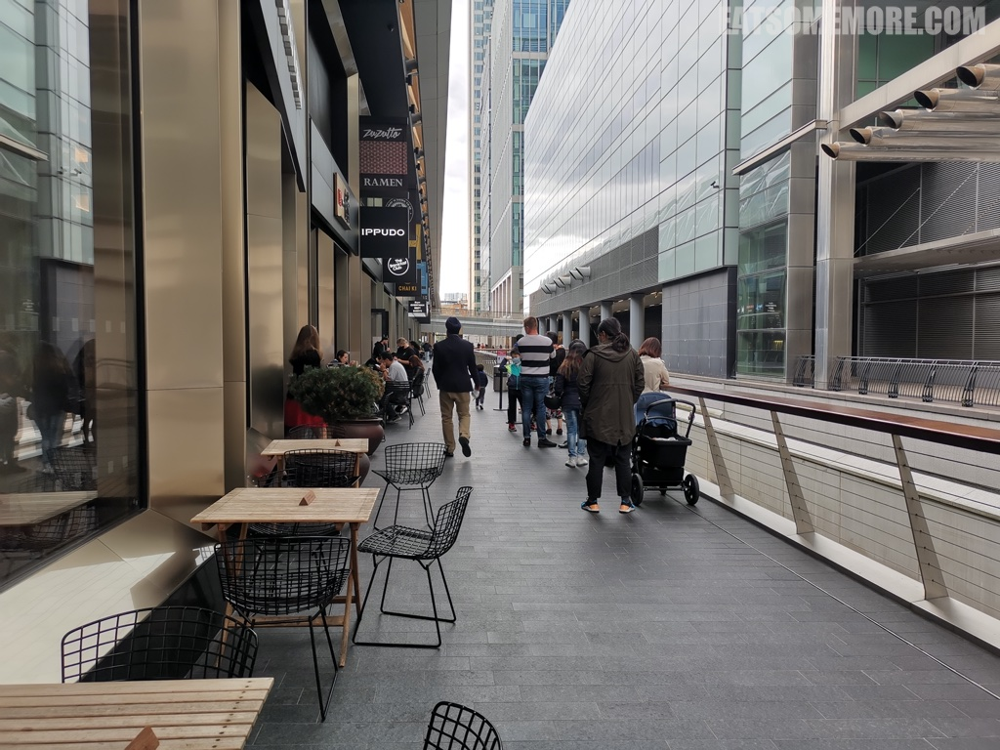
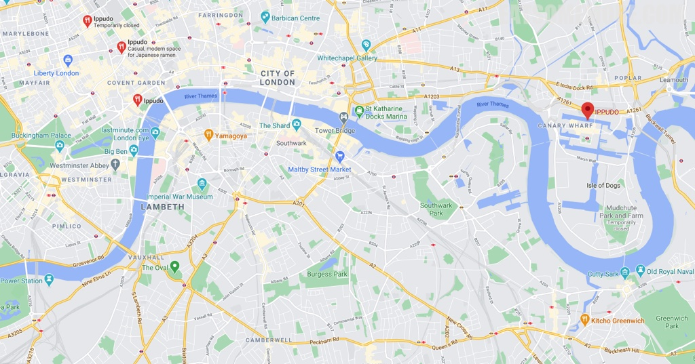

---
title: "伦敦日式连锁拉面店一风堂"
author: "九姨"
date: "2023-10-29"
categories: "美食"
tags: "英国,英格兰,推荐,伦敦"
coverImage: "images/IMG_20200831_164956.jpg"
---

>创始于1985年九州博多的日本一风堂，在全球范围内都广受欢迎，载誉无数。它在伦敦就有几间分店，经常大排长龙。这天我们去的是金丝雀码头的分店。

>推出于1996年的经典白丸原味拉面是典型的博多拉面，拥有浓厚的豚骨高汤，自制的细长拉面，香酥的猪肉叉烧，脆弹的木耳丝，爽口的豆芽，鲜嫩的笋丝，和辛香葱花。

>用日式柴鱼海带高汤煨出来的猪肉粒、洋葱和鸡蛋盖在日本米饭上，再撒上海苔末和葱花，看似简单，实而不简单。

网站：[https://www.ippudo.co.uk/](https://www.ippudo.co.uk/)

地址：Unit CR 28, Level Minus One Crossrail Station and Retail Mall,
1 Crossrail Place London E14 5AR

