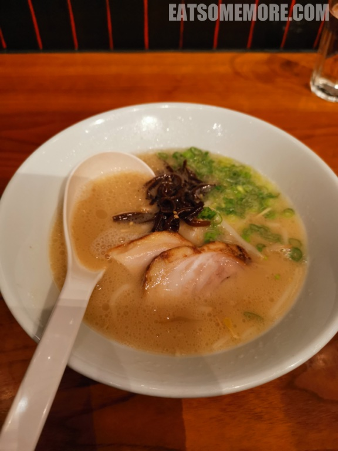

---
title: "伦敦日式连锁拉面店一风堂"
author: "九姨"
date: "2023-10-29"
categories: "美食"
tags: "英国,英格兰,推荐,伦敦"
coverImage: "images/IMG_20200831_164956.jpg"
---

>创始于1985年九州博多的日本一风堂，在全球范围内都广受欢迎，载誉无数。它在伦敦就有几间分店，经常大排长龙。这天我们去的是金丝雀码头的分店。

>推出于1996年的经典白丸原味拉面，拥有一风堂经典的豚骨拉面，自制细长拉面，pork belly chashu, sesame kikurage mushrooms, bean sprouts, and spring onions. A classic, Hakata-style ramen

SHIROMARU CLASSIC - A bowl full of basics IPPUDO’s original creamy tonkotsu pork broth served with homemade thin and straight noodles, topped with pork belly chashu, sesame kikurage mushrooms, bean sprouts, bamboo shoots and spring onions. A classic, Hakata-style ramen.。

>日式高汤，是日本式高汤，主要用到日式柴鱼丝同海带煲成。。

网站：[https://www.ippudo.co.uk/](https://www.ippudo.co.uk/)

地址：Unit CR 28, Level Minus One Crossrail Station and Retail Mall,
1 Crossrail Place London E14 5AR

