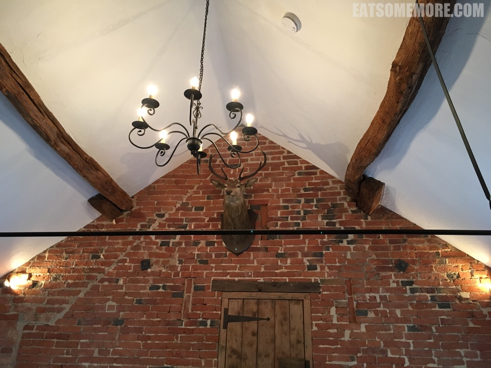
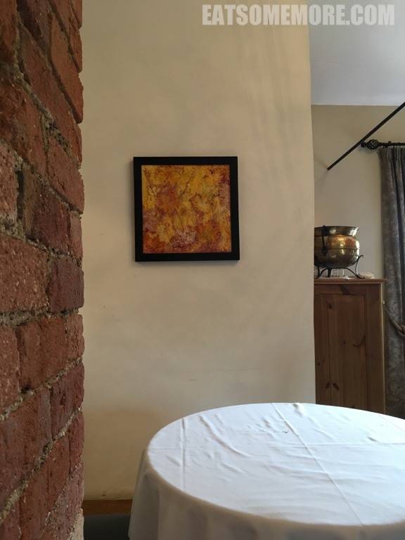
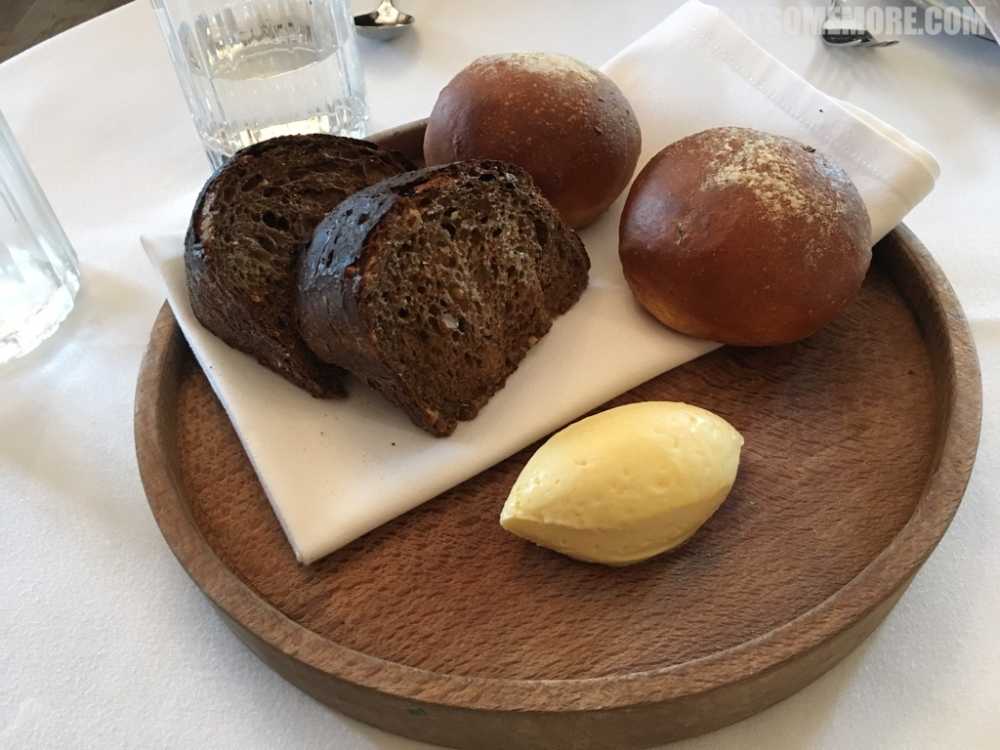
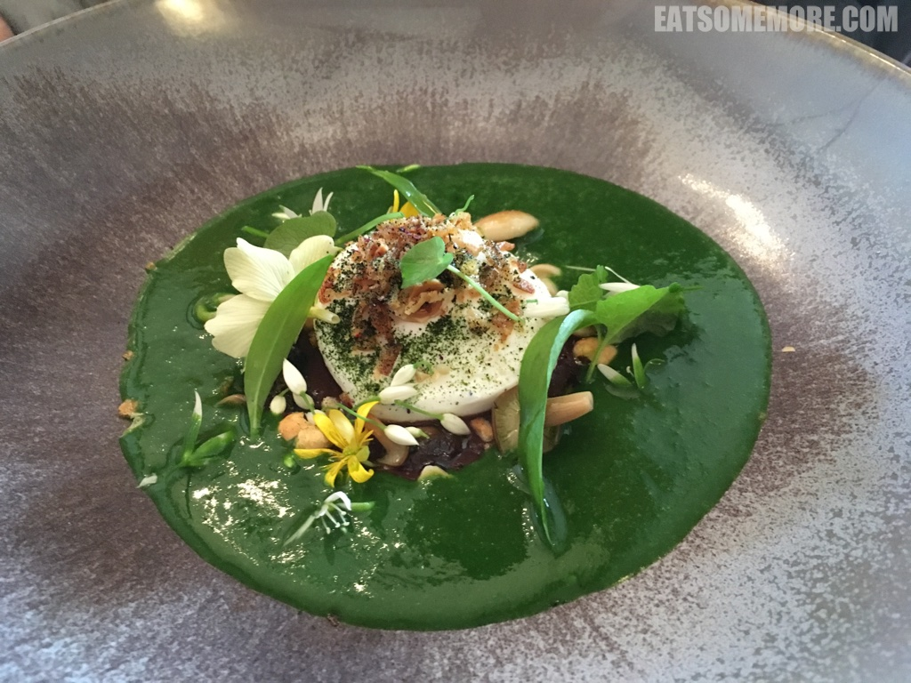
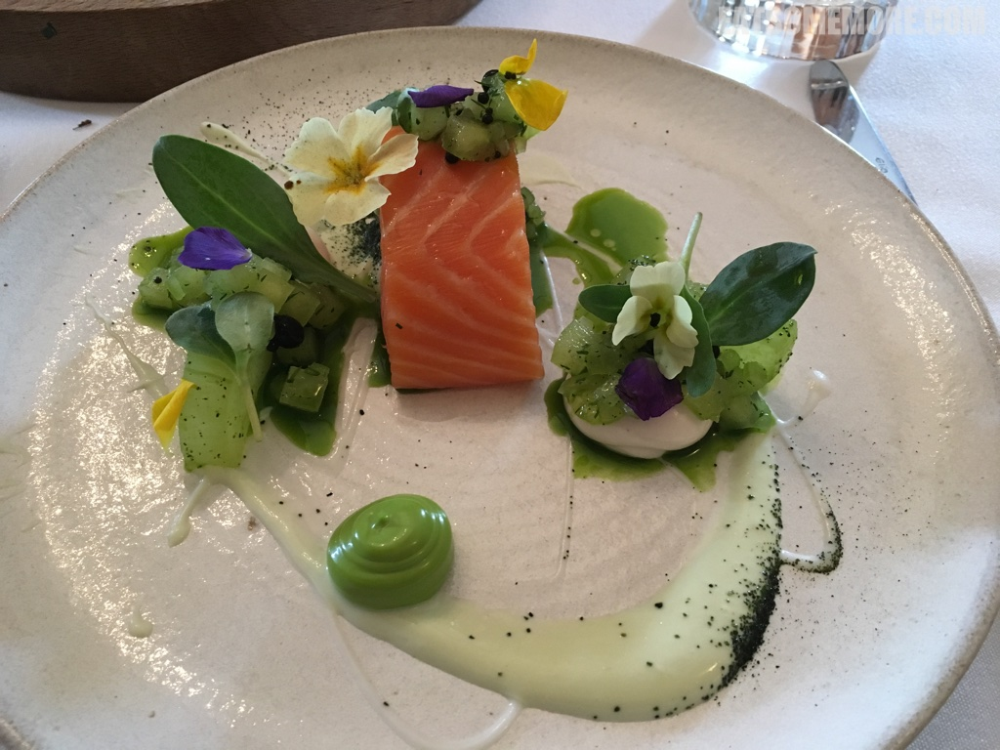
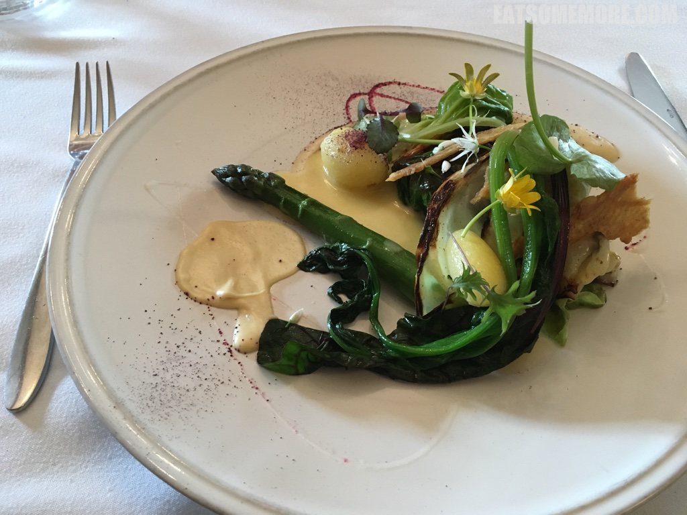
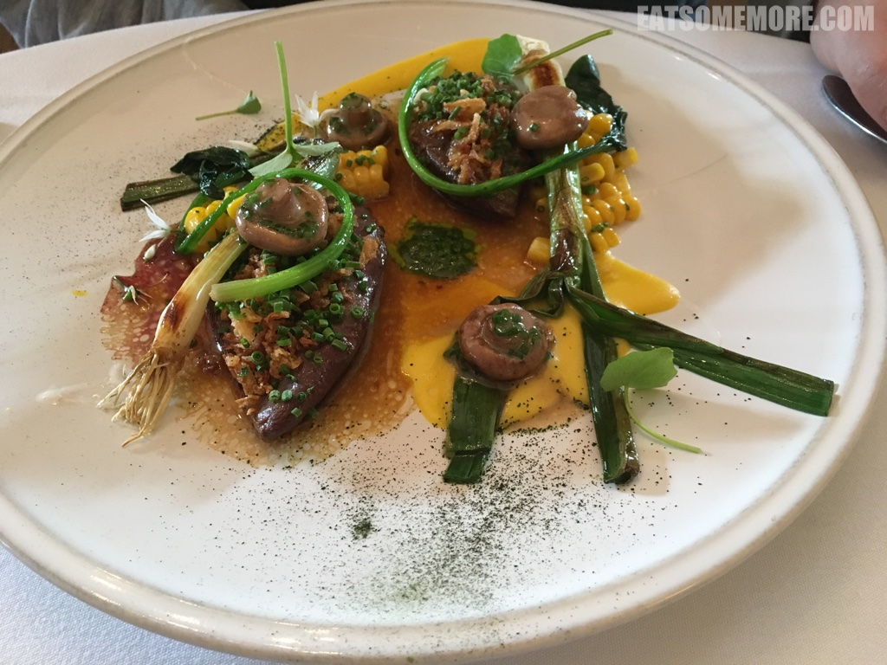

>英国许多的精致餐饮，往往藏身于乡村农场当中，根据不同季节的时令产出更换餐牌。

>内部装饰很有狩猎农舍的特色。

>同时，墙上还挂着抽象风格的油画。

>深浅颜色和浓淡笔触之间，落叶的飘摇姿态呼之欲出。

>温温的酸种面包和小餐包很香，湿度适中，搭配慕斯形态的黄油，非常优秀。

>清明刚过、谷雨未至之时，适时地邂逅了这道溏心鸭蛋熊蒜汤佐榛仁时蔬，又美味又神奇。整道菜汤浓、蛋滑、菇脆，每一口都能尝到蒜香、葱香、韭香、蛋香、花香、坚果香。这是多美妙的春日味蕾体验！

>厚切微熏三文鱼，突出了食材本身的鲜甜，保留了原本的软糯，佐以生蚝、莳萝、黄瓜的混合酱汁和时令蔬菜。这滋味，比海风清新，比田园甜美。

>康沃鳕鱼埋在脆炸鸡皮，烟熏鱼卵，小萝卜和芦笋嫩芽当中。

>葱油本地林鸽和甜玉米粒格外合适。

网站：[http://www.johnshouse.co.uk/](http://www.johnshouse.co.uk/)

价格（2017）：平日午餐定食£24（两道菜），£28（三道菜）。

地址：139-141 Loughborough Road, Mountsorrel, Loughborough, Leicestershire, LE12 7AR

