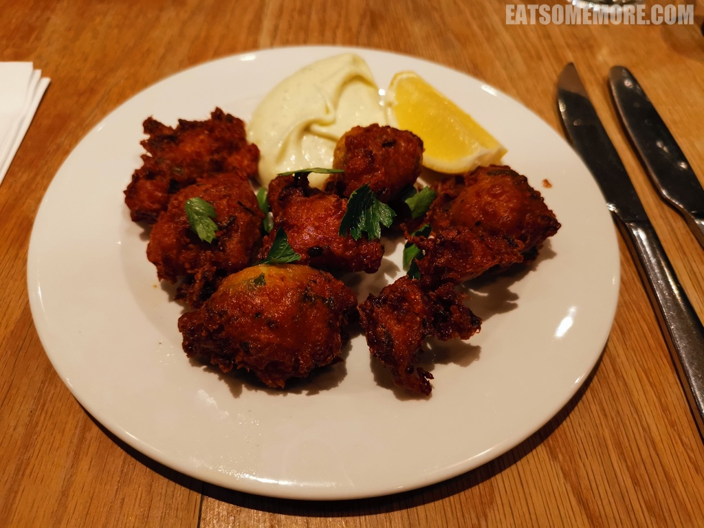
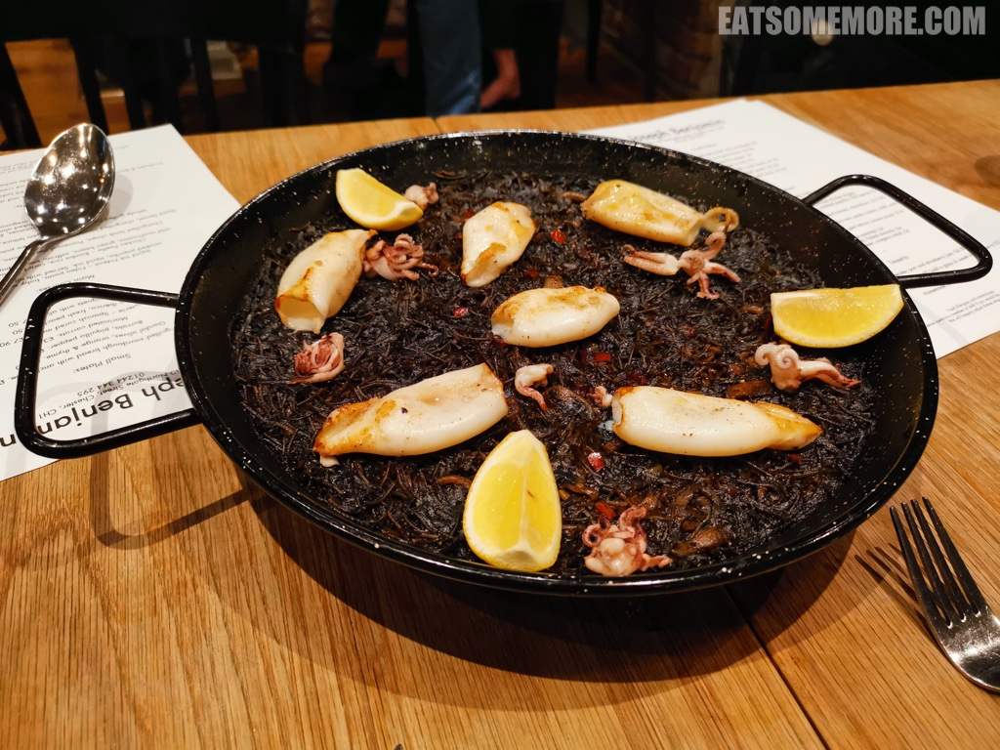
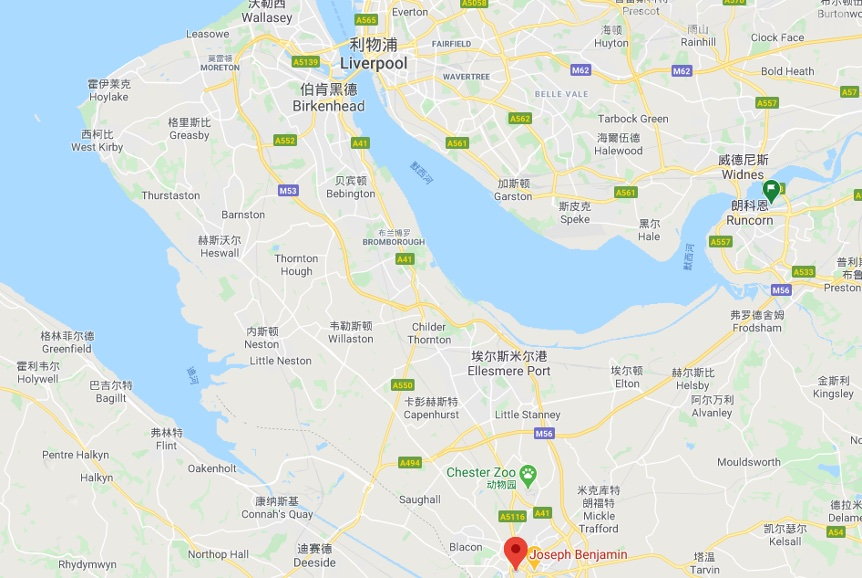

>切斯特的北门大街直通镇中心，热闹非凡，比几年前来的时候更难停车了，差点没赶上预约的时间。所幸餐厅非常贴心地帮我们通过电话在厨房关门之前下了单，才没有遗憾错过。炸腌鳕鱼丸酥脆咸香，沾着清香的大蒜蛋黄酱，吃得负罪感满满。

>蒜香墨鱼汁短细面的每一口都能吃到高浓度的咸鲜味道，带有藏红花独特的香味和烟熏甜椒粉微微的辣，提升了意面风味上的层次感。鱿鱼仔们烤得香嫩脆甜，是整道菜的画龙点睛之笔。

网站：[https://www.josephbenjamin.co.uk/](https://www.josephbenjamin.co.uk/)

地址：134-140 NORTHGATE STREET, CHESTER CH1 2HT

