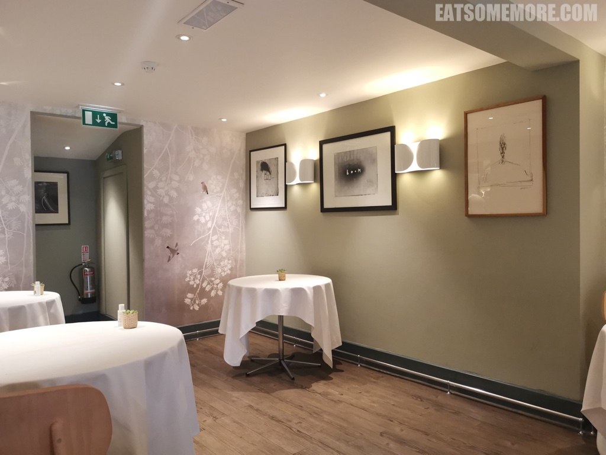
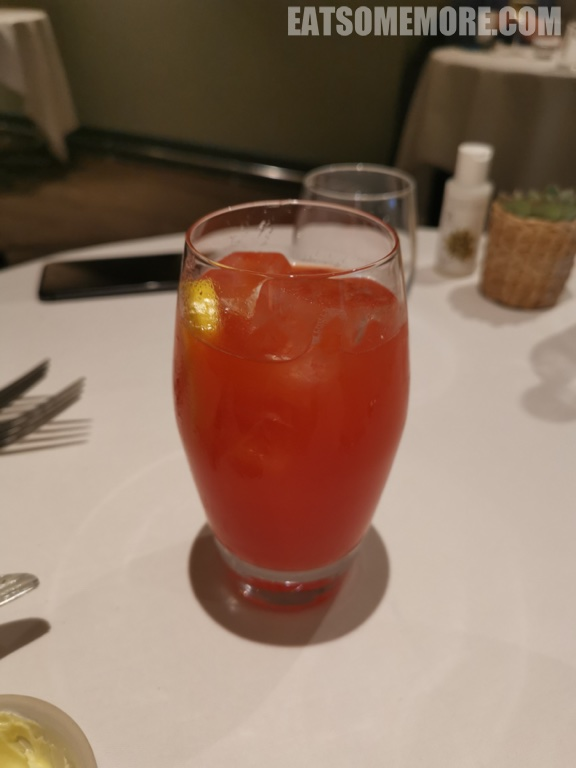
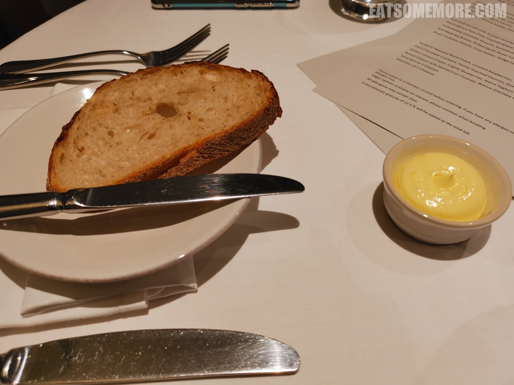
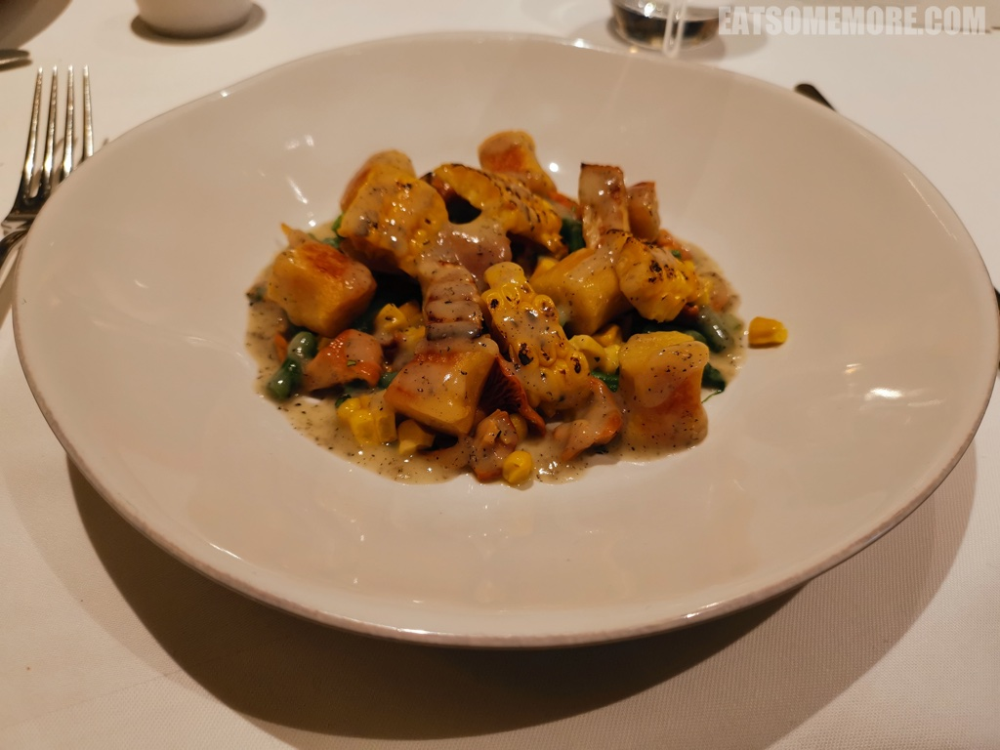
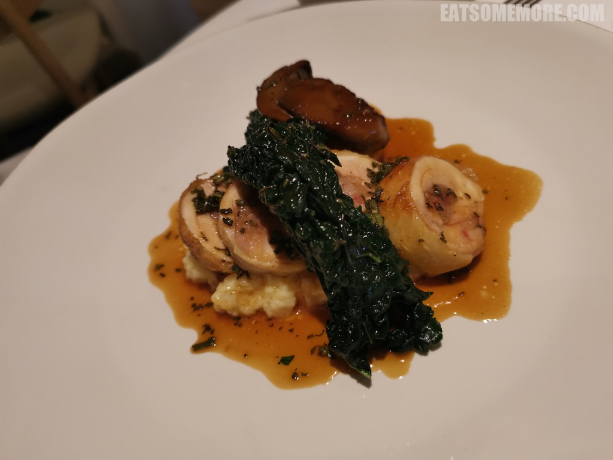

>西伦敦荷兰公园附近的小巷子里，有一间米其林一星的家常菜馆。餐厅整体布置素雅，墙纸上画着花鸟，画框里裱着素描。

>特调冰镇马鞭草草莓柠檬汽水，酸甜微苦，据说是具有清热解毒、驱虫止痒功效的真正“快乐肥宅水”。

>酸种面包的外皮酥脆，内里的湿润度、空气感和弹性都控制得刚刚好，搭配柔滑易推展的原味黄油，奶香浓郁，生津开胃。

>薄切烤小牛肉鲜嫩而有嚼头，浅浅焯过的季夏四季豆和小青豆与生菜嫩芽一起为这道菜添加了脆嫩爽口的口感，再以榛子酱和现磨芝士粉调味，满口鲜香。

>松露榛仁芝士洋蓟四季豆沙拉里的每一类食材都经过相应的烹调，是非常适合中国胃的一道沙拉。各种食材独特的香气和迥然不同的口感，也搭配得巧妙，有被惊艳到。

>松露焦糖帕马森土豆丸子，和苏格兰鸡油菌，清甜玉米粒以及爽脆绿豆烩在一起，鲜得上头、香得浓郁。

>蜜汁鸡腿去了骨，填入以鼠尾草调味并已煮得甜糯的洋葱，弹嫩多汁。一旁的大蘑菇饱满壮实，十分入味，一口咬下去，口感脆嫩的同时，在嘴里迸发出鲜甜的汁水，搭配吸满了酱汁的羽衣甘蓝和奶油块根芹粒，呈现出更多美味层次，值得推荐！

网站：[https://www.kitchenw8.com/](https://www.kitchenw8.com/)

价格：平日套餐 £26.5 起。

地址：11-13 ABINGDON ROAD, LONDON W8 6AH

