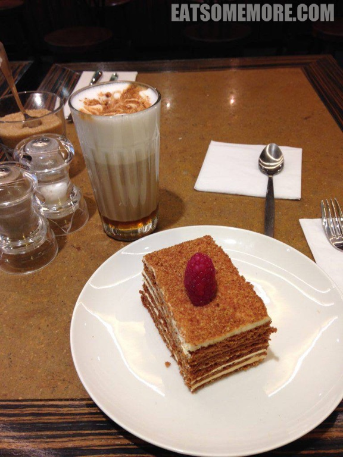

伦敦的soho地区有许多巷弄里的美食，其中有一间咖啡馆独特、活泼又美味，不论是朋友小聚、午间小憩还是情侣约会，都非常合适。

它的明星单品非榛果拿铁和蜂蜜蛋糕莫属。拿铁的坚果香、咖啡香和奶香都朴实而浓郁。蜂蜜蛋糕之于我，好像是温柔版的千层酥。它的外表那么朴素，味道却这样的惊艳。一层蜂蜜蛋糕一层奶油，如此反复多次的结合，竟是这样的香甜柔滑，温暖人心！

网站：https://letocaffe.co.uk/

地址：155 Wardour Street, London, W1F 8WG

营业时间：周日至周二 9:00 - 23:00, 周三至周六 8:00 - 23:00