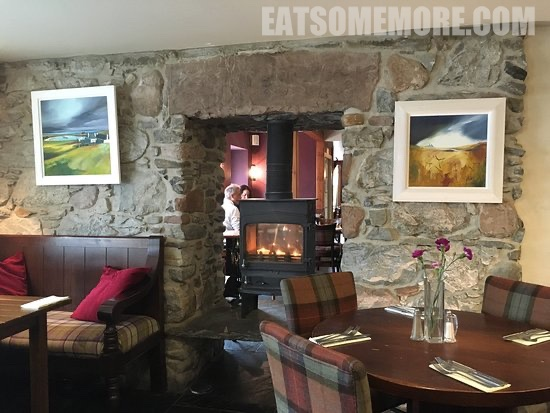
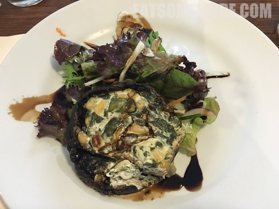
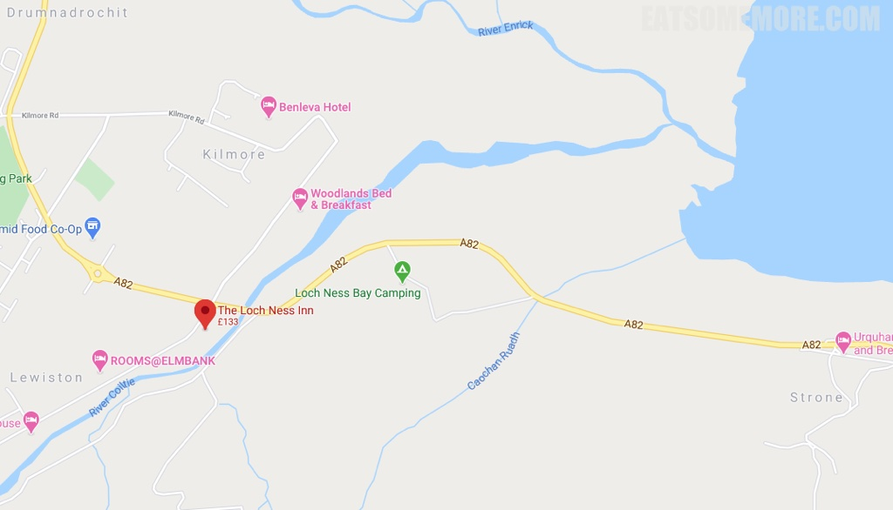

>Never know British food so tasty - The restaurant is 5 minute drive from the Loch Ness. It was clean, cozy and decorated with beautiful paintings of this region on the stone walls. The lunch set menu was of good value. My starter was portobello mushroom with cheese and salad. It was absolutely full of taste with the distinct scent of cheese, mushroom and pine nuts. All ingredients were fresh and contributing to each other's taste. My main was smoked salmon with vermicelli. It had an amazing Chinese oyster sauce taste in there. I love this restaurant!

>

>

网站：[https://www.staylochness.co.uk/](https://www.staylochness.co.uk/)

地址：Lewiston, Drumnadrochit IV63 6UW

