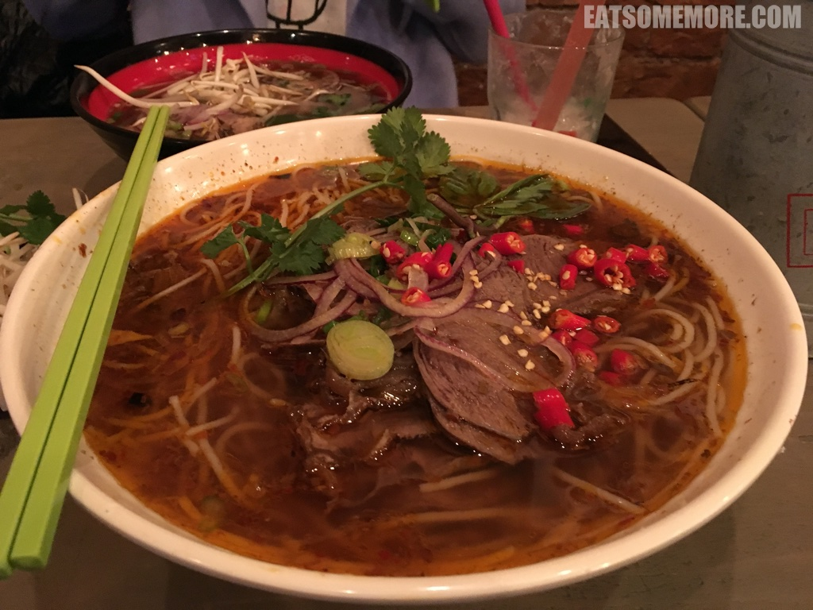

>做了许久心理斗争，我还是决定跟大家分享这家曾经我在伦敦最喜欢的越南米粉店。一间街角的小铺子，一推开门就有牛肉高汤的浓香扑面而来。我每次必点的 Pho Chin，也就是炖牛肉清汤宽粉。汤色看起来十分清澈，味道却甘鲜浓郁，汤头里还融合了柠檬草的香和洋葱的甜。炖牛肉切了片，肥瘦相间，鲜香可口。河粉入味的同时还带有筋性。那么大的一碗我都能吃完。可惜，最近这家的出品已经不复往昔。不知道什么时候，才能找回原来的好味道呢？

>顺化牛肉粉 Bún bò Huế 的口味更复合一些，融酸、甜、鲜、香、辣为一体。大号版本比普通版大好多。一开始米粉比较有嚼劲，豆芽菜爽脆，香菜和柠檬草清新。吃过一阵子后，粉和牛肉都变得软了一些，还吸了很多汤汁，入味非常。

>虽然河粉已经无法跟过去同日而语，但是饮品的产出还算稳定。钟爱榴莲的我当然会推荐这款Che Thai，椰汁当中加入榴莲、菠萝蜜、棕榈果和藻胶，清甜香滑。如果你正巧在附近，不妨来杯饮料，再碰个运气试试河粉恢复水平了没有。

地址：24 Evelyn St, London, SE8 5DG

