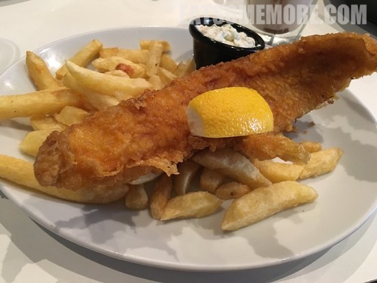

>苏格兰位于世界三大渔场之一的北海渔场附近，北大西洋暖流和东格陵兰寒流的交汇孕育了丰富的鱼产。在这里连炸鱼薯条都开起了“旗舰店”。除了炸鱼，餐厅还提供更健康的煎鱼选项，更有暖呼呼的杂菜炖汤和黄油面包。

>我的大炸鱼外表非常香脆，鱼肉鲜嫩。

>炸鱼的种类繁复，包括鳕鱼、线鳕、𩽾𩾌鱼等等。

网站：[https://mhorfish.net/](https://mhorfish.net/)

地址：75-77 Main St, Callander FK17 8DX

