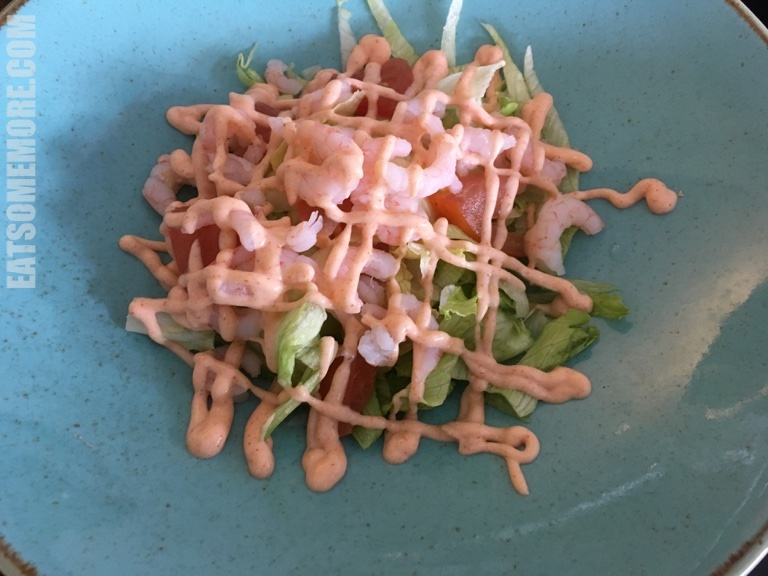
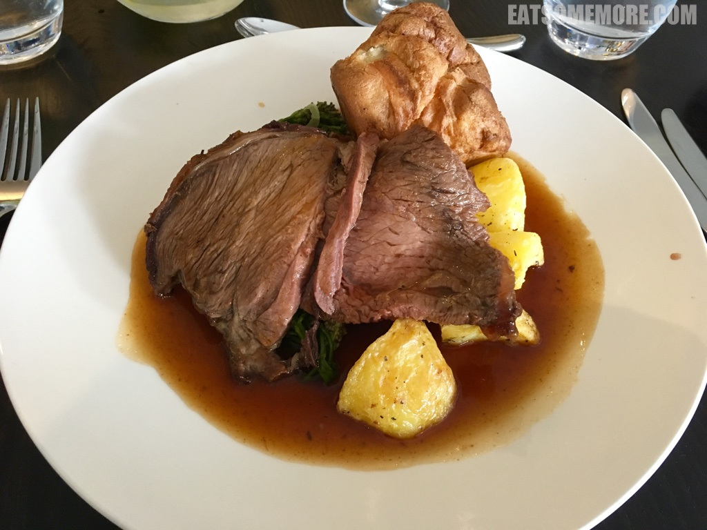
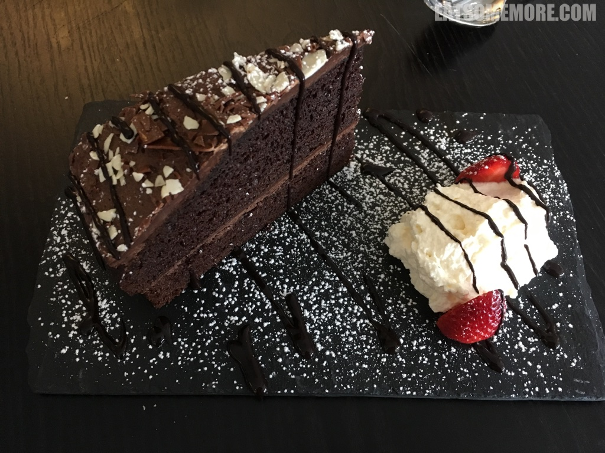
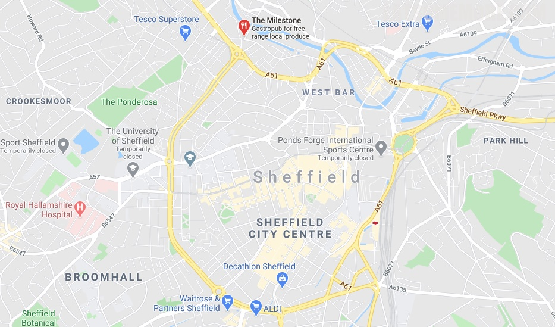

>鲜虾沙拉清新鲜甜。

>周日烤肉是英国的传统美食，由烤牛肉切片、烤西兰花、烤土豆、烤约克郡布丁配上肉汁而成。烤牛肉切片柔软鲜香肉汁四溢，西兰花饱有原味，土豆香甜，约克郡布丁的口感像极了咱们中国的油条。周日的饕餮享受。

>巧克力蛋糕搭配新鲜奶油和草莓，甜甜蜜蜜。

网站：[https://the-milestone.co.uk/](https://the-milestone.co.uk/)

地址：84 GREEN LANE, KELHAM ISLAND, SHEFFIELD, S3 8SE

