>安布尔塞德三面环山，一面临湖。置身这个山脚下的小镇，有种身在瑞士的感觉。

>大隐于此的是一间米其林一星的乡村菜馆旧章屋 (Old Stamp House)。

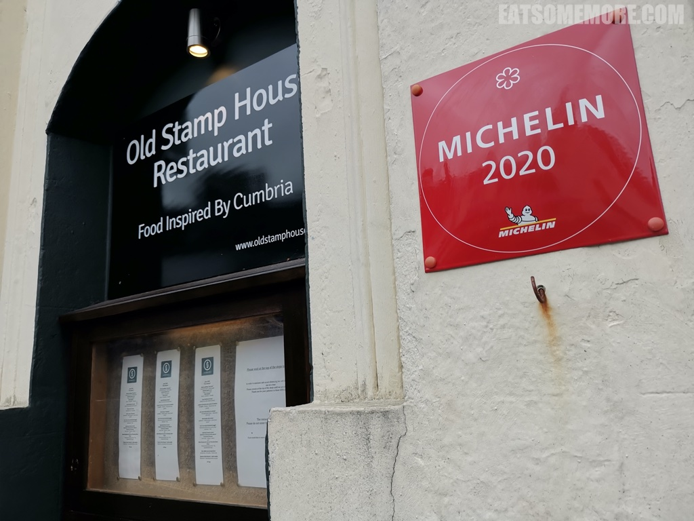

>外露的黑色木梁底下是凹凸不平的白色石墙、复古的玻璃灯罩、湖区的风景画、羊形铜塑和整整一墙的葡萄酒。与其说是下馆子，更像是在人家家里做客。

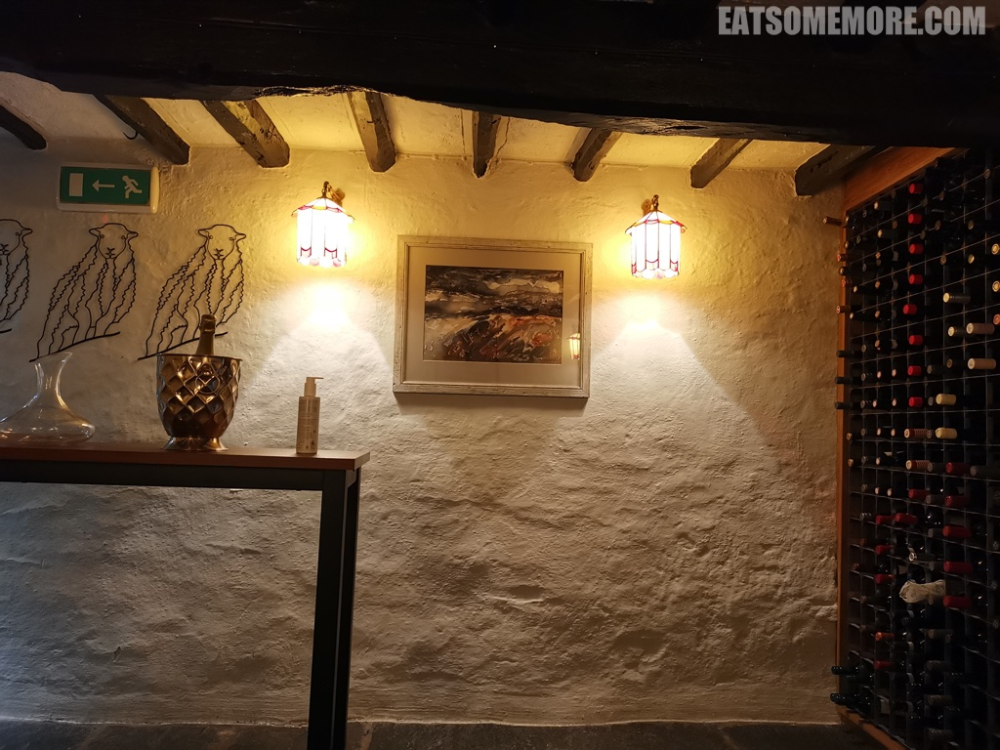

>坐下后，桌上有一封盖了戳的欢迎信，内附对菜品充满感情的详细解释。平板里面是餐厅的酒单。

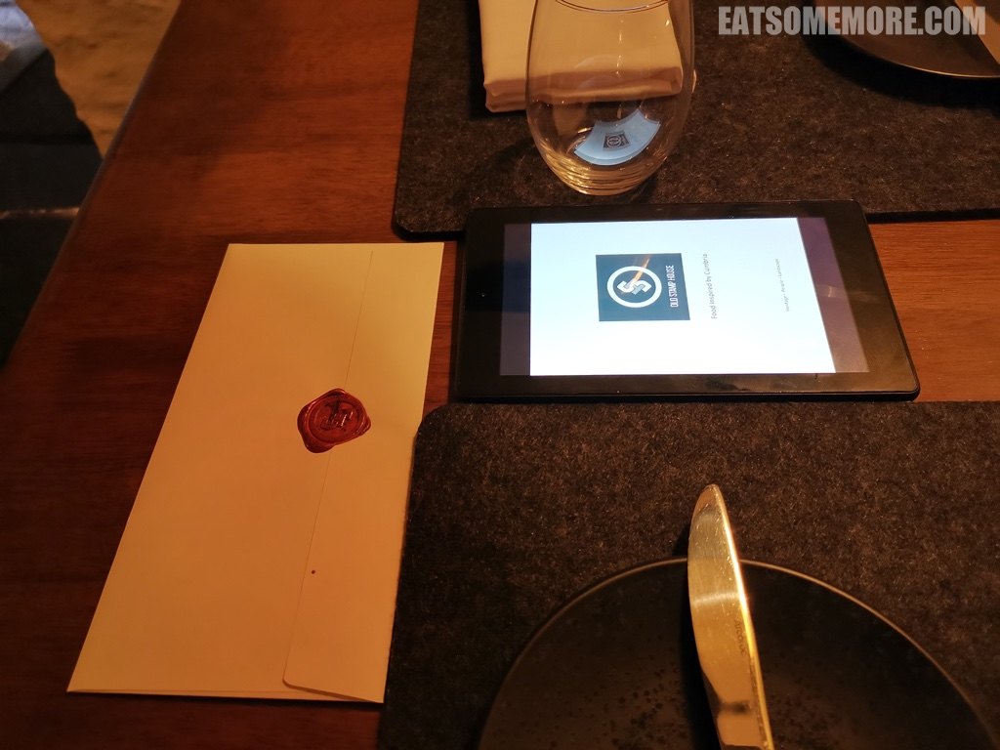

>来到湖区当然要尝一尝湖区鹰首酒厂 (Hawkshead Brewery) 生产的低温窖藏啤酒。入口清新冷冽，带有微苦的麦芽香味。

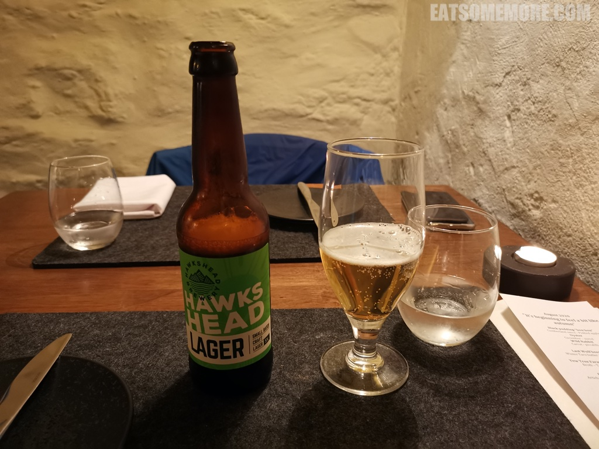

>首先上的是三样创意小点。

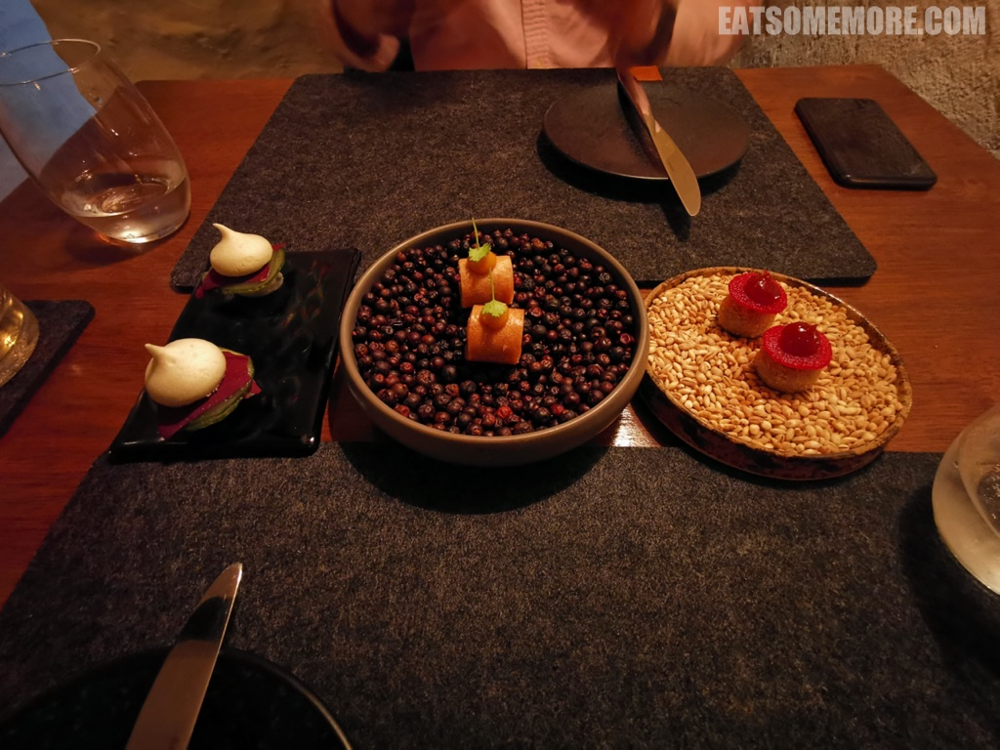

>黑布丁“夹心糖”，以血、内脏和碎肉肠为基础，搭配一片腌渍过的苹果上再挤上一点酸甜的昆布兰酱，是我吃过口味最清新的黑布丁。

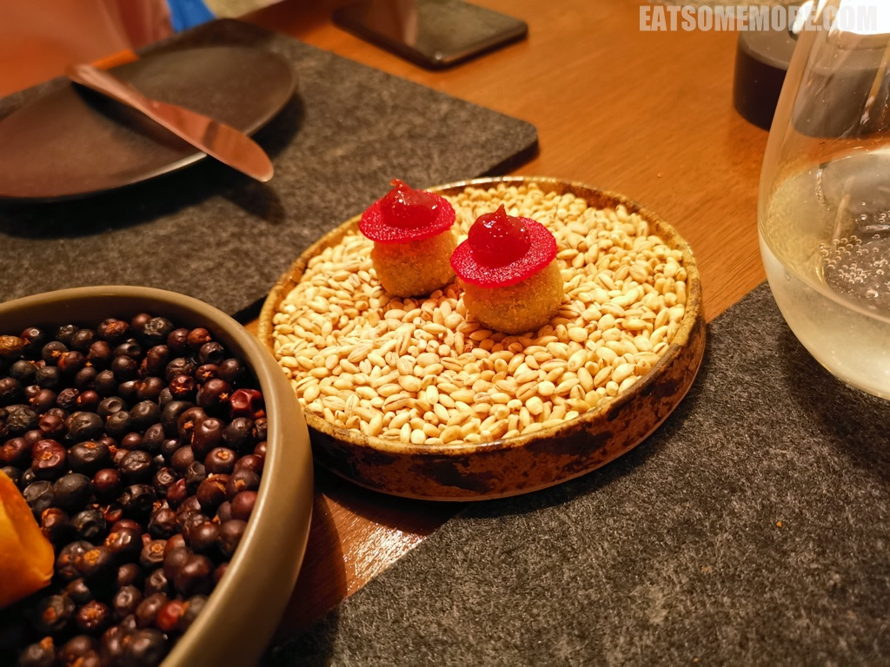

>慢炖昆布兰野兔后腿与甜渍胡萝卜脆皮卷，以香料芥末酱和香菜调味，兔腿一蹬就把我带去了暖风习习的南亚。

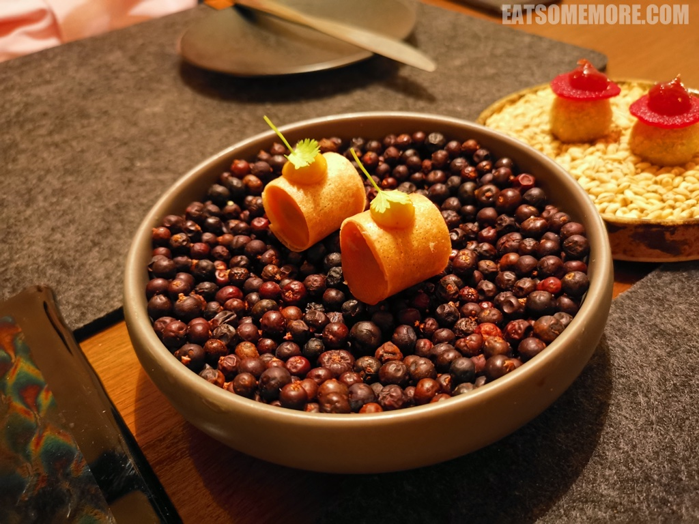

>这三样当中最特别的当属清甜的黄瓜蛋白脆饼夹着甘鲜的蚝酱和略带刺激味道的腌黄瓜和蝴蝶酸模，多层次的味道鲜明又和谐。

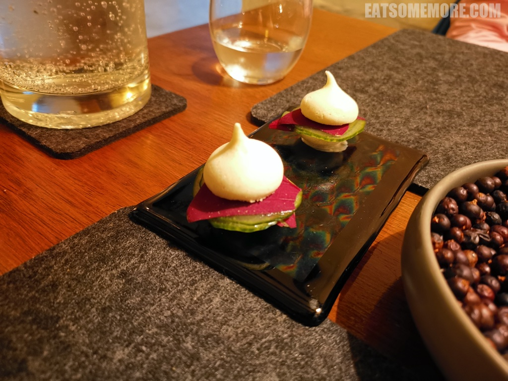

>接着上桌的是我至今吃过最好吃的餐前面包，由品牌麦芽果仁面粉和卡特梅尔“最后的狼”（一种本地的红棕色艾尔啤酒）制成，不仅表皮出类拔萃的酥，海绵状部分较其他面包更为紧实湿润，还具有浓郁的麦芽、水果和巧克力的香气，看似平平无奇，却出其不意地惊艳了味蕾。

>距离餐厅大约五英里处的紫杉农场，放养着昆布兰山区体格强健、屡获殊荣的本地草原绵羊 (Herdwick hogget)。餐厅利用这种羔羊的不同部位，制作了一组羊肉三吃。木勺里乘的是以少许咸香蒜酱和酸甜腌野蒜籽调味的羊排塔塔。这生羊肉竟然毫不腥膻，反而从咀嚼当中生出奶香鲜甜的滋味。陶盘上则摆着先慢炖、薄裹粉、再油炸的羔羊胸部肉丁，又香又酥，再以薄荷解腻、鳀鱼酱提鲜，口味复合，非常好吃。

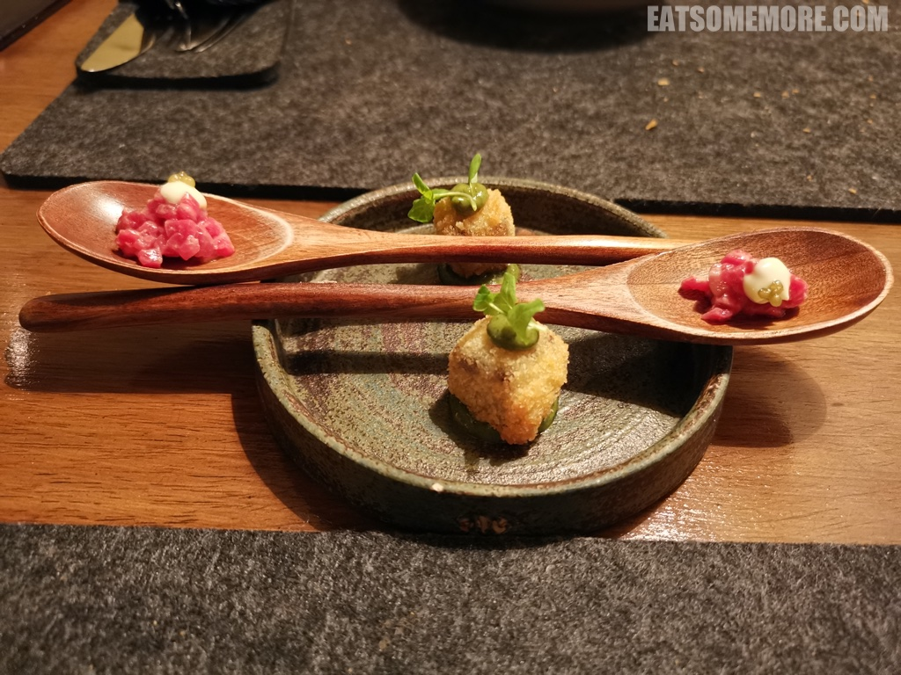

>清汤马德拉酒慢炖羊肩，软而不烂，醇香馥郁。腌渍过的野蒜籽和紫甘蓝丝恰到好处地增添了些清新爽口的味道。

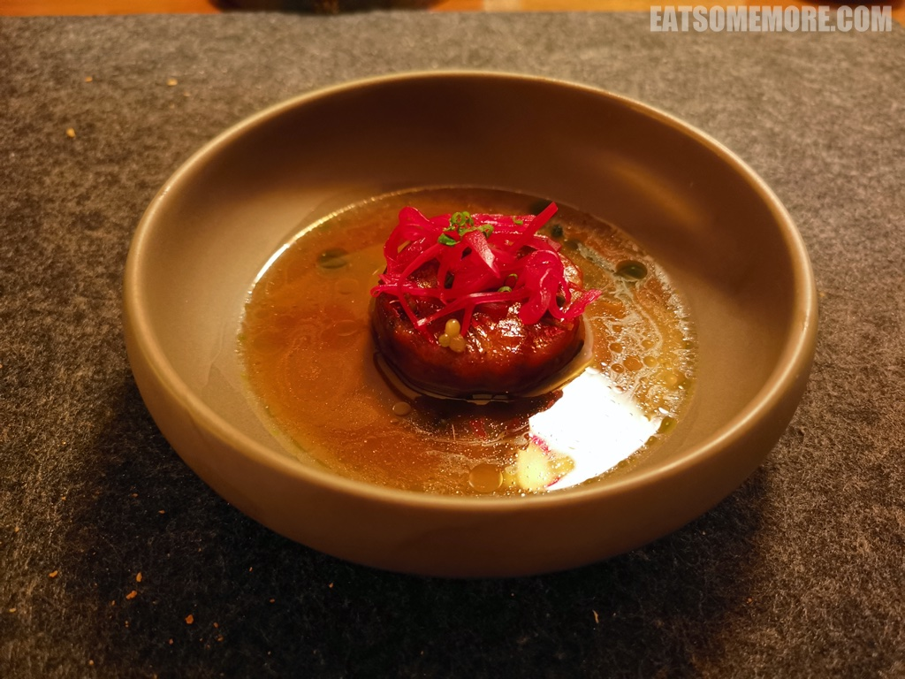

>羽衣甘蓝被炸出了海苔的意思，下面的哈特尔浦现捕鳕鱼鱼排被烤得将将断生，表皮金黄，使用加入了烟熏科尼斯顿水域狗鱼籽的白奶油酱和腌菜蓟酱调味，鲜得层次分明。

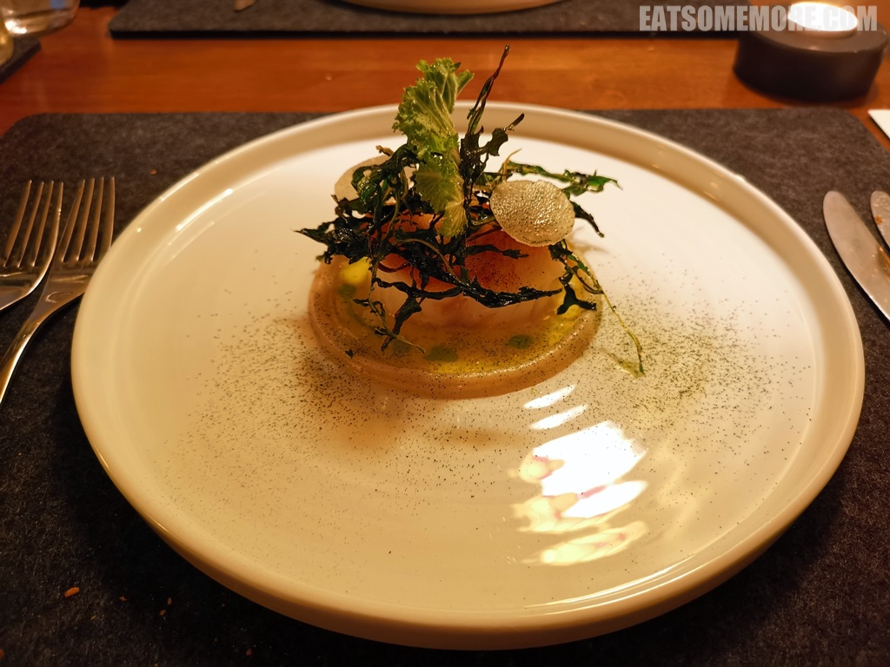

>奥尔斯顿湿地季节限定的松鸡两吃：在洒满鲜刨松露的菌菇馅意大利馄饨的左边是煎得半熟的鲜嫩鸡胸，右边则是烤得香喷喷又有弹性的鸡腿。更厉害的是，看似普通的根芹酱很好地中和了松鸡的野味。吃完这一道菜，心里全是对大自然的感恩和敬畏。

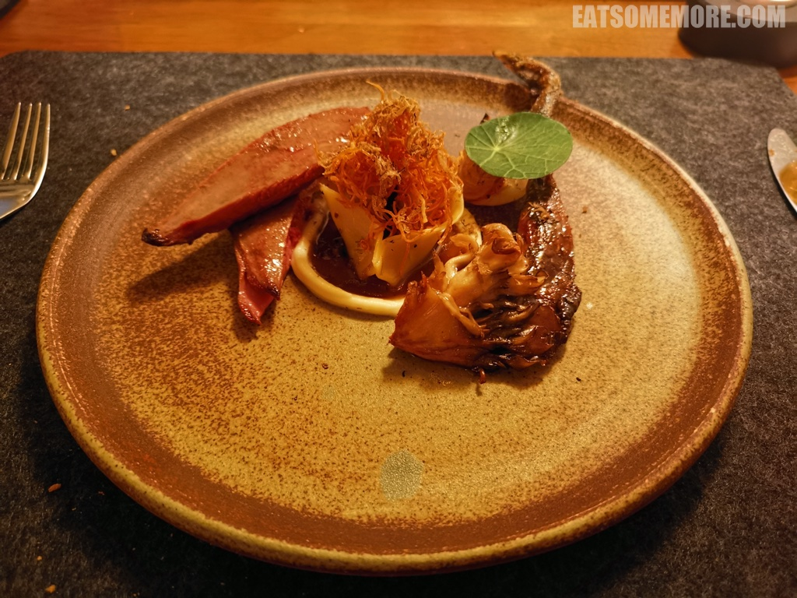

>以昆布兰姜饼为底的焦糖朗姆卡仕达塔柔软香甜，通过黑莓和黑莓酱的桥梁，过渡到插着脆薄姜糖片的黑莓冰沙，酸甜灵动，齿颊留香。

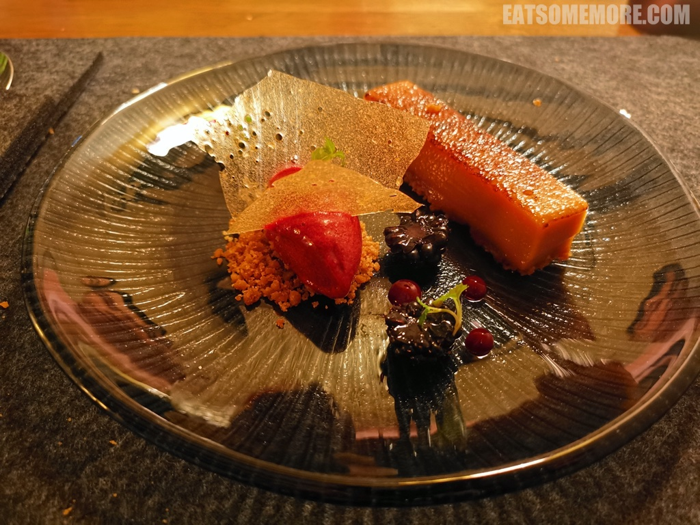

>。

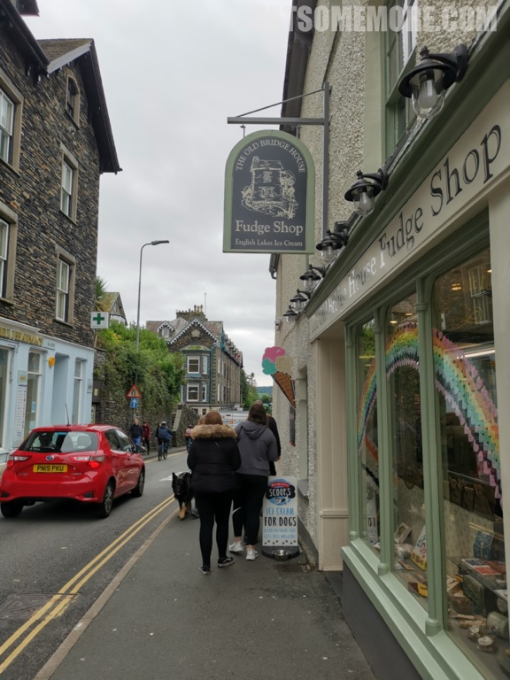

网站：[https://www.oldstamphouse.com/](https://www.oldstamphouse.com/)

价格：午市主厨套餐 £45。

地址：CHURCH STREET, AMBLESIDE LA22 OBU

