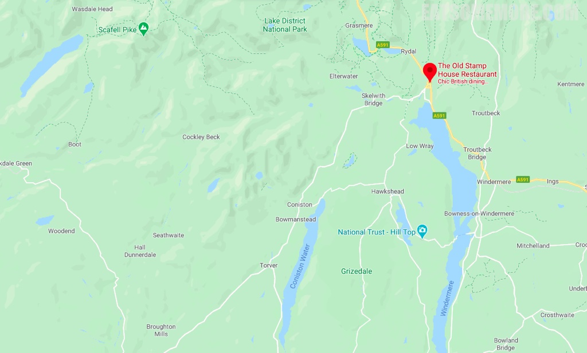

>。

>。

>。

>。

>。

>。

>black pudding "bon bon" - cumberland sauce - puckled apple。

>slow braised wild Cumbrian rabbit haunch, wrapped in brick pastry - served with sweet pickled carrot, piccalilli puree and coriander。

>cucumber meringue, pickled cucumber, oyster emulsion and butterfly sorrel （酸模，又名蕦、薞芜，蓼科多年生草本植物，欧洲和西亚大多数的草原均可见到其踪迹。酸模含有丰富的维他命A、维他命C及草酸，草酸导致此植物尝起来有酸溜口感，常作料理调味用。酸模亦具药用价值，有利尿、发汗、行血等功效。）

>bread make from Carrs malted seeded flour and last wolf beer brewed by Peter Unsworth in Cartmel - handmade butter made by Jeremy Jackson at winter tarn dairy at Crosby Rravensworth。

>Yew Tree Farm Herdwick hogget - Herdwick is a species of sheep that is native to the Cumbrian fells, ours is supplied by John Watson who farms at Yew Tree farm located 5 miles from the restaurant. The loin is served as a tartare and garnished with garlic puree and puree and pickled wild garlic capers. The breast which has been slow cooked and breaded then fried which is known locally as a scrumpet, served with a mint and anchovy emulsion.

>Slowly braised shoulder glazed in the braising stock. The garnish on the shoulder is pickled garlic capers and red cabbage, and the clarified stock seasoned with Madeira and then clarified. 。

>roasted cod loin sourced from the day boats fishing from Hartlepool - pickled artichoke puree - kale crisps - smoked pike roe from Coniston lakes in classic beurre blanc sauce。

>alston moor grouse - truffle freshly grated over the cep puree tortellini - celeriac is made into a putee and shredded and crisped。

>rum tart - brambles (blackberries) + gel and sorbet - caramelised rum custard on cumbrian gingerbread as a base。A tuile was made from the gingerbread trim.

>。

网站：[https://www.oldstamphouse.com/](https://www.oldstamphouse.com/)

价格：午市主厨套餐 £45。

地址：CHURCH STREET, AMBLESIDE LA22 OBU

