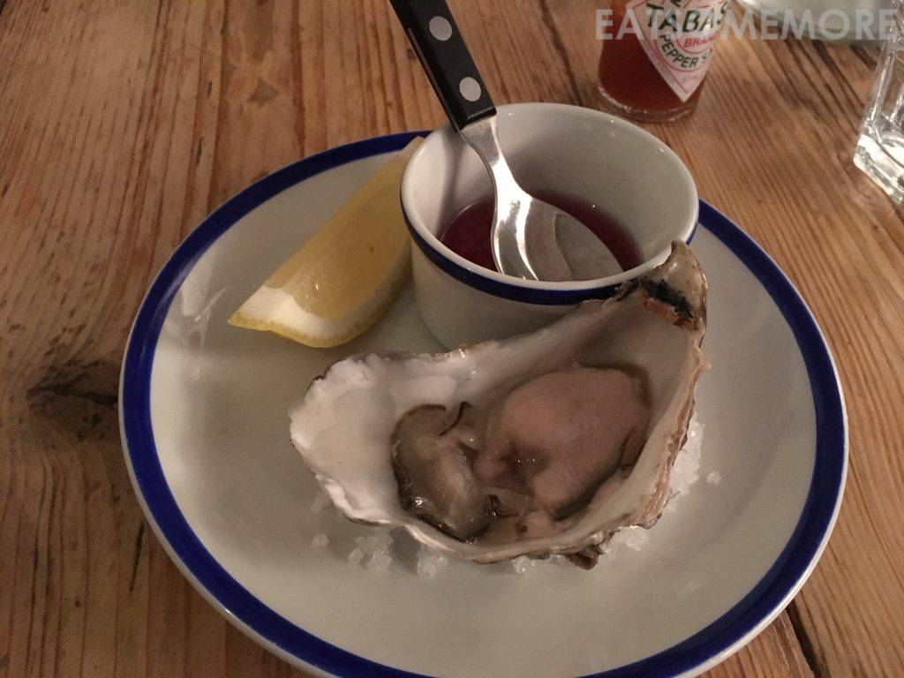
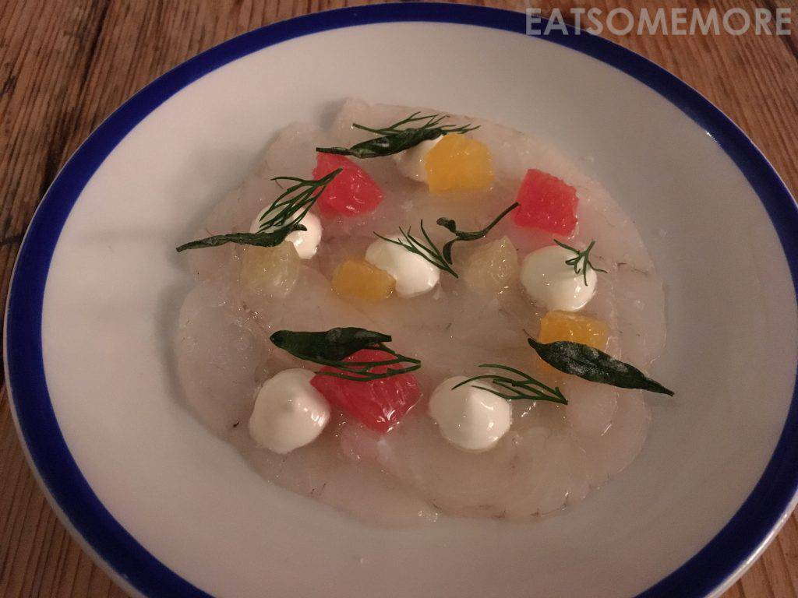
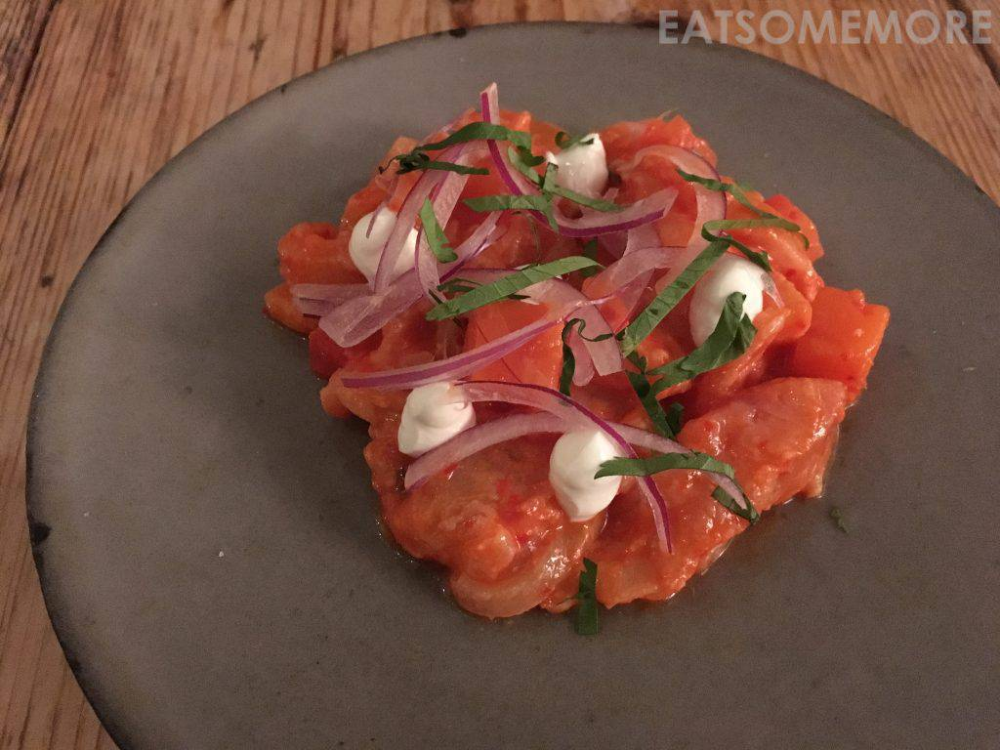
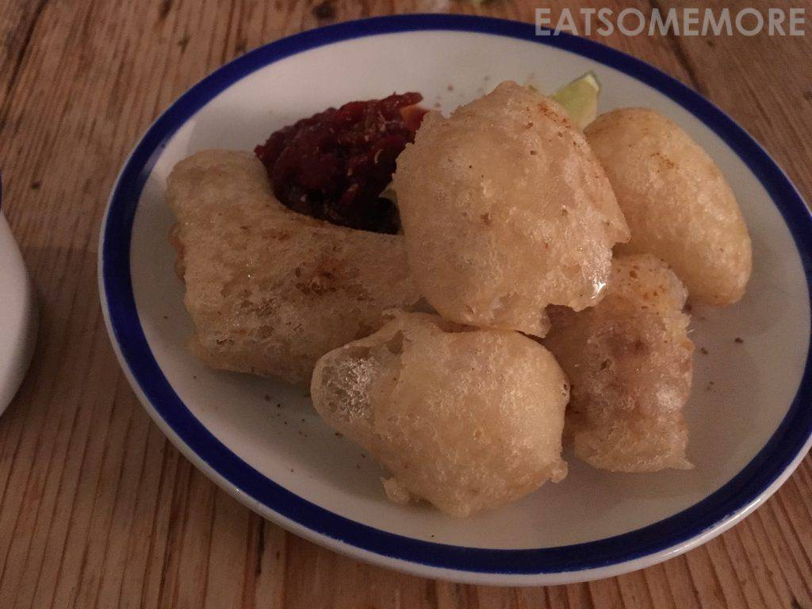
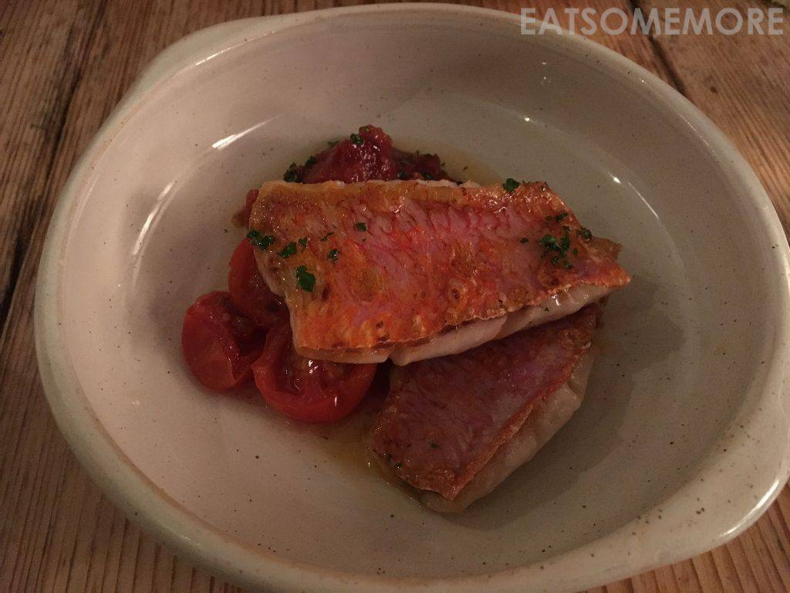
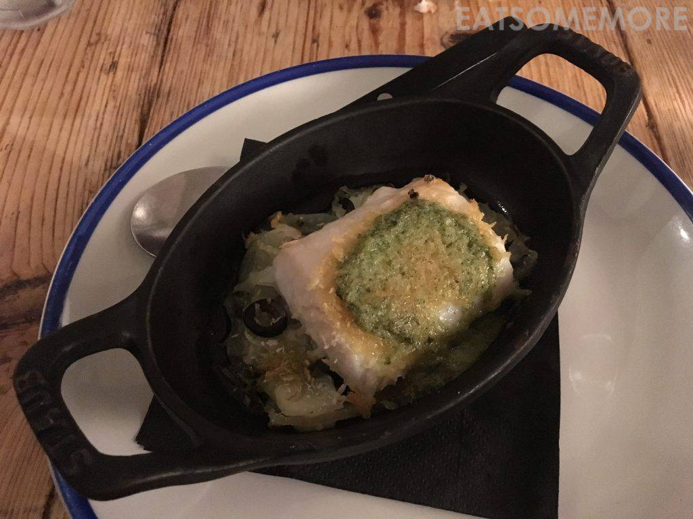
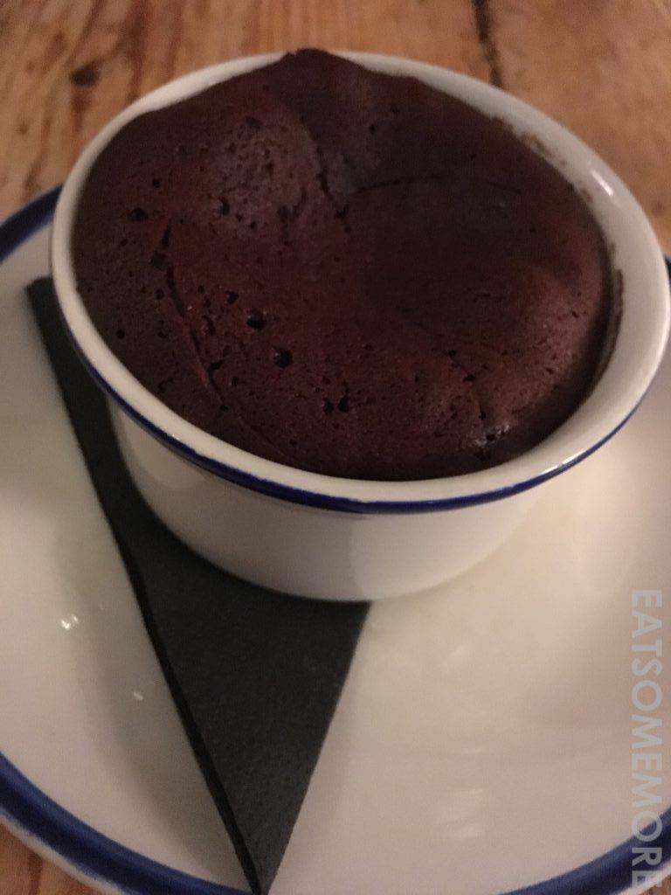

>港口边的米其林一星海鲜餐馆，大约只能容纳不足十桌客人，高朋满座，只能约上将近9点的时间。

>坡西里生蚝之肥美到了惊人的程度。蚝肉饱满圆润，混着海水和鲜挤柠檬汁，软糯柔嫩的鲜甜滋味带着奶香在嘴里且爆发且氤氲，好吃得首屈一指！

>酸种面包点了烟熏鲭鱼黄瓜酱，是最有海味的餐前小点。

>菱鲆佐橙丁及酸奶油，带有果味的鱼生口感脆声，是前所未有的清新体验。

>柠汁腌乌鲻，拌上西红柿、红薯、洋葱丝和酸奶油，味道鲜美而又层次分明。

>脆炸魣鳕块配辣酱，既新鲜又接地气。

>酥炸鲽鱼配墨西哥辣椒蛋黄酱和腌菜，香酥不油腻。

>香煎红鲻把海鱼做出了河鱼的细腻鲜香。

>焗烤无须鳕搭配龙蒿牛油、茴香及黑橄榄，肉质弹牙，味道丰富。

>草莓布丁杯，由新鲜草莓、奶油和草莓果冻层层堆叠而成。

>巧克力苏芙蕾，表面酥软、内里柔滑，口感层次丰富，巧克力香浓郁。

网站：[https://nathan-outlaw.com/restaurants/outlaws-fish-kitchen/](https://nathan-outlaw.com/restaurants/outlaws-fish-kitchen/)

地址：1 Middle Street, Port Isaac, Cornwall PL29 3RH

