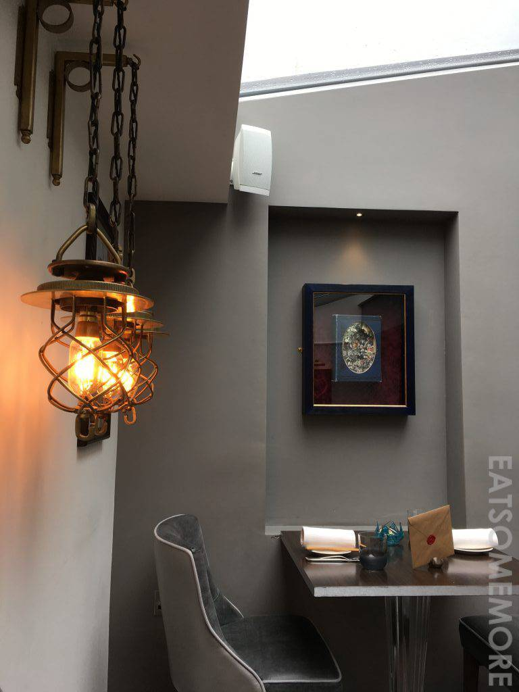
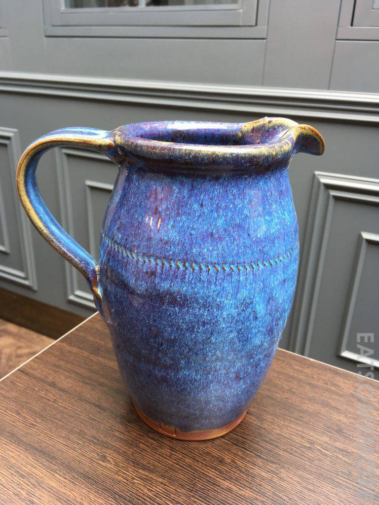
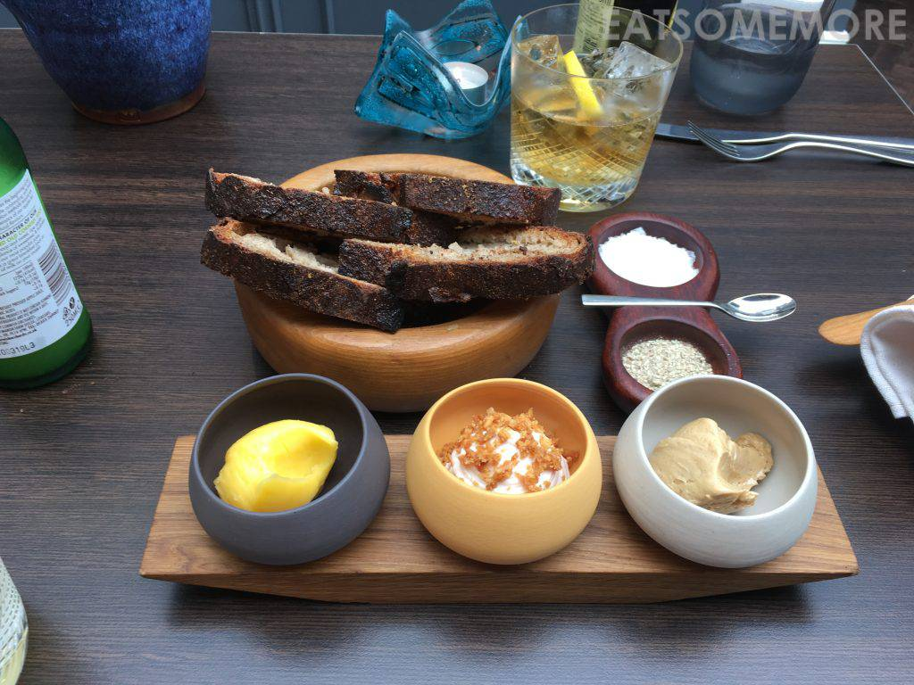
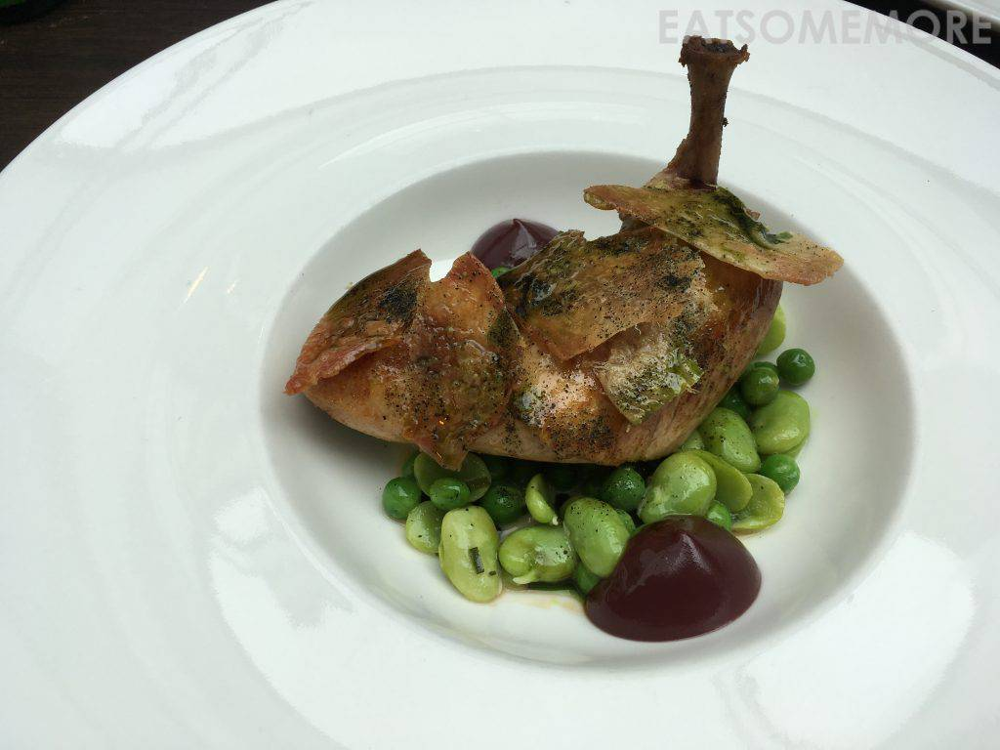

>我们到了餐厅所在的小镇Padstow，才发现它好可爱，巷弄纵横交错、街道热闹繁华。虽说这同时意味着在这里停车并不容易，但从停车场步行至餐厅的十分钟路程，常常有趣得教人迈不动腿脚，实乃不虚此“停”。

>餐厅的陈设又漂亮又别致。

>酸种面包带着焦香味，可以搭配原味黄油或者焦糖奶油，带出最棒的脆度、软度、韧度和湿度。

>奶油菊芋烟熏线鳕浓汤，以香草奶油鲟鱼子酱提味，又与脆饼的口感相得益彰。

>香蒜烤鸡皮脆肉嫩、香气四溢，搭配酸甜梅酱和清新的豌豆甜豆，田园风味淋漓精致。

网站：[https://www.paul-ainsworth.co.uk/](https://www.paul-ainsworth.co.uk/)

地址：6 Middle Street, Padstow, Cornwall PL28 8AP

