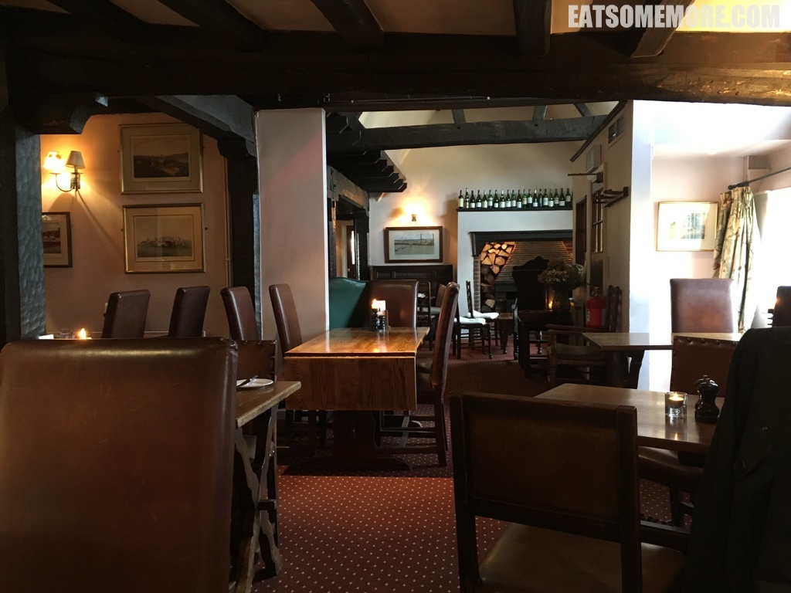
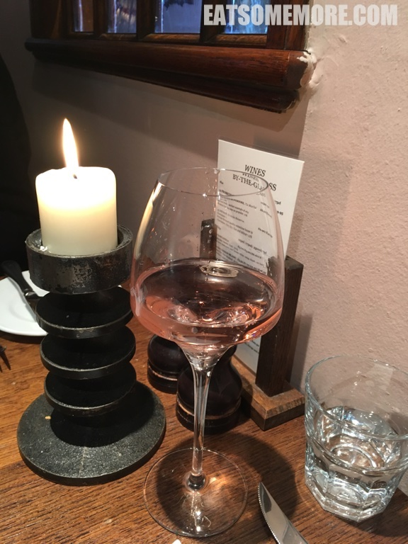
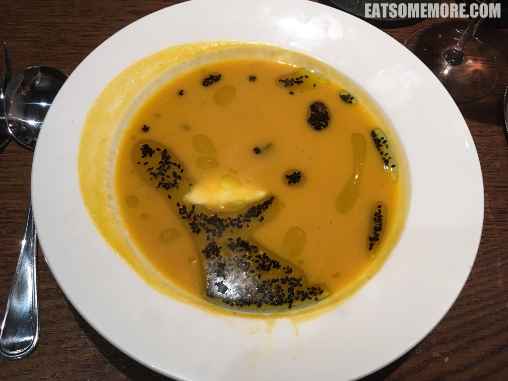
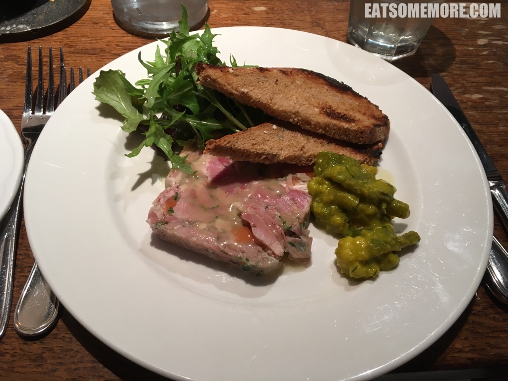
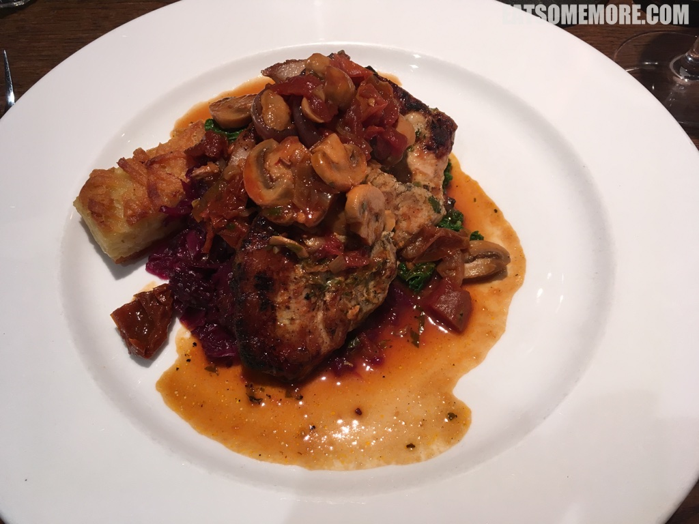
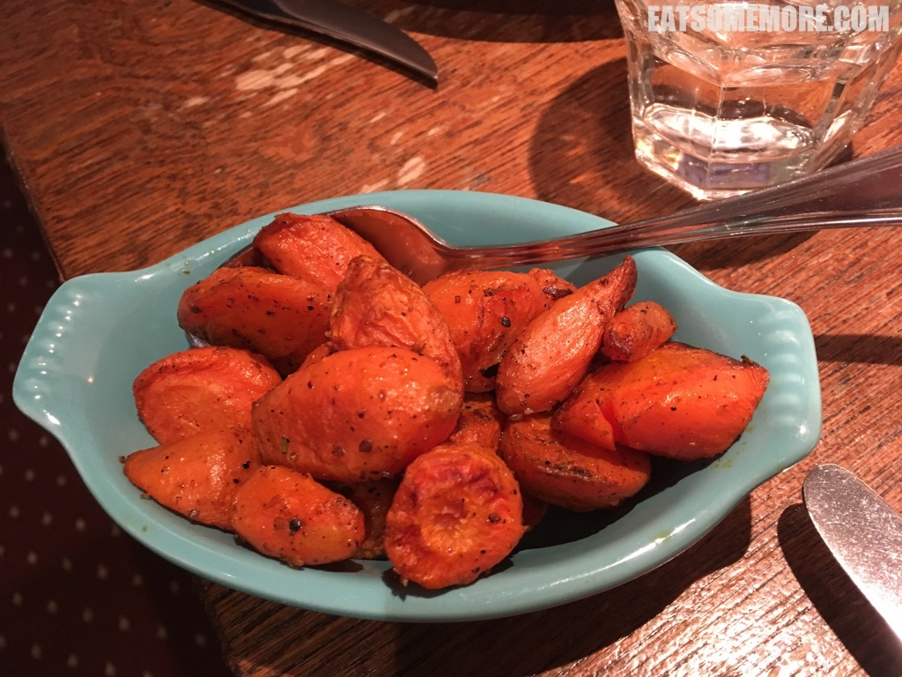
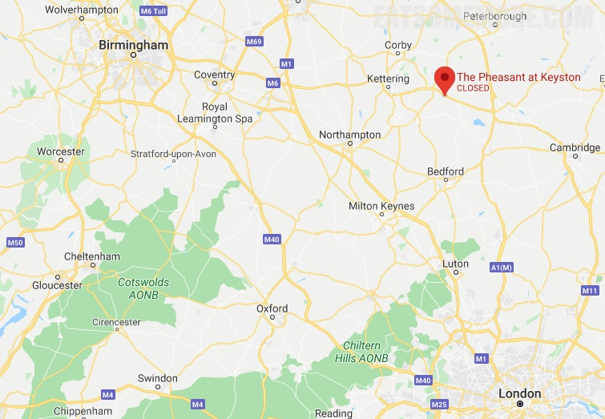

>米其林餐馆评审员在世界各地穿梭于高级餐馆寻味的同时，也在寻找地道的超值餐馆，所以指南中开辟了这个类别。1955年起，米其林指南通过必比登美食推介类别，推荐许多价格大众化、但呈现高品质美食的餐馆。

>

>乍暖还寒时候的一碗胡萝卜姜汤，最合适最温暖最难忘。胡萝卜鲜甜、生姜辛温，搭配鲜奶油甘滑、黑芝麻香润，滋味丰富美妙、暖身暖心。

>Ham hock terrine with piccalilli and granary toast

>Pork chasseur with potato rosti and braised red cabbage

>roast carrots

网站：[http://www.thepheasant-keyston.co.uk/](http://www.thepheasant-keyston.co.uk/)

价格：周二至周六午餐定食£14.95起。

地址：Huntingdon, Cambridgeshire, PE28 0RE

