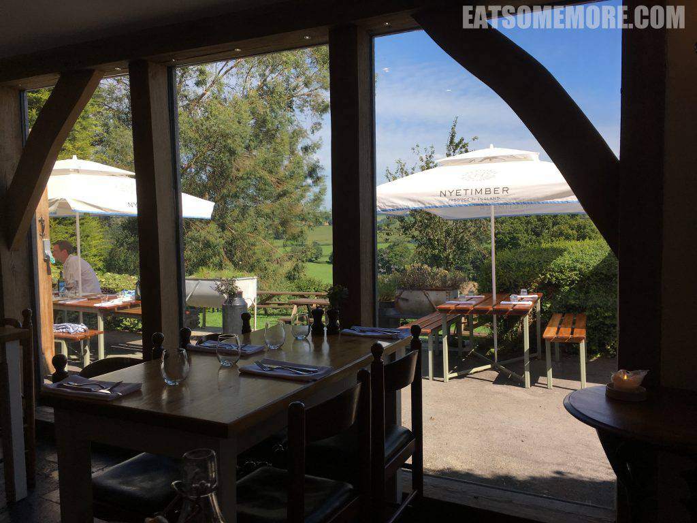
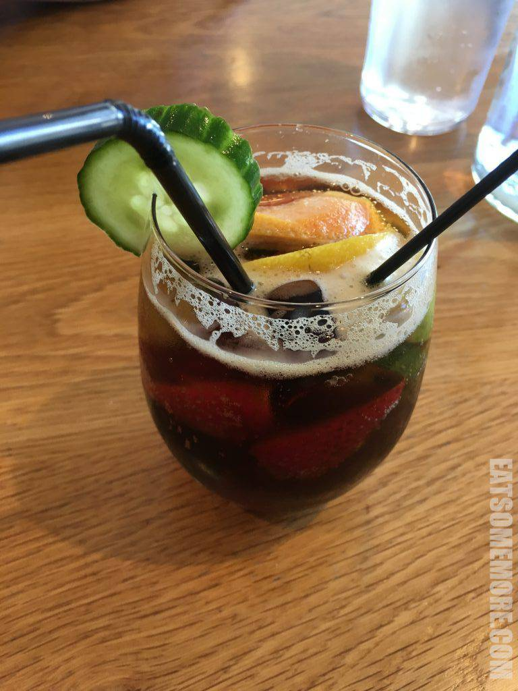
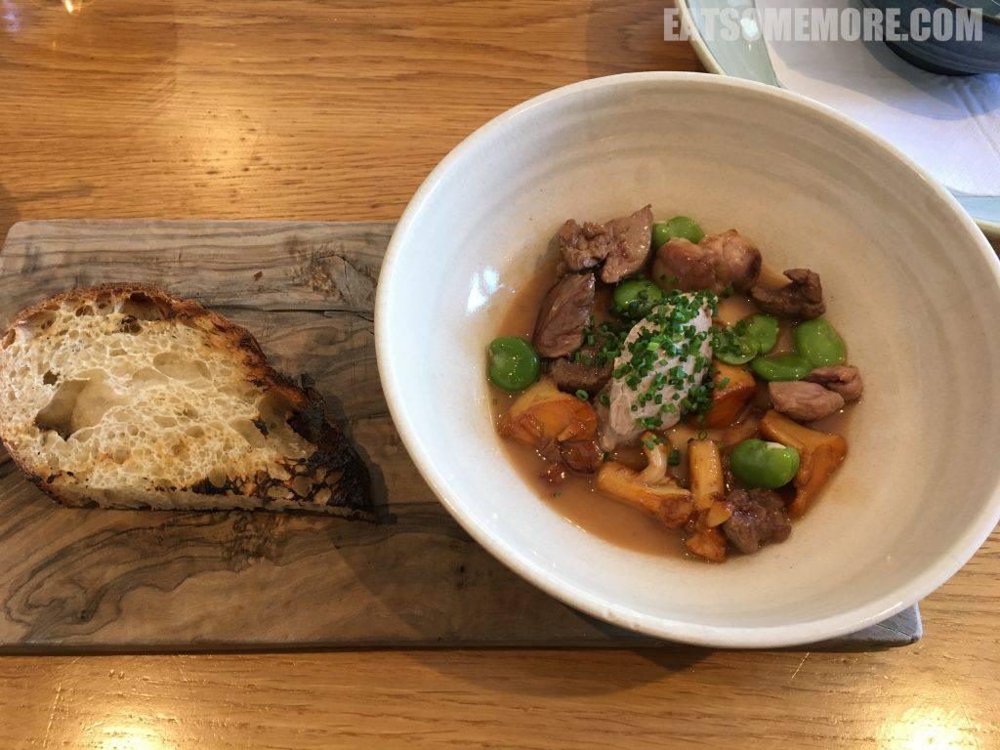
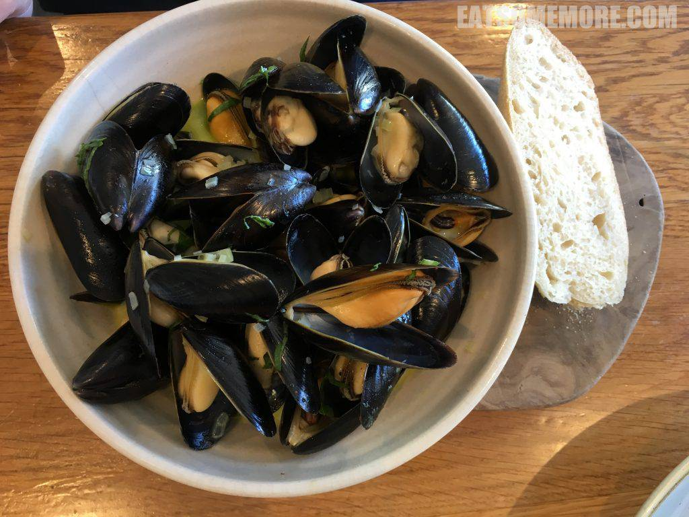
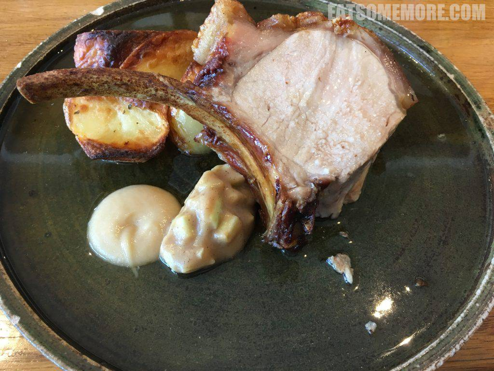
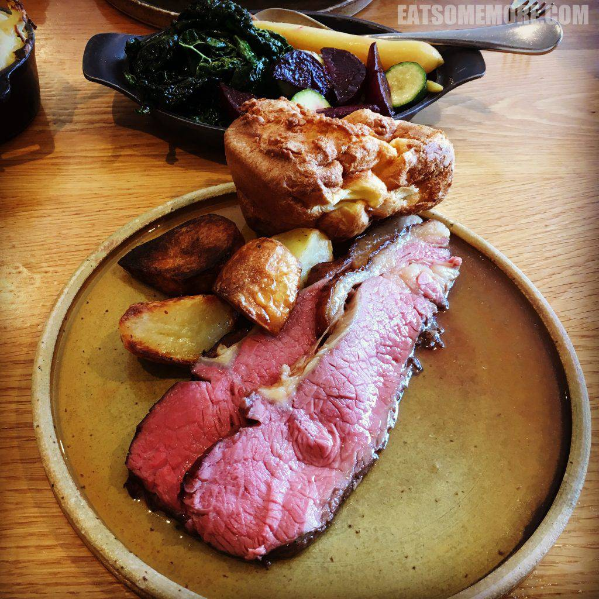

>乡村山野间的米其林一星餐馆，结合了梁柱外露的爱德华风格和现代的大落地窗，门外良田千亩，屋里美食飘香。

>英国夏季调酒的标志——皮姆酒，以杜松子酒为基底，混上柠檬汽水，加入黄瓜、草莓、橙、柚、柠、柑及薄荷叶，清爽的果味与烈酒的醇香碰撞出了这独数英伦的夏天味道。

>米其林餐厅的猪下水口味还是很重，但是一起炖煮后的黄菇和蚕豆却异常鲜美。

>淡菜之美在新鲜也，肉质之嫩在火候也，海味之得宜，假欧当归草本清新及苹果酒芬芳香醇，汤浓味鲜之盛，亦可沉鱼落雁。

>烤猪排搭配洋葱和苹果泥，这种蔬果与油脂的结合，突出了食材的香甜滋味。

>我的主菜是干式熟成生烤牛里脊。根据维基百科，干式熟成的牛肉是吊挂且经过几个礼拜接近〇摄氏度温度风干后的牛肉。干式熟化主要是以两种方式来改变牛肉肉质——第一，水分从牛肉的肌肉组织内蒸发出来，使得牛肉的风味更加集中；第二，牛肉本身的天然酵素会打破肌肉内的结缔组织，软化肉质。一试之下确实如此，肉质软嫩、滋味丰富。科技使人进步，使花园进步，也使美味更进一步呢！

网站：[https://www.theponyandtrap.co.uk/](https://www.theponyandtrap.co.uk/)

地址：Newtown, Chew Magna, Bristol, BS40 8TQ

