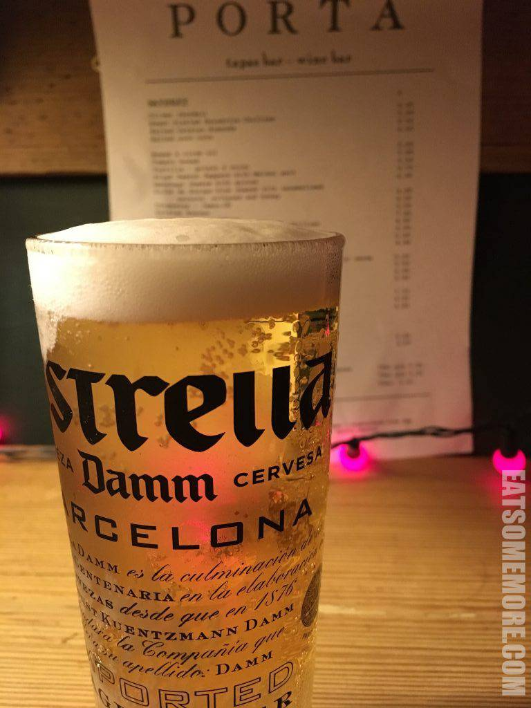
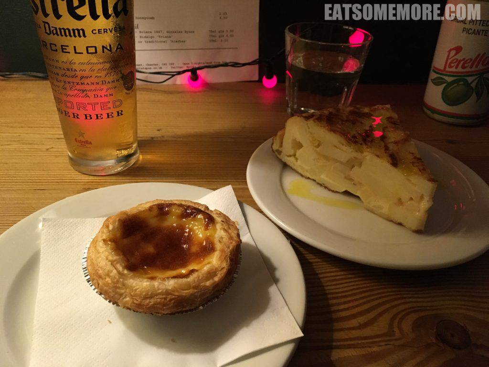
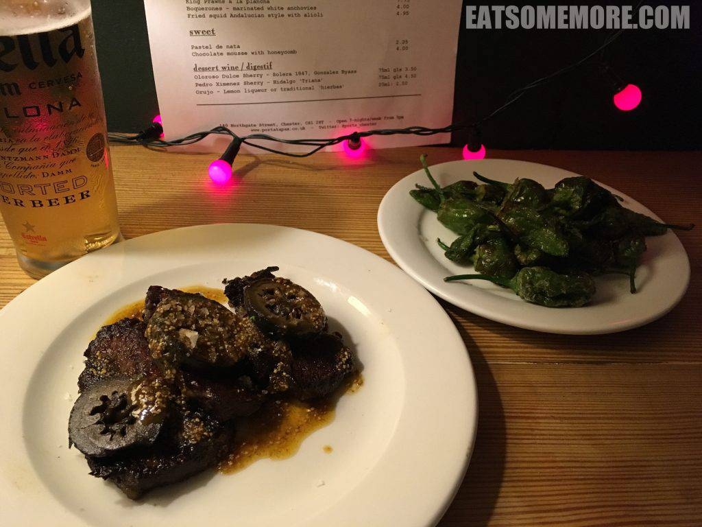
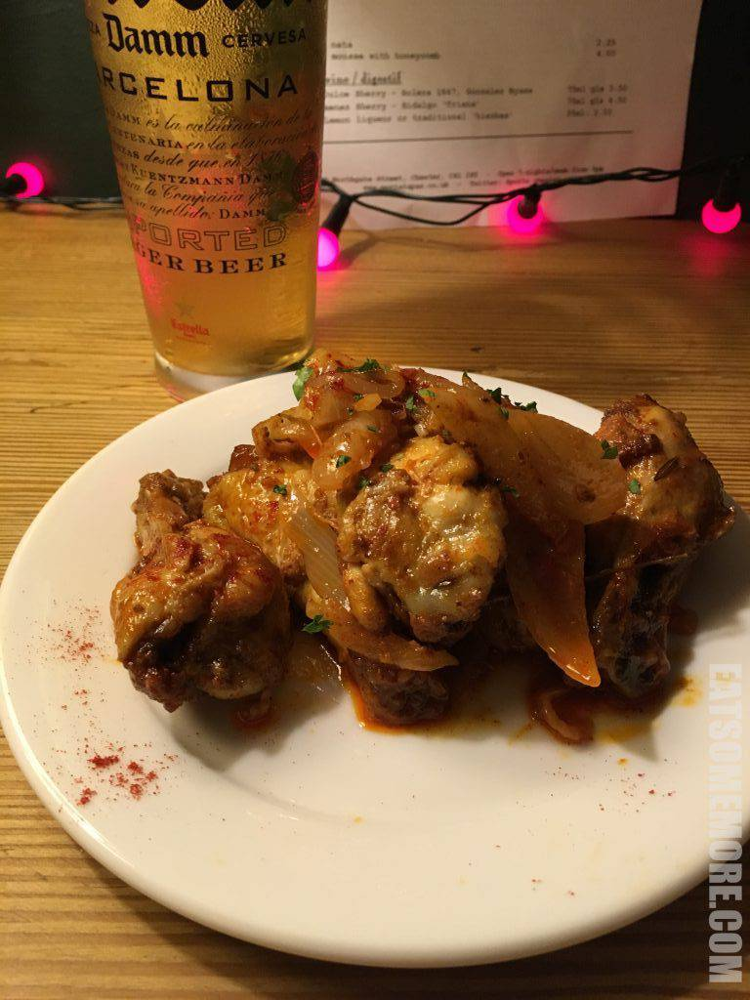
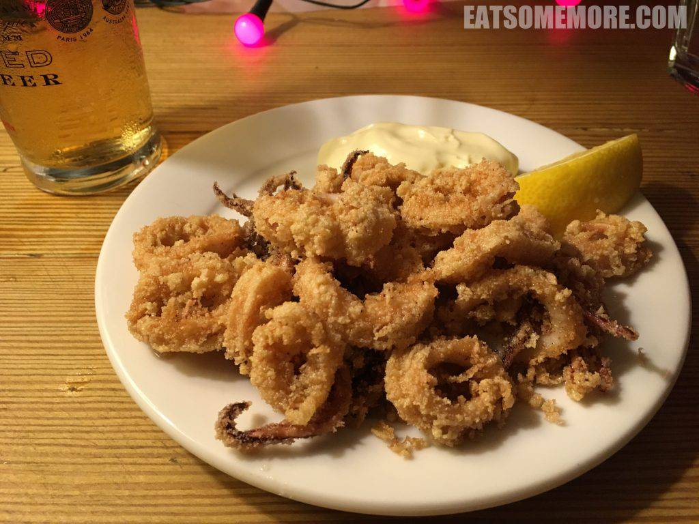
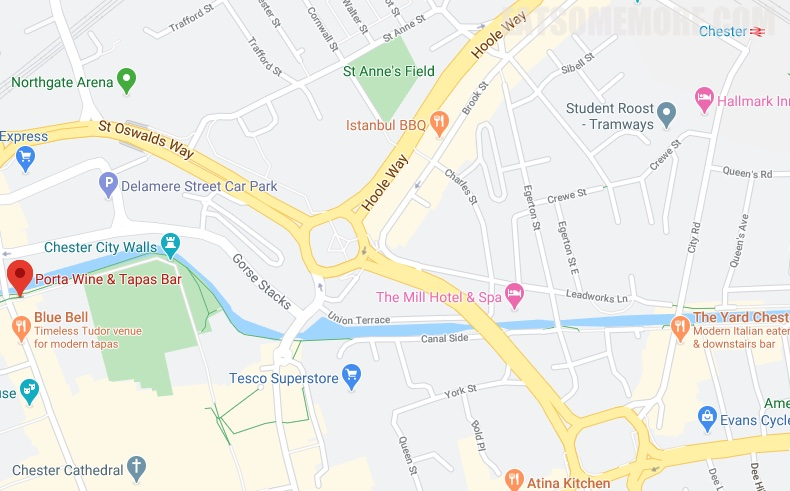

>这间米其林推荐的西班牙小菜馆的金星窖藏啤酒，酒体清澈，尾调似蜜，花果余韵，酯香清新，据说被称为“香槟啤酒”。

>蛋挞冷冷的，蛋味不浓郁，甜味却很重。西班牙鸡蛋土豆饼上淋了橄榄油，是一种亲民的美食。

>香煎牛脸，浓油赤酱的好味道。油煎青椒撒上粗海盐粒，油的香气、椒的清甜、盐粒的口感和谐地结合在一起。

>甜辣翅根，好吃但稍嫌一般了些。

>椒盐鱿鱼圈，外酥里嫩，脆弹鲜香。

网站：https://www.portatapas.co.uk/

地址：140 Northgate Street, Chester, CH1 2HT

