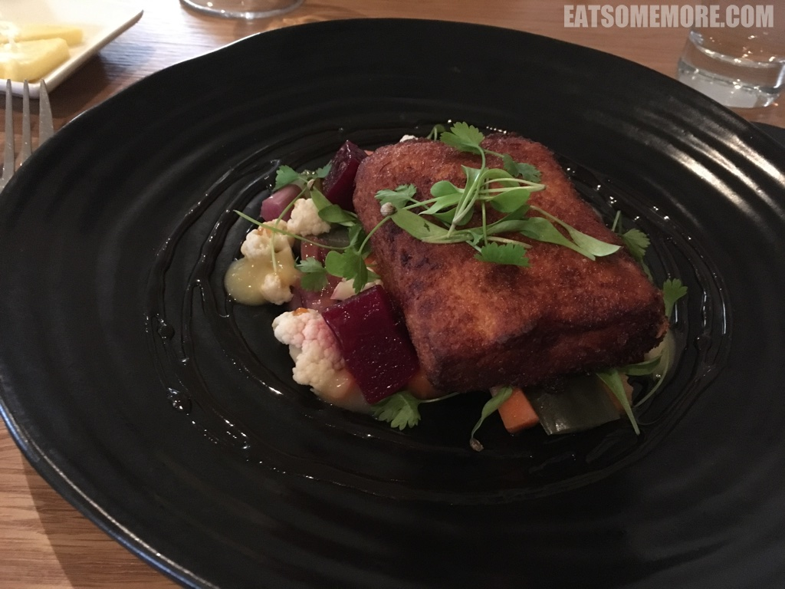
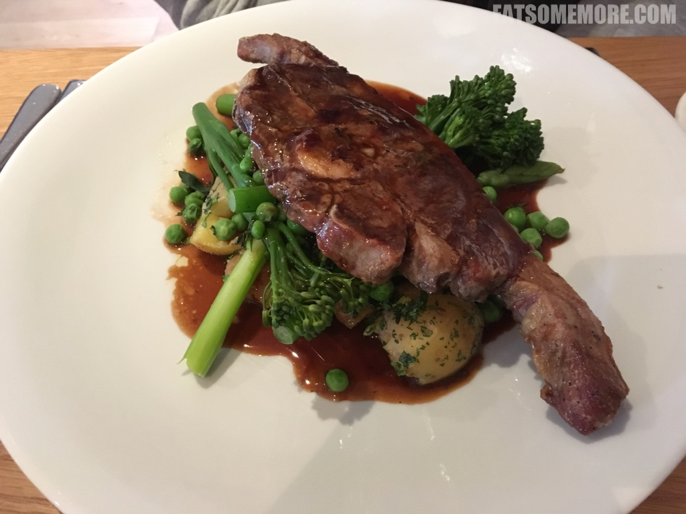
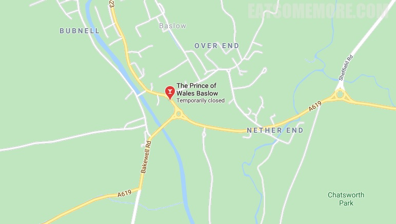

>这间威尔士亲王餐厅实际上位于德比郡峰区附近的巴斯洛，是米其林指南推荐的餐厅，并蝉联四年的猫途鹰 Tripadvisor 网站卓越奖。前菜的分量和品质都很叫人惊艳。

>红烧和清蒸的肘子都吃得多，而脆皮肘子却是第一次遇见。这种酥脆与软糯的结合，加上油花的甘甜、瘦肉的鲜香，完完全全满足了肉食者的最高追求。

>香煎鳕鱼块搭配水煮时蔬。

>煎牛排咸鲜香嫩。

网站：[https://princeofwalesbaslow.co.uk/](https://princeofwalesbaslow.co.uk/)

地址：Church Lane, Baslow, Bakewell, DE45 1RY

