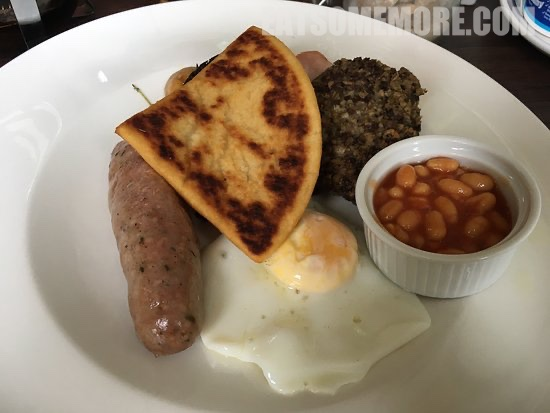

>We stayed at Raasay House for one night. 

>The selection was quite diverse for dinner, including scallop, mussels, cod etc. The seafood was not as fresh as I expected, however was prepared delicately. My favourite was the mushroom soup (full of tasteful mushroom taste) and sweet potato chips. The breakfast did not offer much choice, but still offered comfort food.

>

>

>

>

>

>

网站：[https://www.raasay-house.co.uk/](https://www.raasay-house.co.uk/)

地址：Isle of Raasay, IV40 8PB

