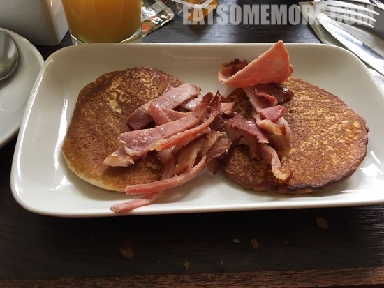

>高地尽头与斯凯岛之间，有一个拉塞小岛。拉塞岛上有一座拉塞屋。

>酒店的晚餐选择丰富。虽然海鲜没有想象当中的新鲜，但是烹调和呈现方式还是很精致。我最喜欢的一道菜是充满蘑菇味的蘑菇浓汤。

>咸香的煎培根搭配甘鲜的油封扇贝。

>奶油青口既鲜且甜。

>与鳕鱼组团的不仅有青口，还有富含氨基酸、维生素和多种矿物质的海芦笋。

>地瓜薯条比普通薯条更加酥脆香甜。

>酒店早餐的选择就比较有限。火腿松饼，咸咸甜甜的。

>当然也少不了英式早餐的标配肉肠、煎蛋、茄汁黄豆和黑布丁。

网站：[https://www.raasay-house.co.uk/](https://www.raasay-house.co.uk/)

地址：Isle of Raasay, IV40 8PB

