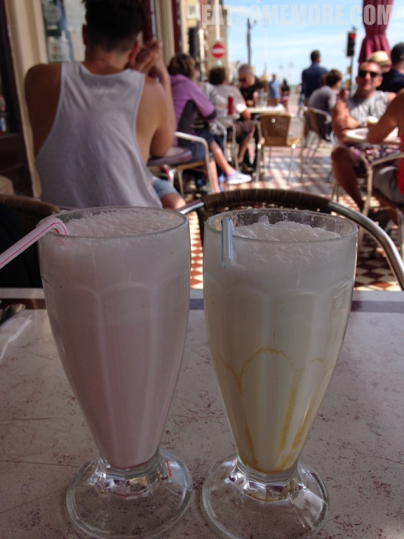

>所有无酒精的冰饮当中，我最喜欢奶昔，牛奶混合冰激凌，比牛奶清凉，比冰激凌解渴。在炎炎夏日的海边来一杯色彩鲜明的奶昔，冰凉香甜、解暑惬意。

>刚到英国的时候，餐牌上的那道鲜虾鸡尾酒(prawn cocktail)总能深深地激起我的好奇心——这到底是个啥？醉虾么？而现实告诉我，这其实是一道更类似沙拉的前菜。这道菜所说的Cocktail并不是大家熟知的鸡尾酒，而是鸡尾酱，又称咯嗲醬，类似千岛酱，主要原料为蛋黄酱、番茄酱和辣酱。一般来说就是稍稍焯过的虾仁淋上鸡尾酱后装在鸡尾酒杯里。今天分享的鲜虾沙拉的特别之处，在于将拌过的虾仁装在了切开的牛油果当中。虾仁的弹、鲜，鸡尾酱的甜、酸、辣，和牛油果的清新、绵密、奶香融为一体，是绝对美妙的味觉体验。

>扇贝是我最喜欢的海鲜之一。除了北海道脆爽的扇贝刺身，欧洲风味的黄油欧芹烤扇贝也特别能够突出食材的柔嫩、鲜甜、多汁。

>芝士焗龙虾，芝士的奶香混合着充沛的氨酸风味。

>平平无奇海鲜意大利面。

网站：[https://theregencyrestaurant.co.uk/](https://theregencyrestaurant.co.uk/)

地址：131 Kings Rd, Brighton, BN1 2HH

