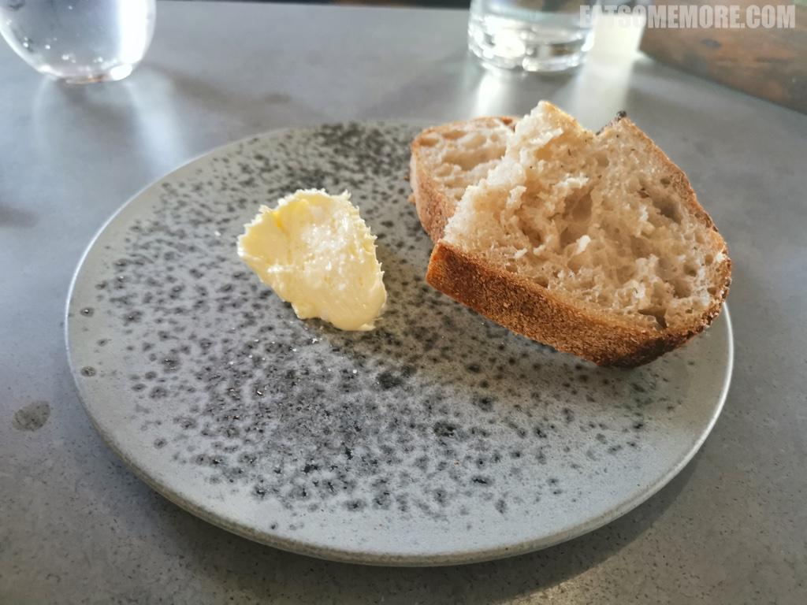
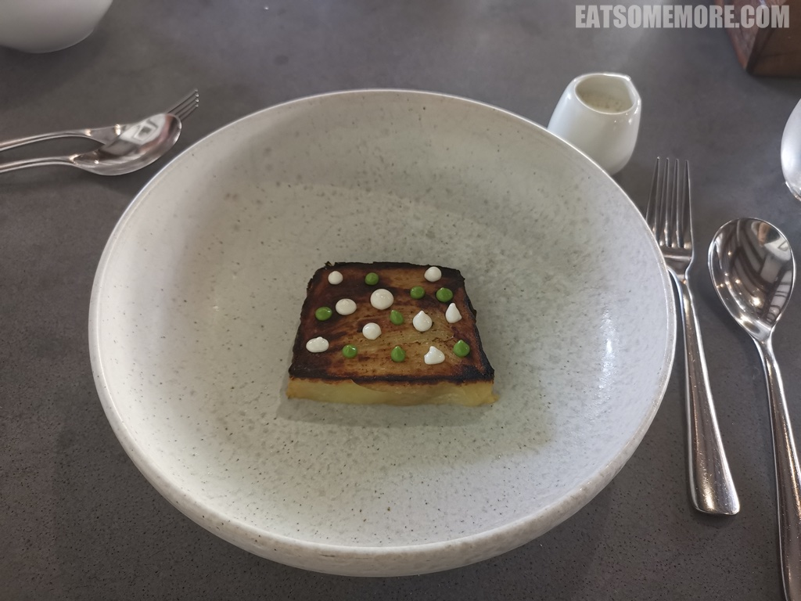
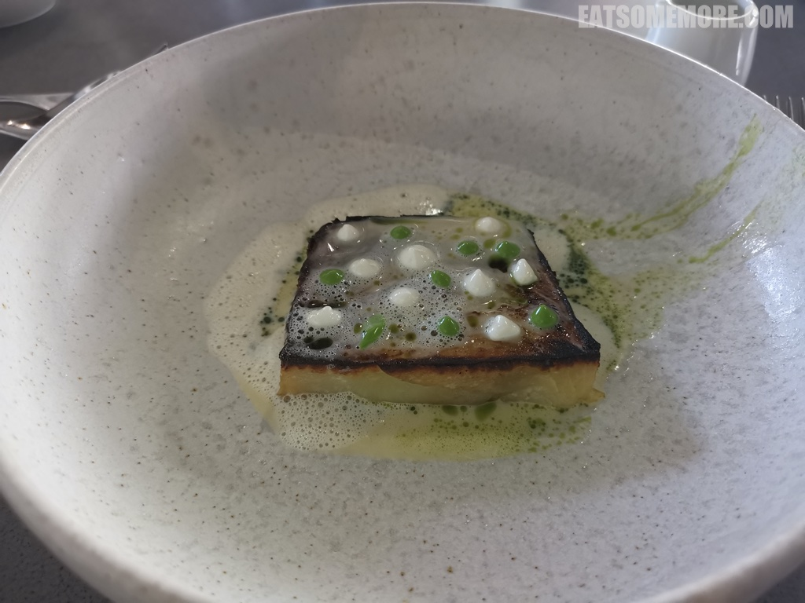
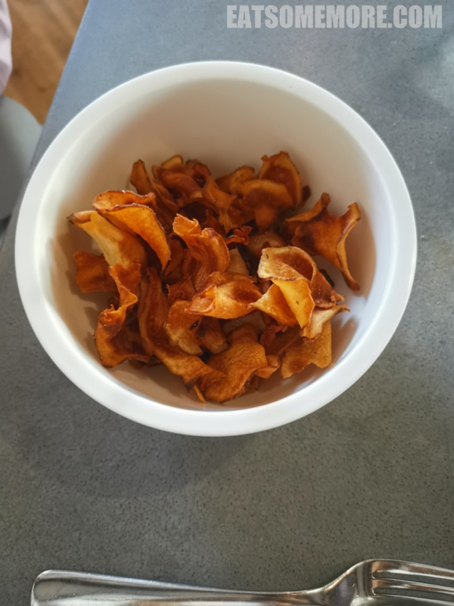
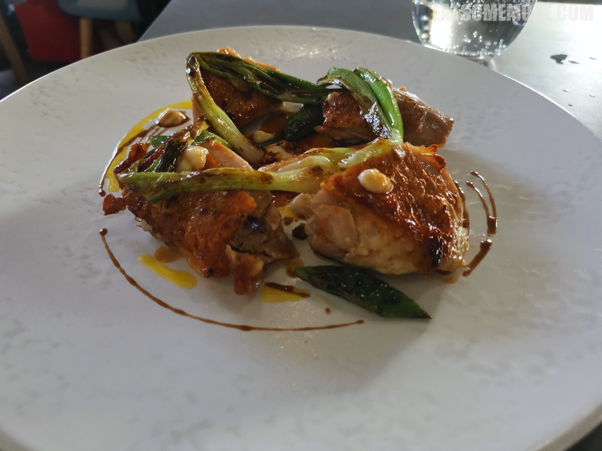
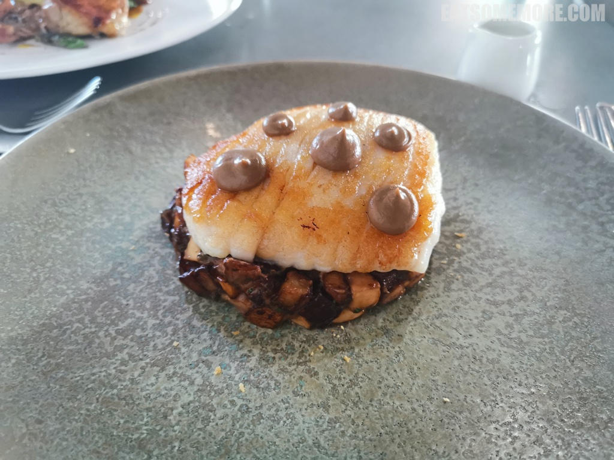
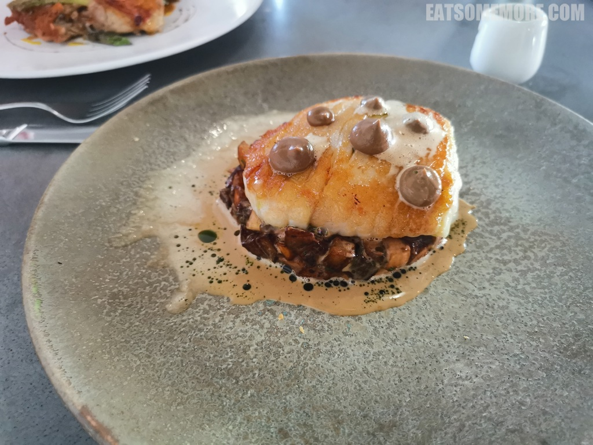
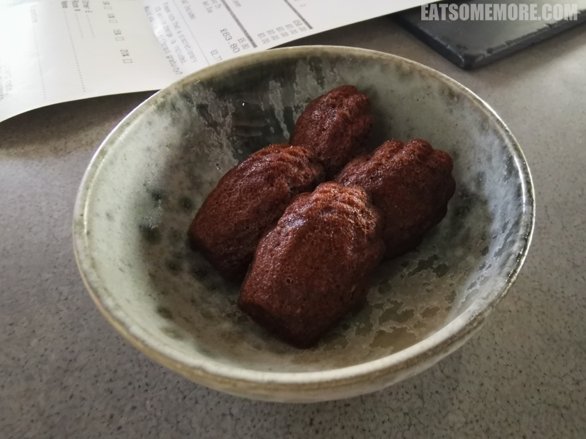

>湖区东南门户的卡特梅尔小镇不仅明媚秀丽，更不乏美味的餐厅，其中得到米其林星级认证的就有两间。我们这天来到的是米其林一星的Rogan and Co餐厅。一坐下来就被桌上萌萌的多肉植物吸引了目光。

>酸种面包内外的软硬、湿干、空气感和焦脆度对比优秀，搭配慕斯状柔滑易推的黄油，我很喜欢。

>前菜是淀粉满满又带着青白文艺波点的焦糖土豆千层饼。

>淋上黄油奶油后食用才发现土豆吸收了黄油的奶香、熊蒜的清甜和海鳗的咸鲜，是看似平平无奇，却惊艳了味蕾的味道。

>烤猪五花和菊芋片也别出心裁。猪五花烤得很香，但不令人感到罪恶，因为向日葵的块茎菊芋是有名的健康食品，虽然味道香甜，却能调节血糖和促进肠道蠕动。

>龙嵩草葱烧世涛(Stout)黑啤兰卡斯特本地鸡，肉质紧实到我不禁要脑补它漫山奔跑的飒爽英姿。

>烤鳐鱼腹去骨脱皮，煎得金黄。

>黄油奶油总能让食物看起来食欲满满。鳐鱼腹肉口感细腻、味道鲜甜，底下的糟香草菇土豆粒焦香咸鲜、口感多样。

>主厨特赠现烤巧克力马德莲贝壳蛋糕，拿起来的时候还有些烫手，一口表皮酥脆，再嚼绵软香甜，巧克力的微微焦苦让蛋糕的味道更有层次和内涵，是我吃过最好吃的马德莲蛋糕。

网站：[https://www.roganandco.co.uk/](https://www.roganandco.co.uk/)

价格：套餐 £29 起。

地址：DEVONSHIRE SQUARE, CARTMEL LA11 6QD

