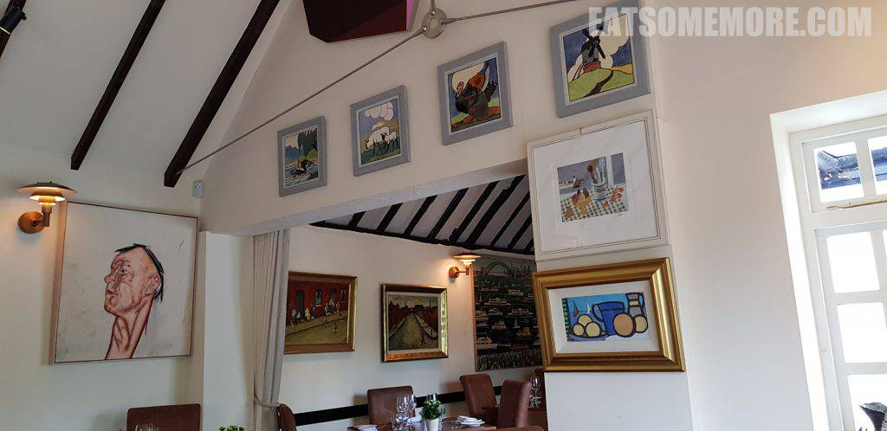
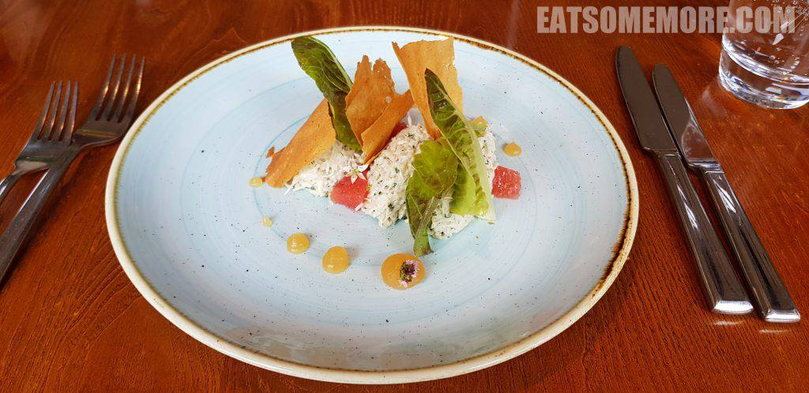
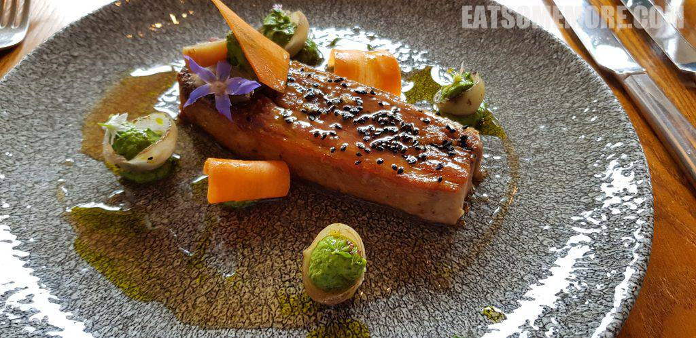
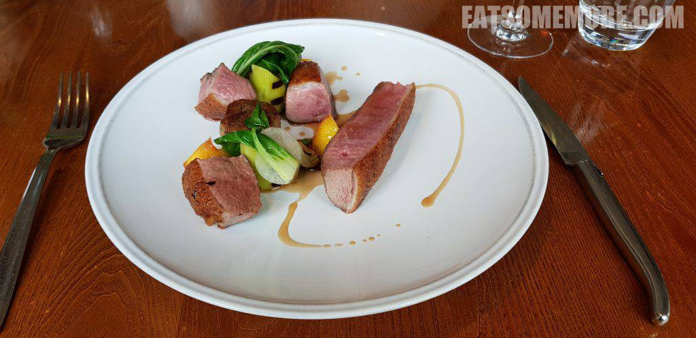
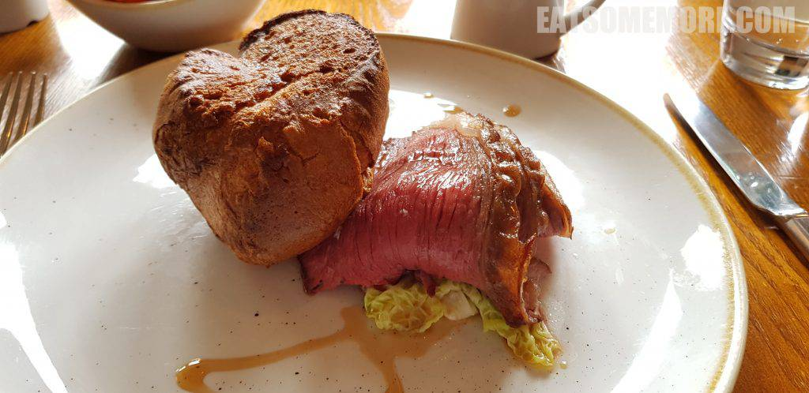

>伦敦以西的米其林餐厅也不少。这一间在温莎大公园西北不远处的米其林一星餐厅，充满了艺术气息。

>进门处就有一幅大型亚克力帆布画，画的是1986年悉尼渡轮大赛的盛况。颜色绚烂，场面恢弘。回家后搜索之下才知道这幅画在2012年由佳士得拍出了八千英镑。为了更好地呈现这幅作品的美，以下贴的是佳士得网站的原图，特此注明出处。

>回到食物，前菜有蟹肉沙拉，酸甜的血橙果味更凸显了蟹肉的甘鲜。

>香煎羊臀肥瘦相间、鲜香软糯，搭配由奶酪、青瓜和林蒜打发成的青色的酱，盛在焦糖化的小洋葱里面，既解腻又增添了一份香甜。

>油封鸭胸鲜嫩多汁，鸭腿丸子酱香咸鲜，搭配黄桃果肉和小青菜，层次丰富。

>英国的周日午餐怎么少得了周日烤肉。熟成二十八天的牛臀肉烘烤后切片，肉质柔嫩、肉汁浓郁，搭配烤蔬菜和约克郡布丁，是十分美好的英式周日烤肉体验。

网站：[https://www.theroyaloakpaleystreet.com/](https://www.theroyaloakpaleystreet.com/)

地址：Littlefield Green, Nr. Maidenhead, Berkshire, SL6 3JN

