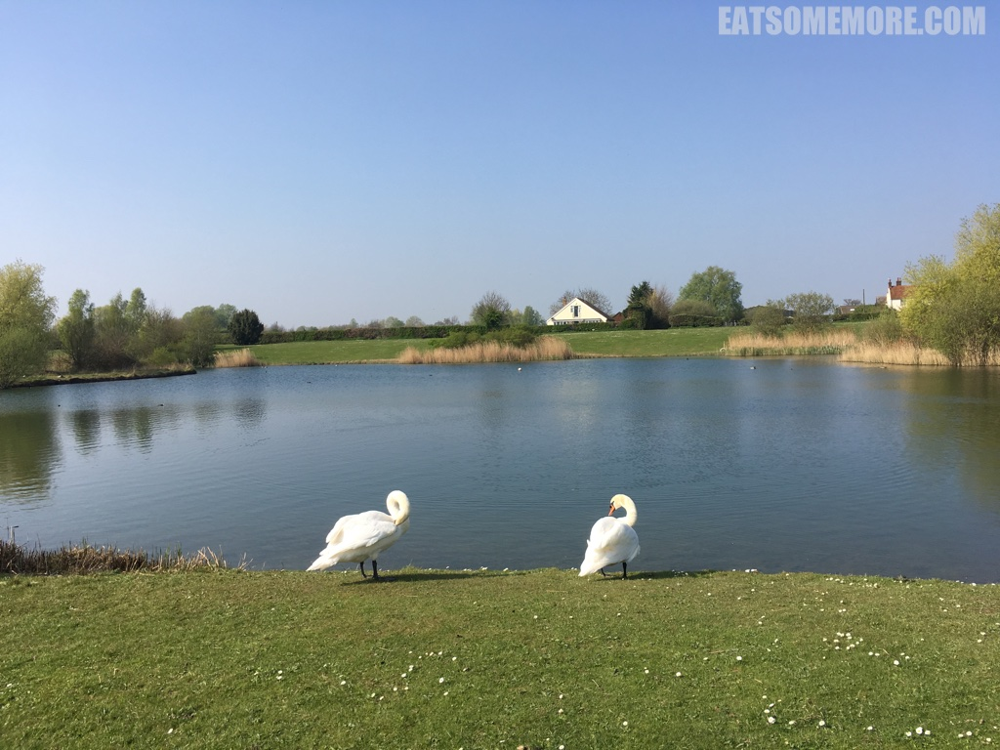
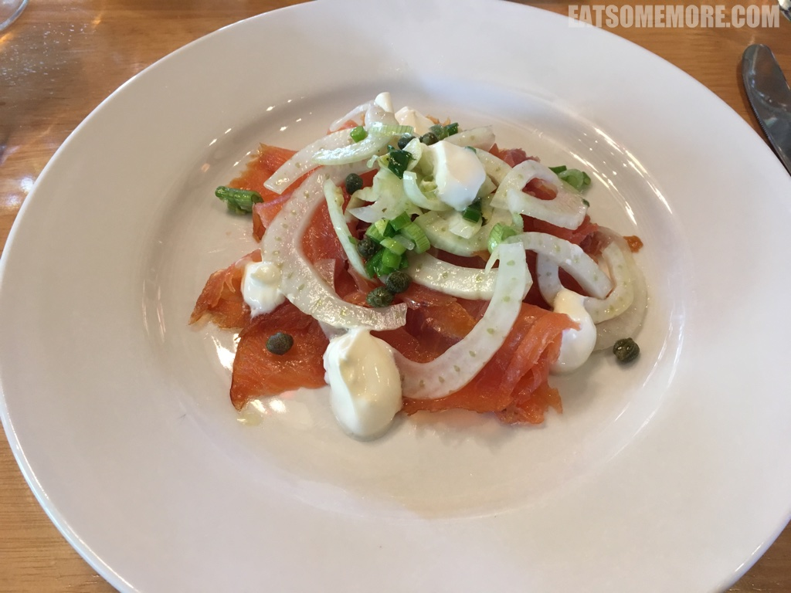
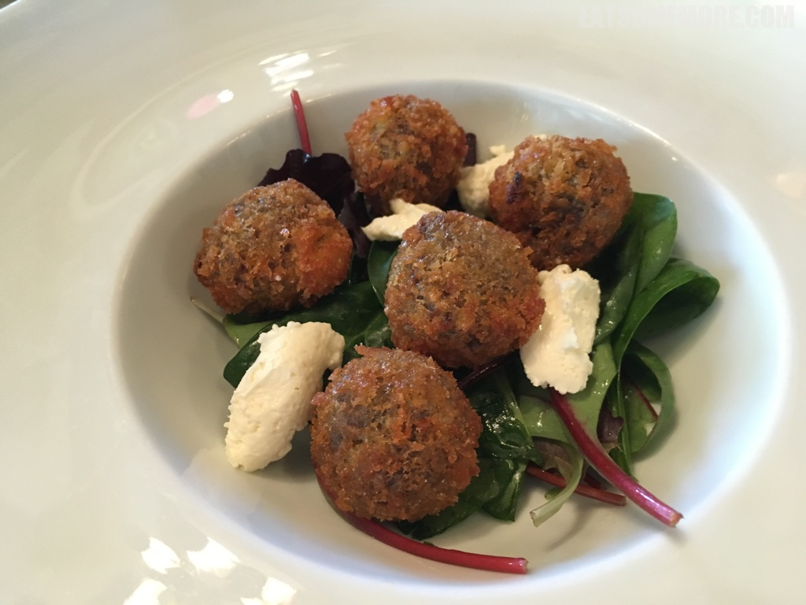
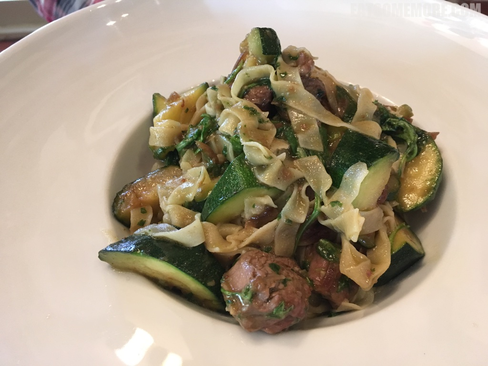
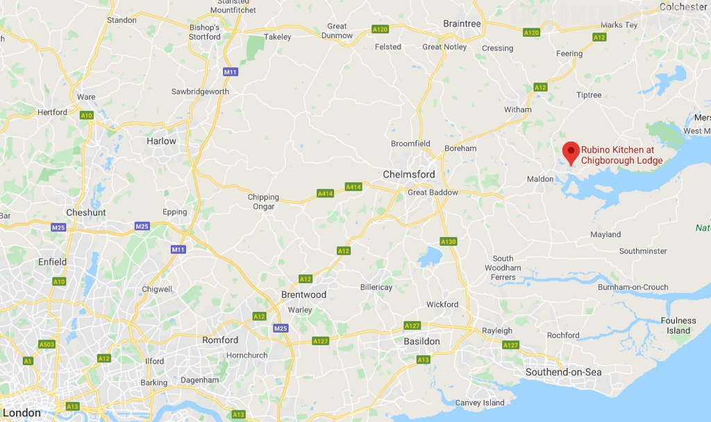

>英格兰东南的艾塞克斯郡（Essex)的一个农场里、鱼塘边，有一家获得米其林推荐，谷歌评分4.9，猫途鹰Tripadvisor满分并连续四年取得卓越奖的餐厅。

>用餐环境优美自然，食物量足味美，服务人员也很友好。

>日本有芥末酱油点三文鱼刺身，而英国最多见的则是烟熏三文鱼，少了一些软糯，多了扎实弹性。这一道酸奶油烟熏三文鱼，咸鲜当中带有松木香，搭配上酸甜幼滑的奶油，再美不过。

>中有濑尿牛丸，西有脆皮牛丸。脆皮又薄又酥，丸子则饱有炖得又软嫩又入味的小牛脸肉的纤维感。舌尖上的英国又一力作。

>羊肉节瓜宽面当中使用的意大利宽面(tagliatelle)，像极了广东河粉，一炒一烩之间便成就平凡的人间美味。宽面吸饱了羊肉的油脂，节瓜鲜爽解腻，怎能不大快朵颐！

>鲜香的煎鳕鱼搭配带皮土豆粒。

>超大碗的蜂巢布林米饭布丁，香滑酸甜。

>这道酸奶蛋糕简直是众多英国甜点中的一股清流，空谷中的幽兰。薄烤饼拌上香草味酸奶，缀以开心果仁及石榴子。薄饼松软、酸奶香浓、开心果甘香、石榴酸甜，口感味道层次丰富、清新细腻，是一道令人惊艳的甜点！

网站：[http://www.rubinokitchen.co.uk/](http://www.rubinokitchen.co.uk/)

地址：Chigborough Lodge, Chigborough Farm, Chigborough Rd, Heybridge Maldon, CM9 4RE

