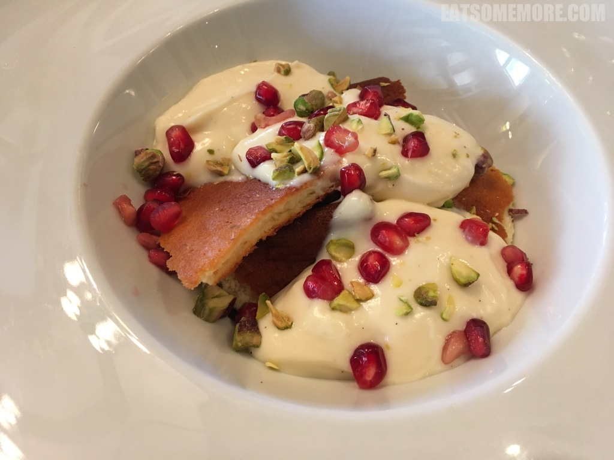

>谷歌4.9分，满分蝉联四届猫途鹰Tripadvisor网站卓越奖，The restaurant is near a fisheries. The environment is very pleasant.

>Beautiful environment, friendly staff and amazing taste.

>酸奶油烟熏三文鱼,日本有芥末酱油点三文鱼刺身，而英国最多见的则是烟熏三文鱼，少了一些软糯，多了扎实弹性。带有松木香的咸鲜口味搭配上酸甜幼滑的奶油，再美不过。

>中有濑尿牛丸，西有脆皮牛丸。丸子还饱有小牛脸肉的纤维感，炖得又软嫩又入味，脆皮又薄又酥。舌尖上的英国又一力作。

>羊肉节瓜宽面，意大利宽面(tagliatelle)像极了广东河粉，一炒一烩之间便成就平凡的人间美味。宽面吸饱了羊肉的油脂，节瓜鲜爽解腻，怎能不大快朵颐！

>

>

>这道酸奶蛋糕简直是英国甜点中的一股清流，空谷中的幽兰。薄烤饼拌上香草味酸奶，缀以开心果仁及石榴子。薄饼松软、酸奶香浓、开心果甘香、石榴酸甜，口感味道层次丰富、清新细腻，真是一道令人惊艳的甜点！

网站：http://www.rubinokitchen.co.uk/

地址：Chigborough Lodge, Chigborough Farm, Chigborough Rd, Heybridge Maldon, CM9 4RE

