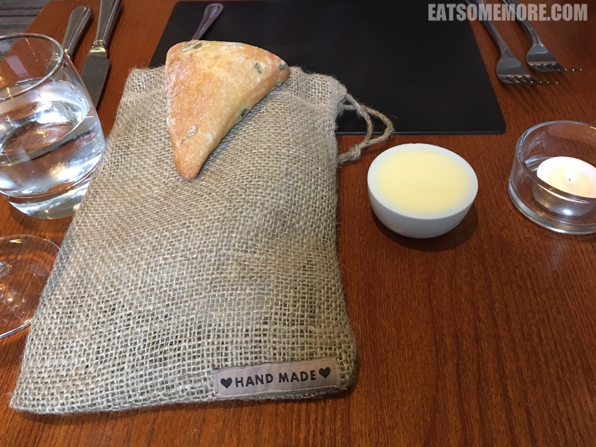
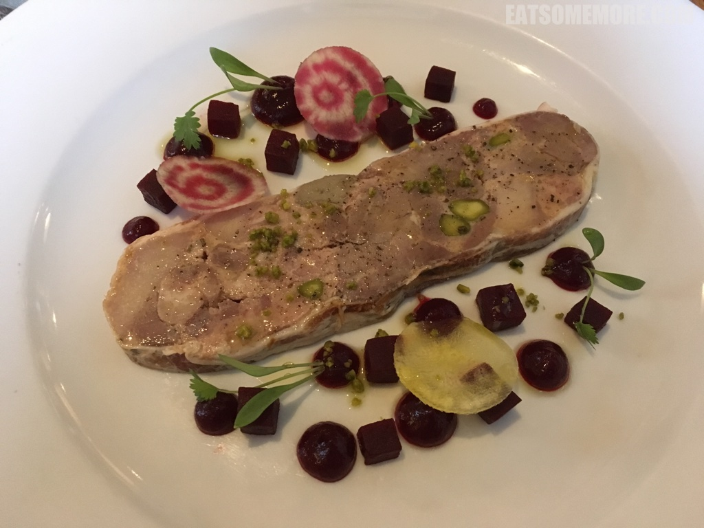
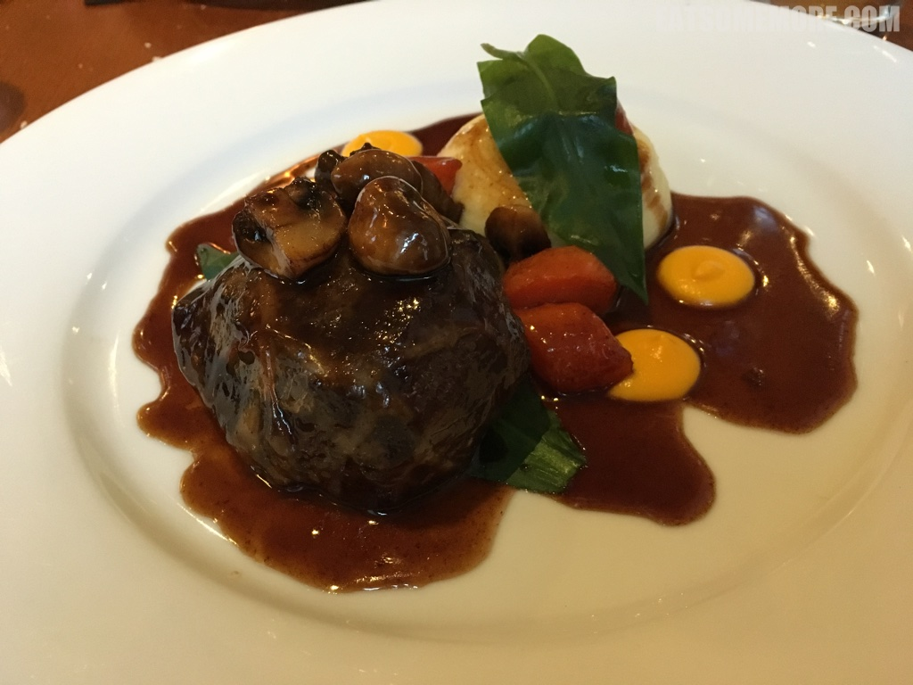

>16-19，米其林指南推荐，The Jerusalem Artichoke soup is absolutely amazing, and loved the braised beef cheek. The soup is hearty and tasty. The beef is soft, tender but full of flavours.

>However, the service was disappointing, The waitress erroneously gave us the bread for other customers, and then directly took it from our table to another table.

>pork and duck terrine with pistachios and beetroot salad - I ordered pork and duck terrine as starter, however was served two mains (pork and duck) - later turned out to be ordered by other customers. We had to ask for the bill twice as we were forgotten for half an hour after first asking for the bill.

>好多朋友包括我本人都总说英国无美食。然而渐渐也发现英国美食值得被正名。今年春天在德文郡遇见的一道唤醒味蕾的前菜是这道菊芋浓汤。菊芋对我来说很是陌生，又名洋姜，甘凉清热，熬煮成汤后分外香甜。更棒的是汤里还有西班牙红椒肠的咸鲜，生鸡蛋黄的香滑，黄油烤面包丁的酥脆，以及细葱时蔬的清香。

>大家不难发现英国乡村牛羊遍野。而我最近发现，英国有许多精致的餐厅都藏身于这些农场当中。由于原料新鲜、产地直供，菜品的水准都比较有保障。例如这一道啤酒炖牛脸肉佐奶油土豆泥、胡萝卜、蘑菇及熊葱。牛脸肉较牛的其他部位纤维更细，加啤酒炖后香酥软烂。土豆泥奶香十足。真真一道令人满足的乡村美味。我只能心悦诚服地说，英国人好会做菜！

网站：[https://www.samuelfox.co.uk/](https://www.samuelfox.co.uk/)

地址：Stretfield Road, Bradwell, Hope Valley, Derbyshire, S33 9JT

