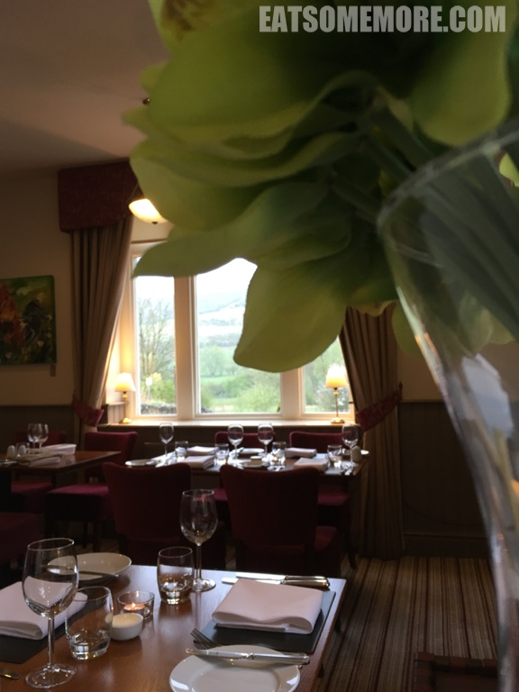
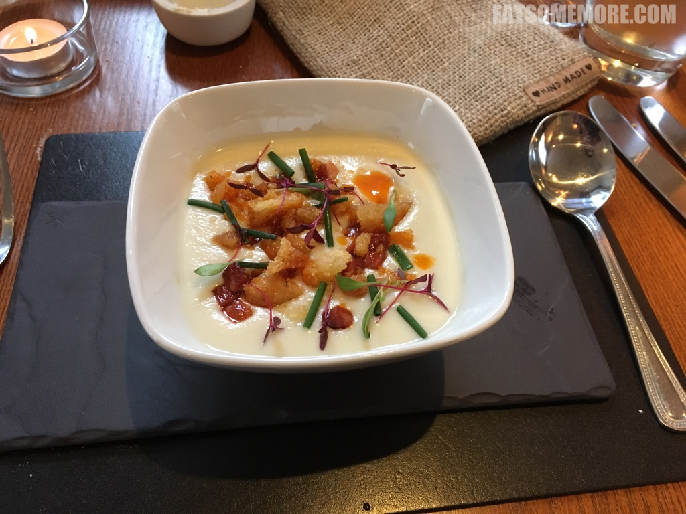

>有时也在想米其林指南是怎么找到这些位于田野之间的餐厅的。

>这间餐厅的服务稍微有所欠缺，例如上错菜，买错单等等。

>猪肉、鸭肉和开心果混合肉糜搭配红菜头沙拉。

>春天的菊芋浓汤是一道唤醒味蕾的前菜。菊芋对我来说很是陌生，又名洋姜，甘凉清热，熬煮成汤后分外香甜。更棒的是汤里还有西班牙红椒肠的咸鲜，生鸡蛋黄的香滑，黄油烤面包丁的酥脆，以及细葱时蔬的清香。

>大家不难发现英国乡村牛羊遍野。由于原料新鲜、产地直供，牛羊菜品的水准都比较有保障。例如这一道啤酒炖牛脸肉佐奶油土豆泥、胡萝卜、蘑菇及熊葱。牛脸肉较牛的其他部位纤维更细，加啤酒炖后香酥软烂。土豆泥奶香十足。真真一道令人满足的乡村美味。我只能心悦诚服地说，英国人好会做菜！

网站：[https://www.samuelfox.co.uk/](https://www.samuelfox.co.uk/)

地址：Stretfield Road, Bradwell, Hope Valley, Derbyshire, S33 9JT

