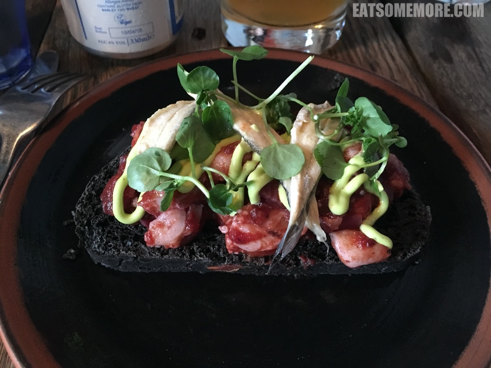
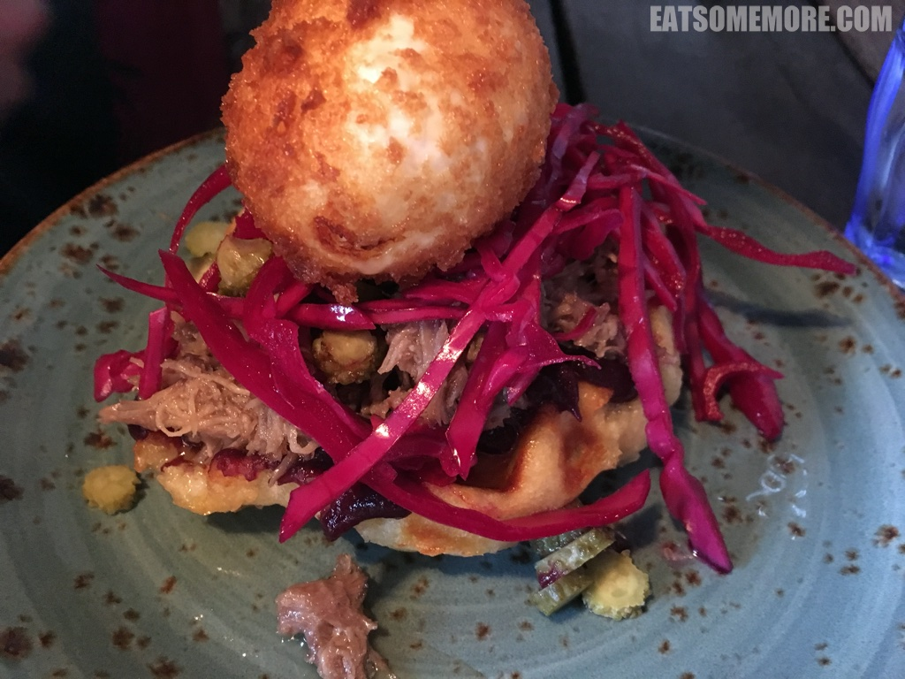
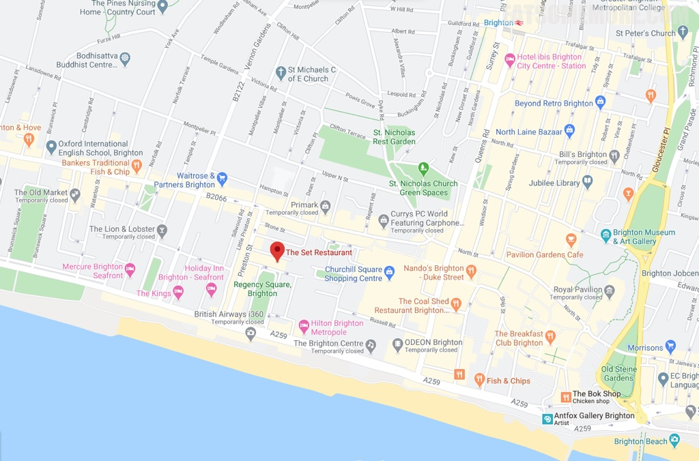

>前菜有满满的海味，在黑色的吐司上码着腌鳀鱼、章鱼腿、豆苗和牛油果酱。

>主菜是手撕猪肉炸蛋土豆华夫饼。英国常见的猪肉料理方式是通过手撕处理来避免口感干柴，同时也有助于入味。以土豆为原料的华夫饼更具根茎类蔬菜特有的香味。整道菜的亮点在于顶上的炸蛋——鸡蛋的表皮炸得酥脆，但是一刀切开后金黄的蛋液缓缓流出，给所有食材裹上了一层鲜甜的蛋香，画龙点睛。

网站：[https://www.thesetrestaurant.com/](https://www.thesetrestaurant.com/)

地址：33 Regency Square, Brighton BN1 2GG

