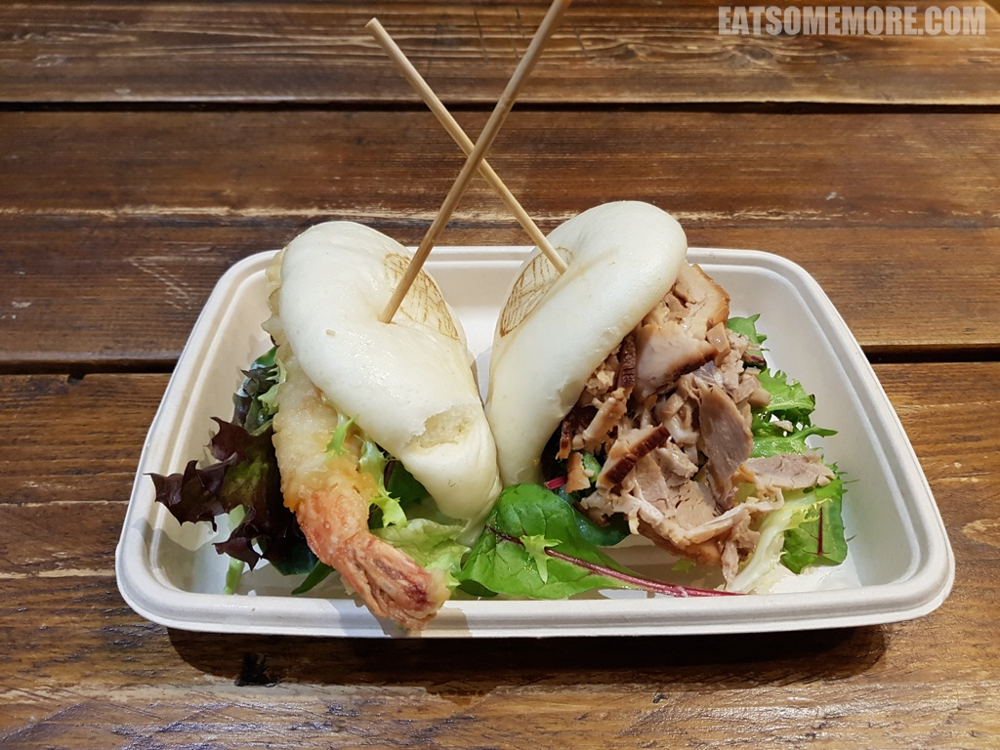
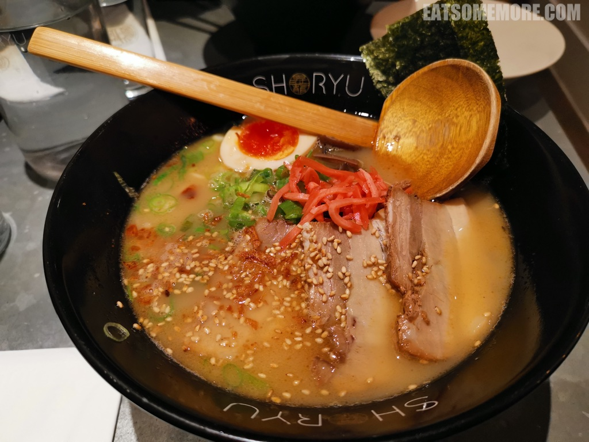

---
title: "伦敦博多拉面店 Shoryu"
author: "九姨"
date: "2022-10-02"
categories: "美食"
tags: "英国,英格兰,推荐,伦敦"
coverImage: "images/IMG_20191216_114533.jpg"
---

>伦敦 Shoryu 是一家很受欢迎的连锁博多拉面店。日式叉烧包面皮暄软，用料十足，大虾天妇罗香酥，叉烧肉鲜香。

>豚骨拉面的汤头咸甜鲜醇，面条筋道入味，溏心蛋甘甜鲜香，叉烧肉薄片软嫩，加上芝麻、葱花和海苔，使得味道层次更加丰富。

网站：[https://shoryuramen.com/](https://shoryuramen.com/)

地址：33 Broadgate, London EC2M 2QS

