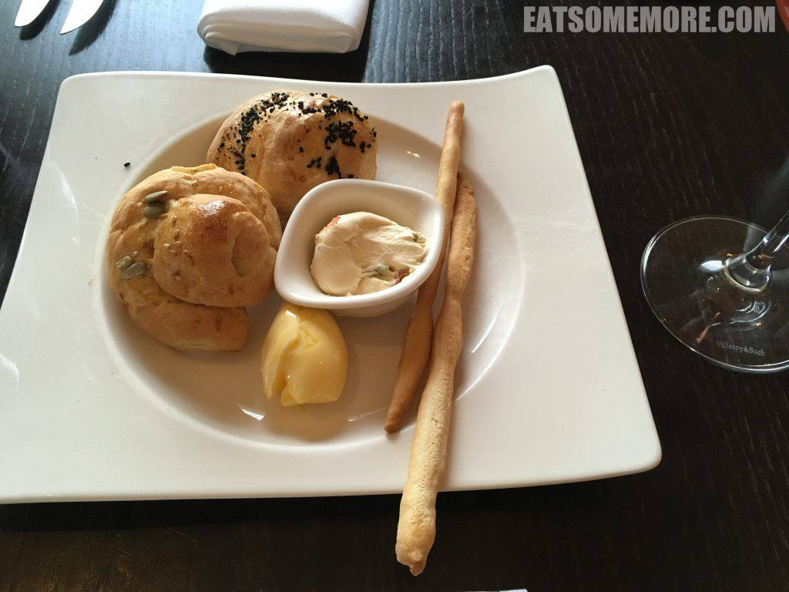
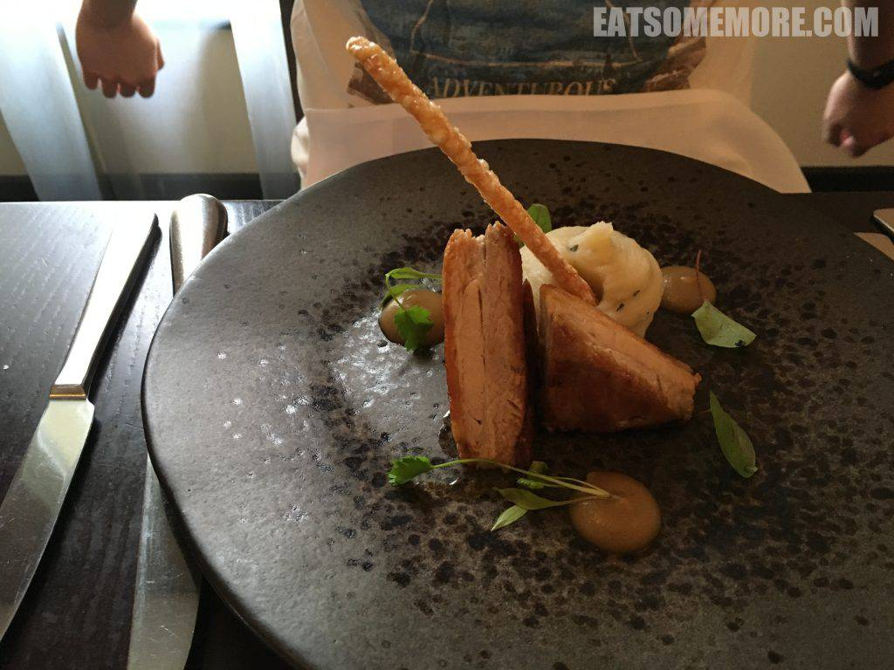
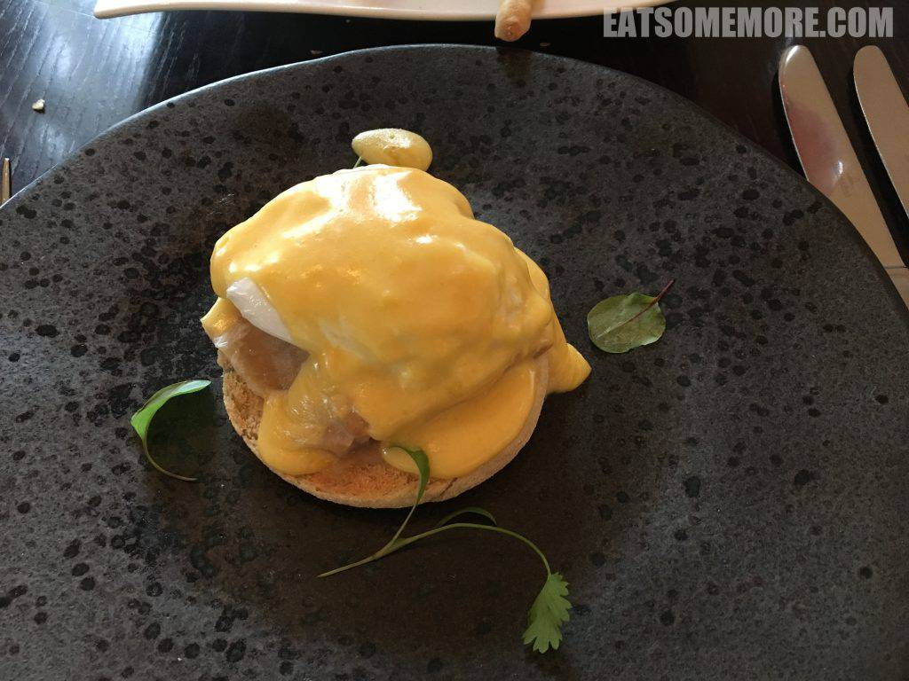
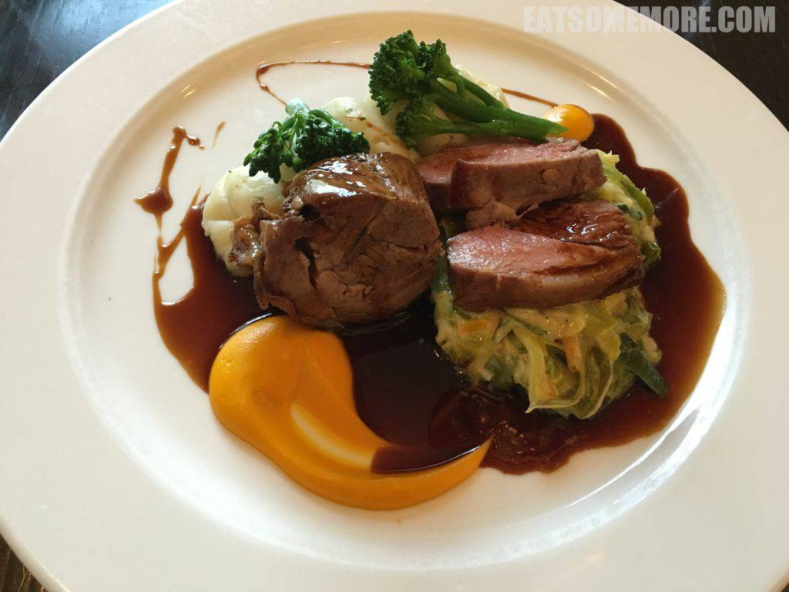
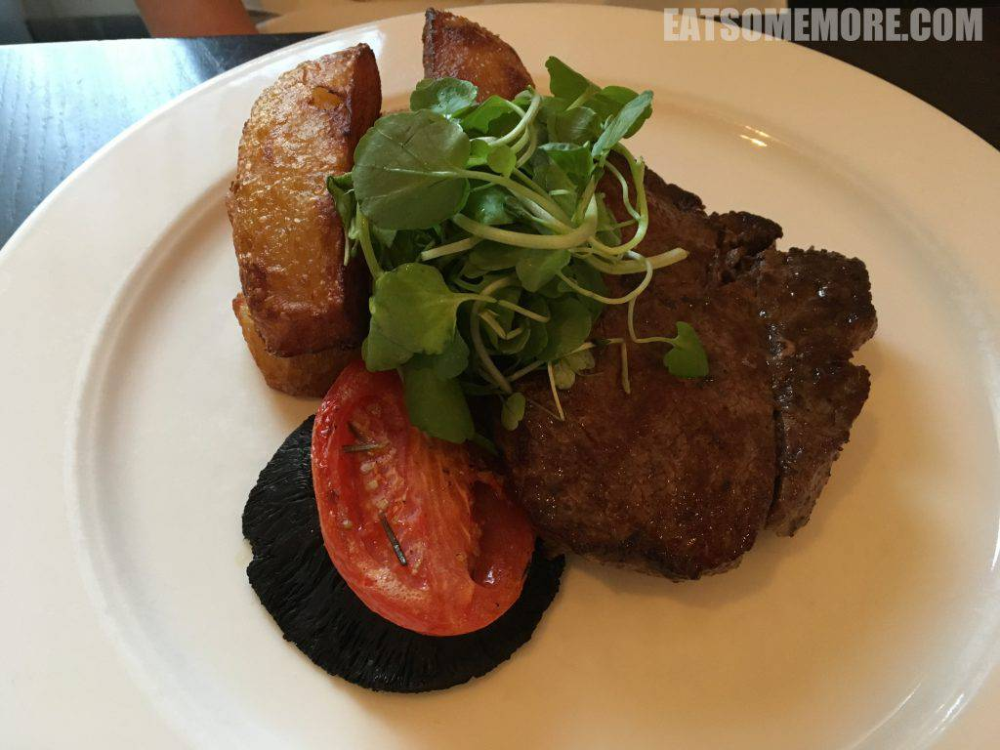
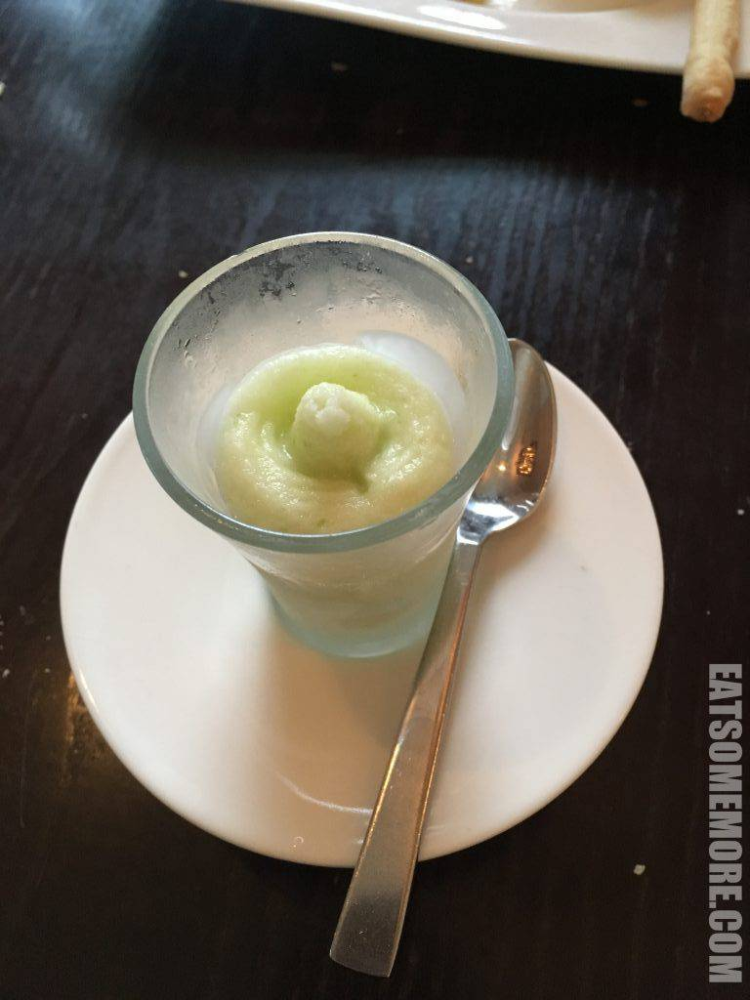

>康威海滩上有个房车度假村，在密密麻麻白房子和蔚蓝大海的印衬下，有种身处佛罗里达的错觉。这个度假村里面还隐藏着一间超棒的米其林推荐餐厅，蝉联四届猫途鹰Tripadvisor网站卓越奖。餐前面包就很特别。

>脆皮烧肉，皮脆肉鲜。

>第一次吃到鱼肉的班尼迪蛋，新奇有趣。然而恕我愚见，班尼迪蛋还是要多些动物脂肪更好吃。

>没料到这里居然能将羊肉两吃。羊臀煎得五成熟，色泽粉红、口感柔嫩、肉汁鲜香；羊肩经过慢炖，质地酥软、味道浓郁、肥瘦相间，搭配着红酒肉酱、胡萝卜慕斯、奶油大葱丝、水煮西兰花和香芹土豆泥，呈现出更具深度的好味道！

>香煎牛排，鲜香弹牙。

>厨师特赠的苹果沙冰，清新香甜。

网站：https://www.darwinescapes.co.uk/

地址：Aberconwy Resort & Spa, Aberconwy Park, Conwy, North Wales, LL32 8GA