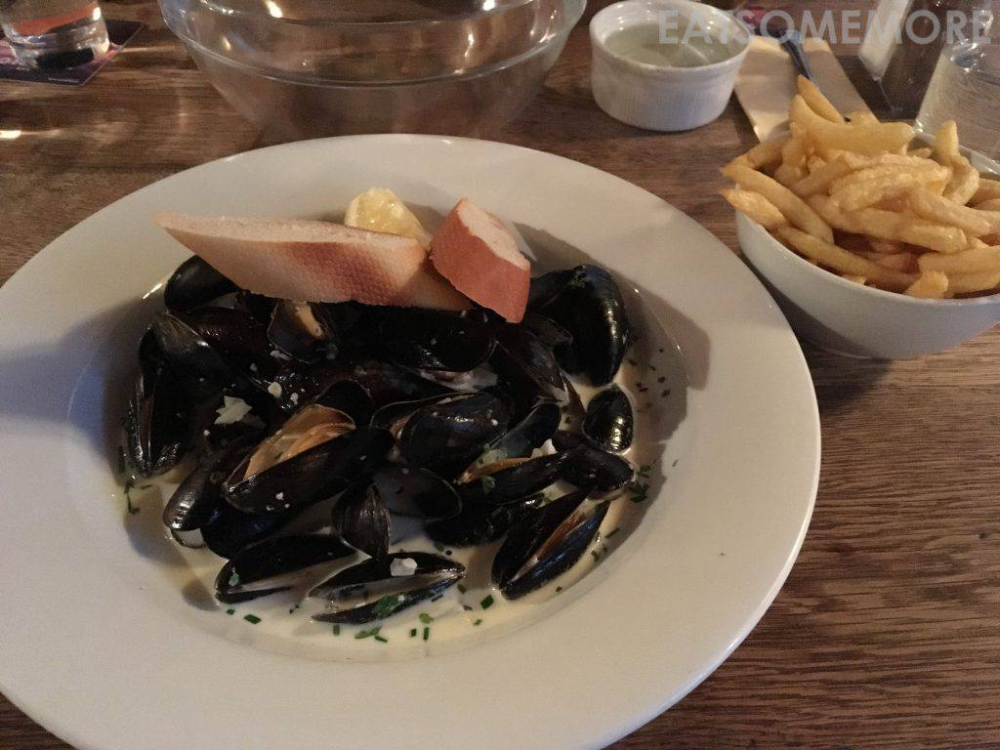
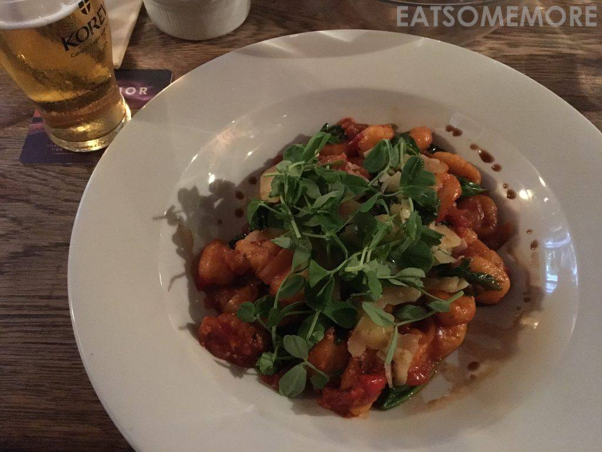
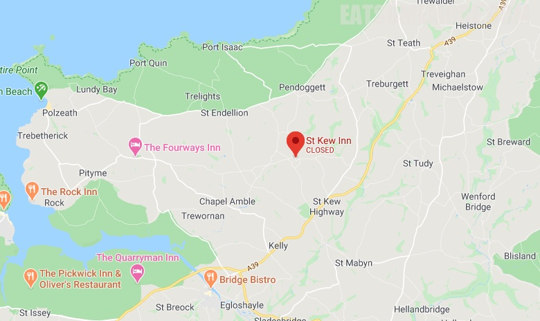

>很有烟火气的小镇 St Kew 的热门小酒馆蝉联四届猫途鹰Tripadvisor网站卓越奖，并得到米其林指南的推荐。奶油白酒青口，下酒一流。



>红酱马铃薯团子洒上西洋菜和帕马森干酪，酸甜清香、温润柔韧，不仅筷子停不下来，简直令人诗兴大发：
```
洋芋粉身化玉棋，
番茄一腔酸甜味。
既柔且韧繁催箸，
温润尽自磐石来。
```




网站：[https://www.stkewinn.co.uk/](https://www.stkewinn.co.uk/)

地址：St Kew, Bodmin, Cornwall PL30 3HB

