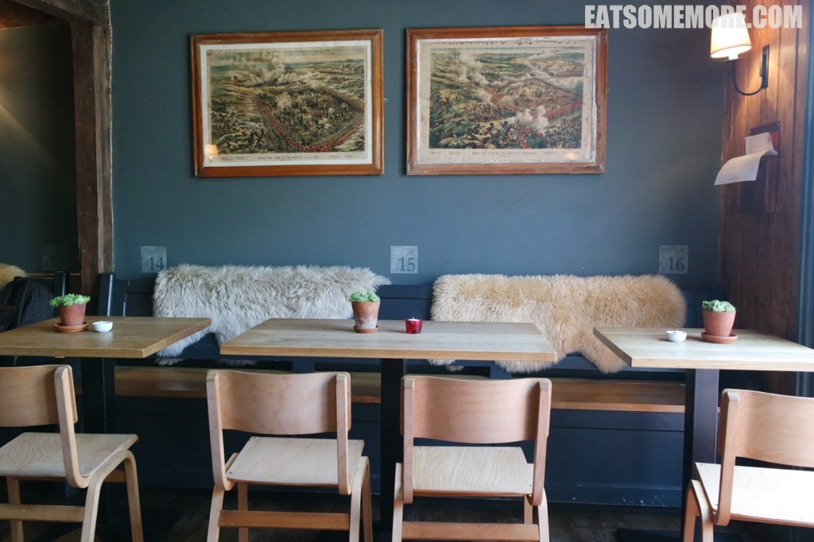
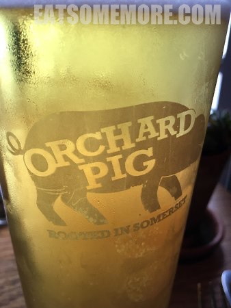
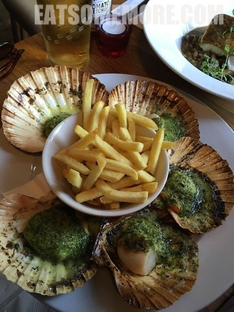
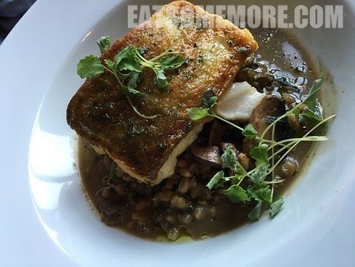
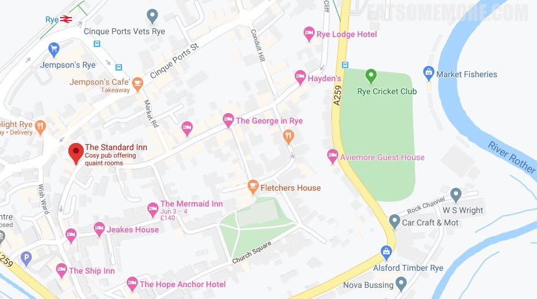

>莱伊镇上一座典型都铎式梁柱外露的小房子里，有一间颇受欢迎的英式餐馆。座位上铺着柔软的羊皮毛。

>新鲜扎啤清凉爽口。

>前菜竟然有五个大扇贝，烤得刚刚好，一咬就迸发出鲜甜的汁水。

>香煎鳕鱼被搁在蘑菇炖麦饭上，是迥异又特别的鲜味结合。

网站：[http://thestandardinnrye.co.uk/](http://thestandardinnrye.co.uk/)

地址：The Mint, Rye TN31 7EN

