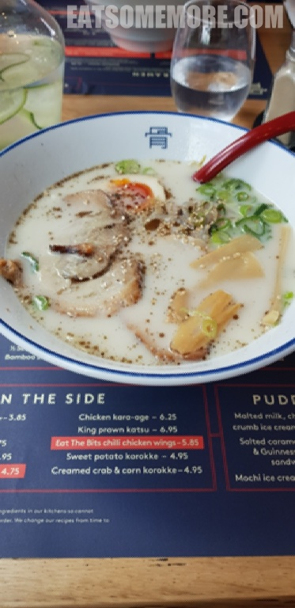
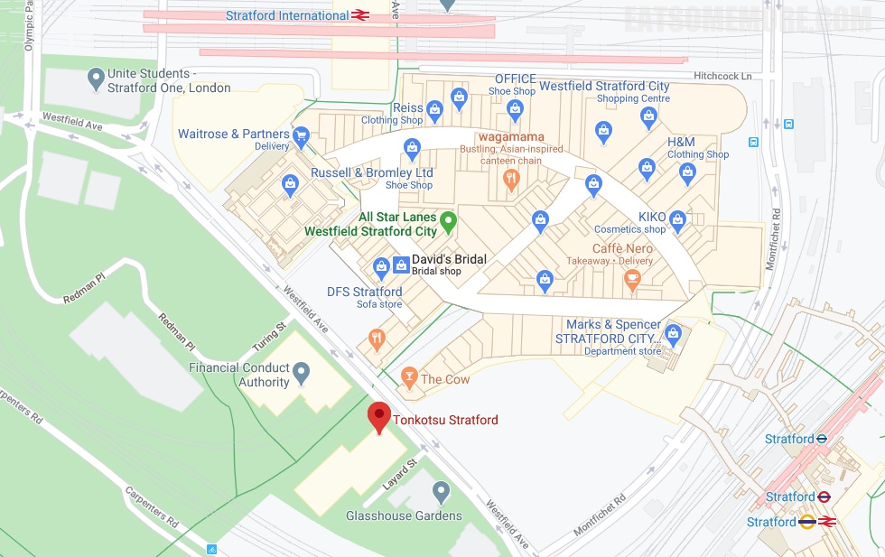

---
title: "伦敦豚骨拉面店 Tonkotsu"
author: "九姨"
date: "2023-06-04"
categories: "美食"
tags: "英国,英格兰,推荐,伦敦"
coverImage: "images/20190302_133957.jpg"
---

>每天早上5:59分开始煲的猪骨汤头，色奶白、味香浓。面条、叉烧、溏心蛋、笋片、葱花和芝麻，样样做得恰到好处，放在一起正正是暖心又暖胃的治愈系美食。

网站：[https://tonkotsu.co.uk/](https://tonkotsu.co.uk/)

地址：Unit 1, Endeavour Square, International Quarter Stratford, London E20 1JN

