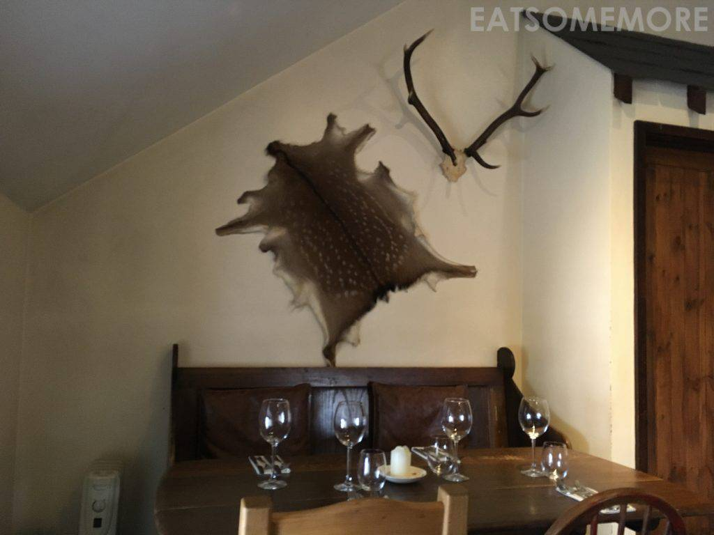
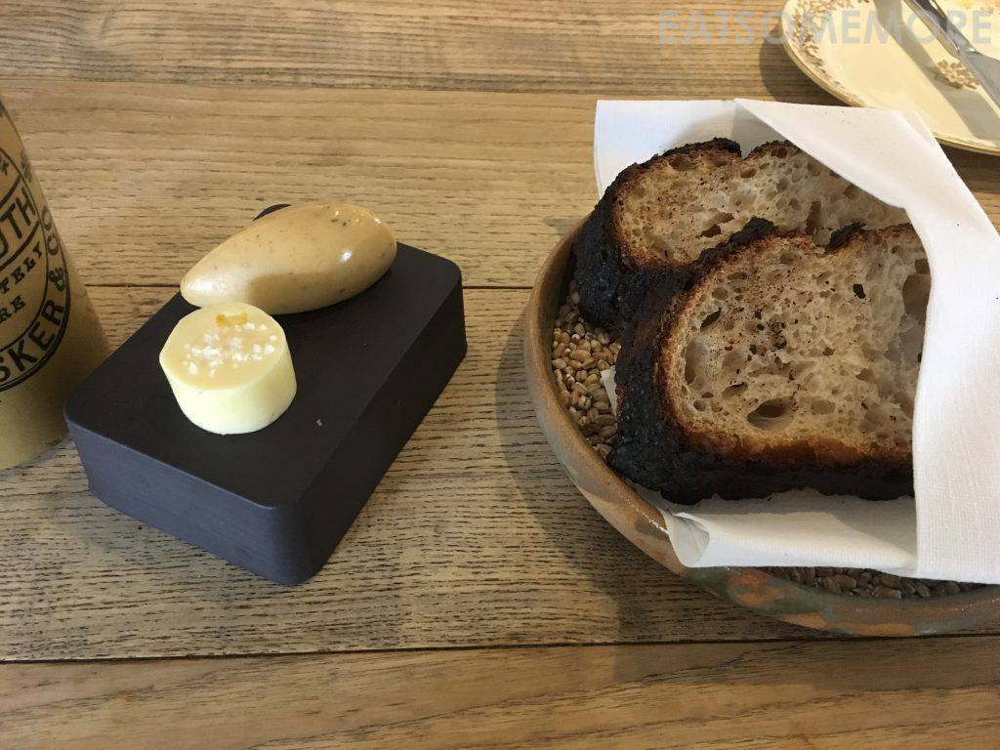
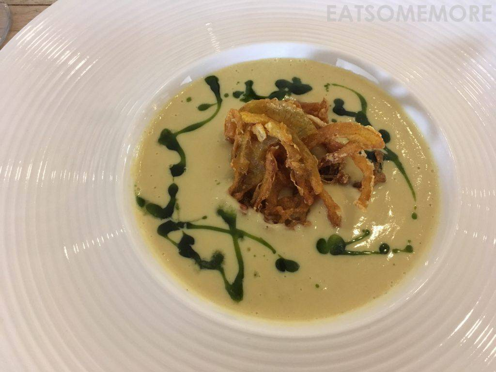
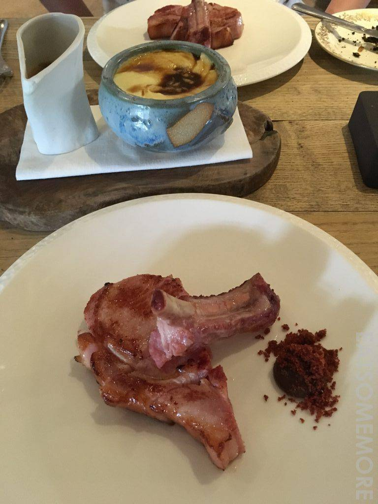
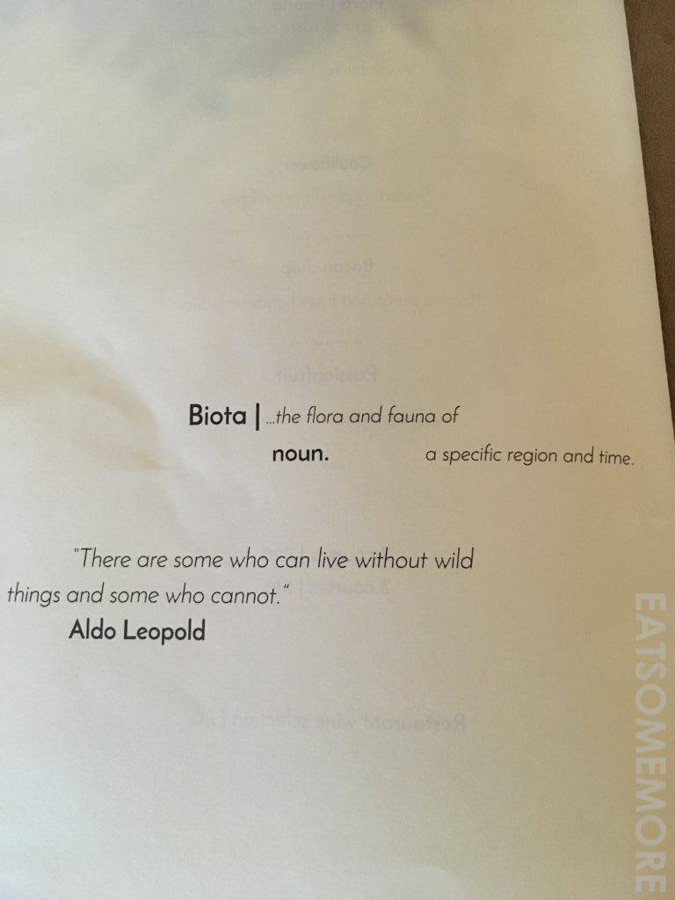
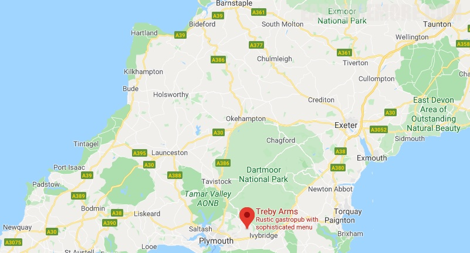

>我们去的时候，这间餐厅是米其林一星。2018年新榜公布，名落孙山，我竟不觉得奇怪。

>餐前酸种面包和两种黄油。

>花菜浓汤搭配印度炸洋葱。

>苹果酱培根肉排。

>这餐不合口味，只好匆匆白描作罢。餐牌上引用的这句话我倒很喜欢：有人可以远离乡野，而有人却万万不能。即使是叶公好龙，却也听起来很美。

网站：[https://www.thetrebyarms.co.uk/](https://www.thetrebyarms.co.uk/)

地址：Sparkwell, Plympton PL75DD

