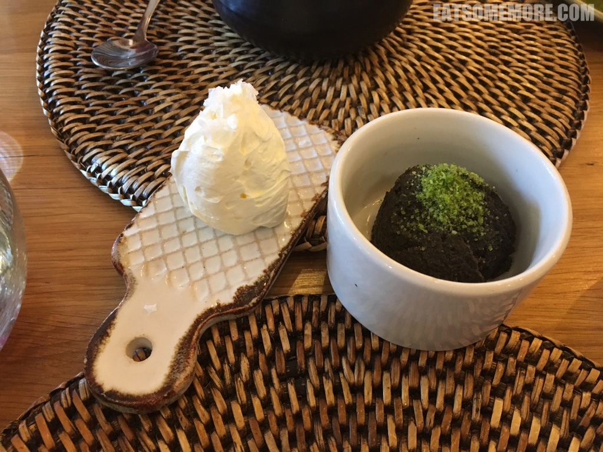
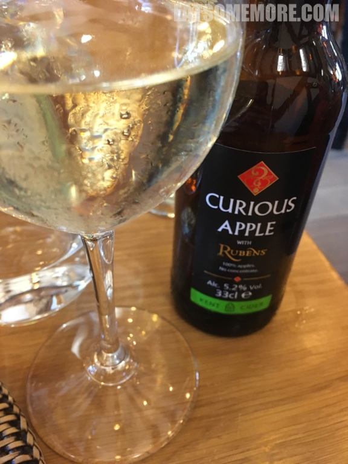
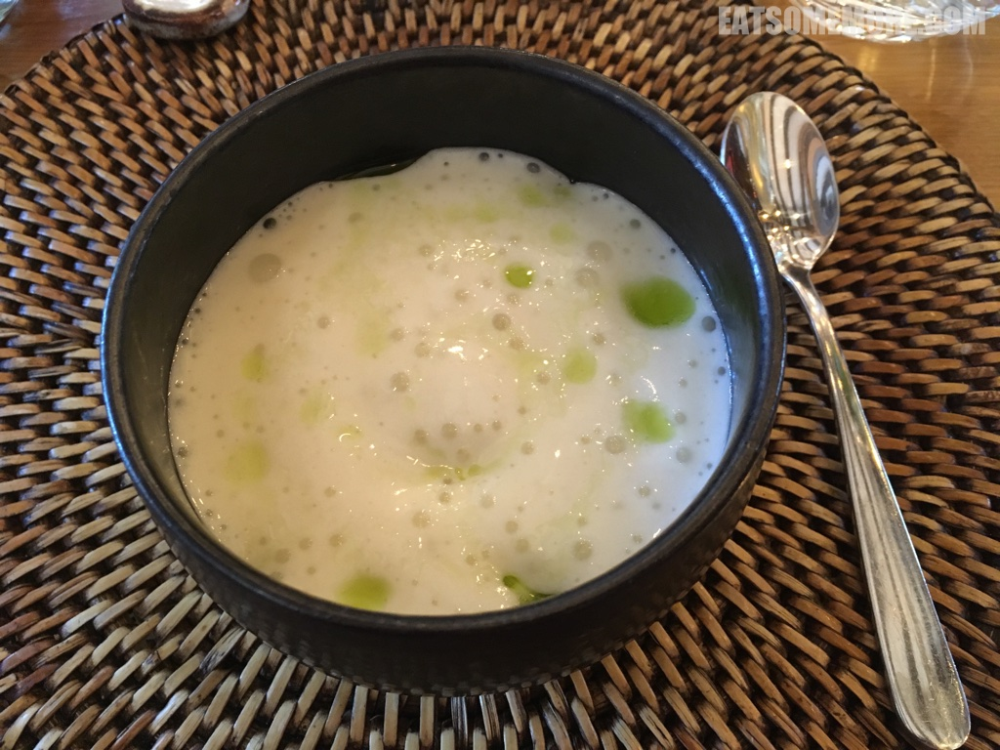
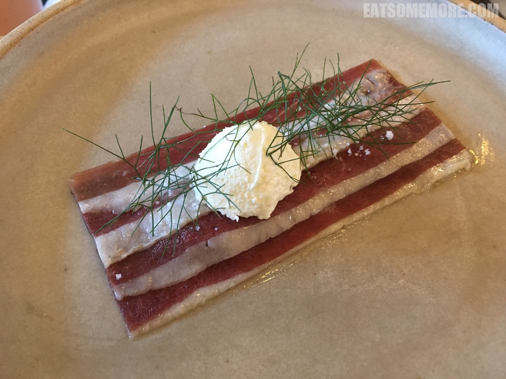
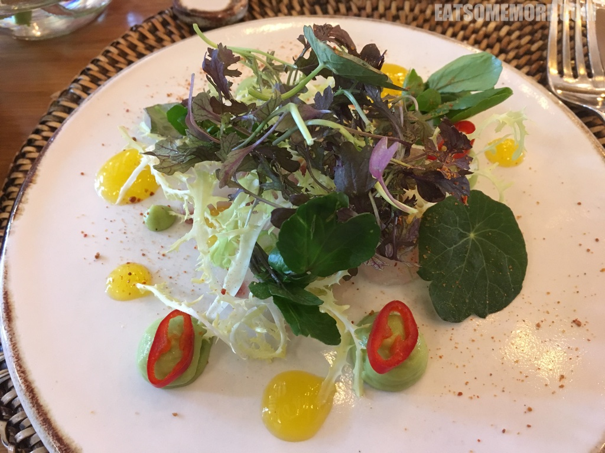
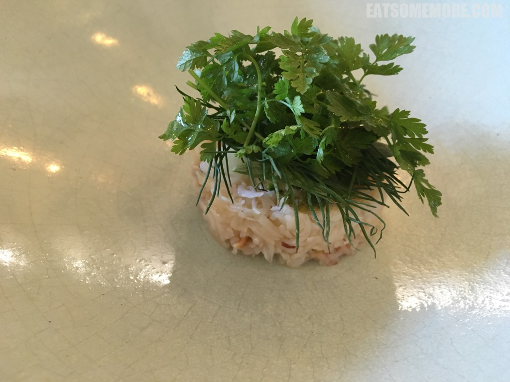
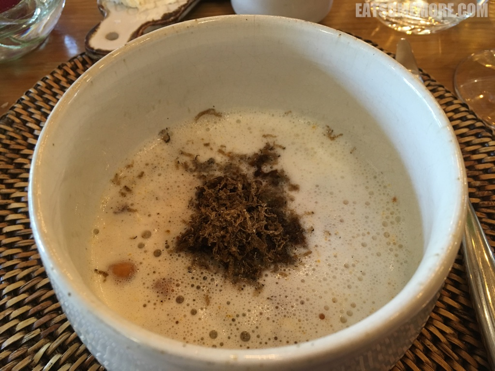
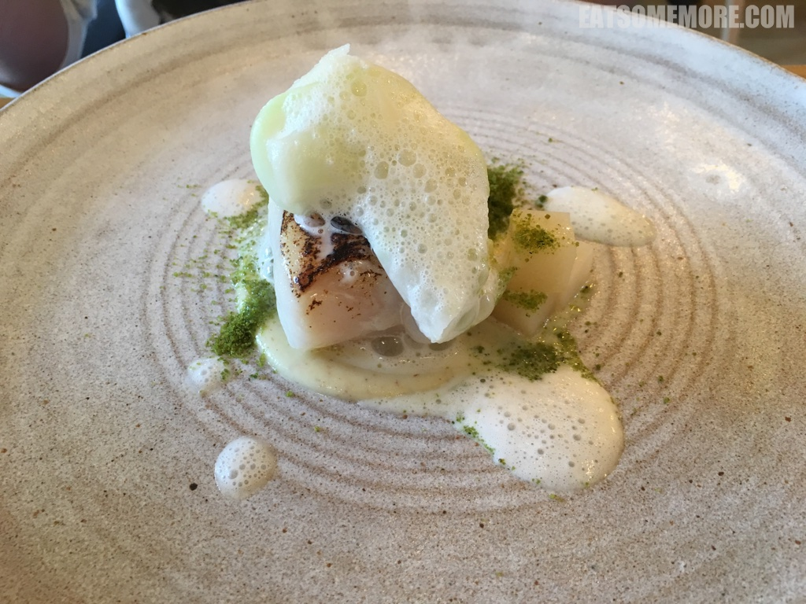
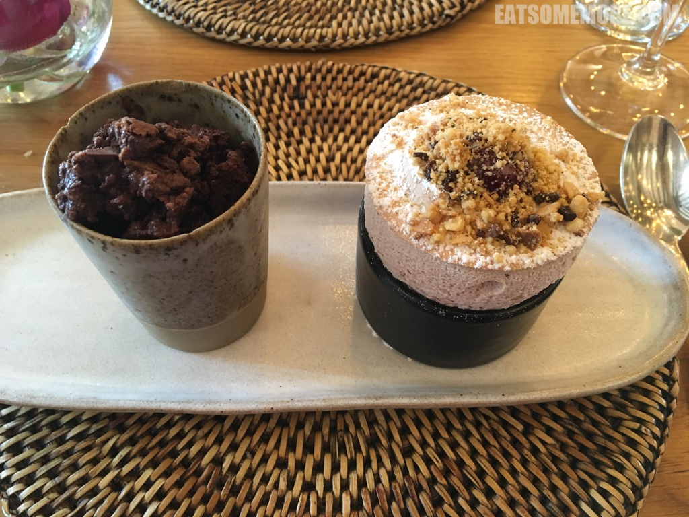
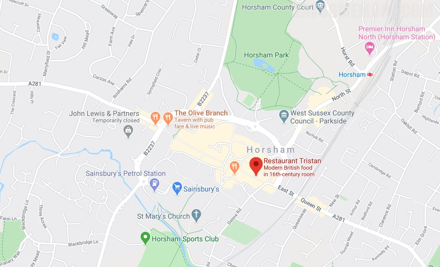

>伦敦以南、布莱顿以北的萨里山杰出自然风景区 (Surrey Hills Area of Outstanding Natural Beauty) 有个钟灵毓秀的霍舍姆 (Horsham) 小镇。镇上有一间米其林一星餐厅，得了四年的猫途鹰Tripadvisor网站卓越奖。它从黄油一上桌就拉了许多好感，因为经过打发的黄油不仅好推易涂，口感也更滑。其中绿色的是橄榄味的黄油。

>我并不喜欢气泡软饮料，却对清爽甘冽的苹果啤青眼有加。

>朝鲜蓟浓汤里有一颗溏心鸭蛋，香甜丝滑。

>我吃过不少风火腿，却是第一次吃到风鸭刺身。腌渍后的鸭肉切了薄片，肉质柔软、口感湿润、肥瘦相间、油花甘美、瘦肉鲜香，兼有奶油香、野茴香，馥郁芳馨，回味无穷。

>鲷鱼时蔬沙拉，使用了橙酱和牛油果泥，爽口清新。

>蟹肉沙拉里放了满满的欧芹和莳萝，清甜鲜爽。

>黑夏松露烟熏青口，嫩滑鲜甜。

>鸽子腿煎得又香又嫩，酱汁的味道也调得特别浓郁。

>香煎鳕鱼，鲜嫩非常。

>甜点舒芙蕾轻软得像云朵一样。整个用餐体验首尾一贯，精彩纷呈，非常推荐。

网站：[https://www.restauranttristan.co.uk/](https://www.restauranttristan.co.uk/)

价格：午市套餐三道菜定食£30、四道菜定食£35。

地址：3 Stans Way, East Street Horsham West Sussex RH12 1HU

