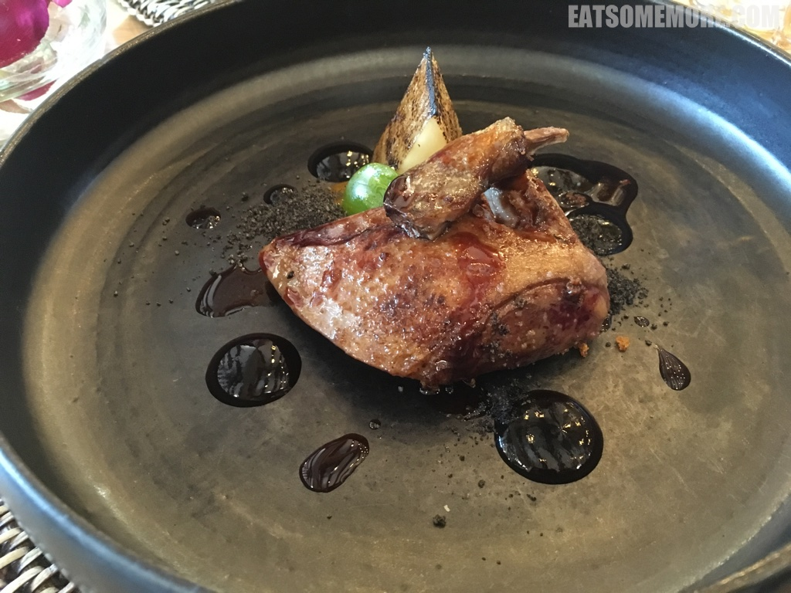

>伦敦以南、布莱顿以北的萨里山杰出自然风景区 (Surrey Hills Area of Outstanding Natural Beauty) 有个钟灵毓秀的霍舍姆 (Horsham) 小镇。镇上有一间米其林一星餐厅，得了四年的猫途鹰Tripadvisor网站卓越奖。它从黄油一上桌就拉了许多好感，因为经过打发的黄油不仅好推易涂，口感也更滑。其中绿色的是橄榄味的黄油。

>我并不喜欢气泡软饮料，却对清爽甘冽的苹果啤青眼有加。

>朝鲜蓟浓汤里有一颗溏心鸭蛋，香甜丝滑。

>我吃过不少风火腿，却是第一次吃到风鸭刺身。腌渍后的鸭肉切了薄片，肉质柔软、口感湿润、肥瘦相间、油花甘美、瘦肉鲜香，兼有奶油香、野茴香，馥郁芳馨，回味无穷。

>鲷鱼时蔬沙拉，使用了橙酱和牛油果泥，爽口清新。

>蟹肉沙拉里放了满满的欧芹和莳萝，清甜鲜爽。

>黑夏松露烟熏青口，嫩滑鲜甜。

>鸽子腿煎得又香又嫩，酱汁的味道也调得特别浓郁。

>香煎鳕鱼，鲜嫩非常。

>甜点舒芙蕾轻软得像云朵一样。整个用餐体验首尾一贯，精彩纷呈，非常推荐。

>Tristan 更是少数提供早餐的米其林餐厅。早餐的素质也非常过硬。蓝莓奶昔酸甜鲜活，灵气十足。

>餐厅特别赠送了圣诞特色点心百果馅饼，柔软甜蜜的果干与肉桂等香料馥郁的香气特别般配。

>厚厚的酸种面包两面烤过后抹上少许黄油，铺排了三片柔嫩软糯、咸香鲜甜的烟熏三文鱼，并洒了些祛腥增香的肉蔻末，搭配滑嫩鲜香的炒鸡蛋，整体体现出非常和谐平衡的味道。

>另一道菜一上桌就以其浓郁的黑松露香味强势地刷了一波存在感。香煎意大利五花咸肉更为丰富的油脂使得烤酸种面包的味道更加惊艳了。虽然咸肉一入口有些偏咸，但是咀嚼间无法掩盖的是猪肉的甘香，再轻轻划破圆润的水波蛋，全熟的蛋白和奔涌而出的香滑蛋液很好地中和了肉的咸味。与此同时，开头提到的黑松露在整道菜当中起到了点睛之笔的作用，好像是腐乳配白粥那样理所当然的合衬，又好像是流星划过夜空般的惊喜。总而言之非常美味！

网站：[https://www.restauranttristan.co.uk/](https://www.restauranttristan.co.uk/)

价格：午市套餐三道菜定食£30、四道菜定食£35。

地址：3 Stans Way, East Street Horsham West Sussex RH12 1HU

