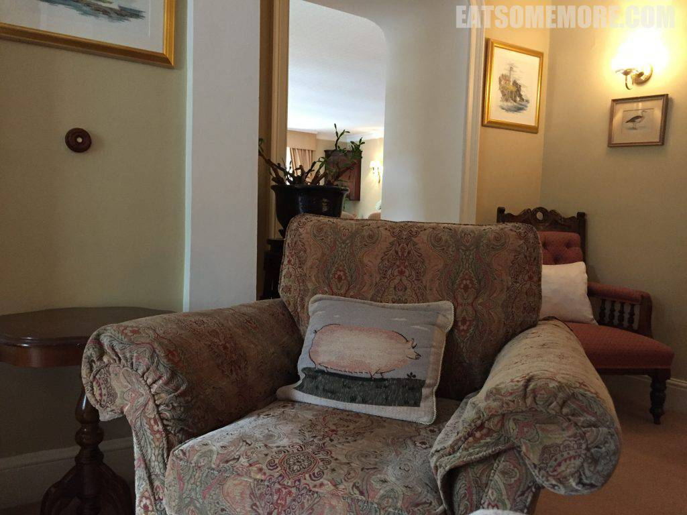
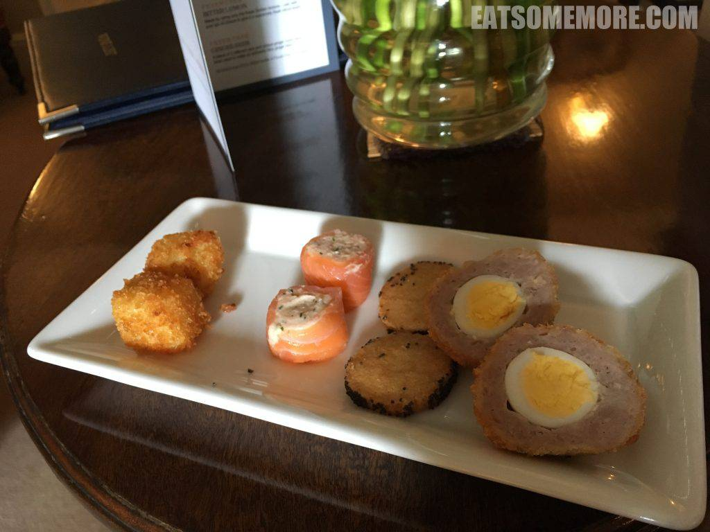
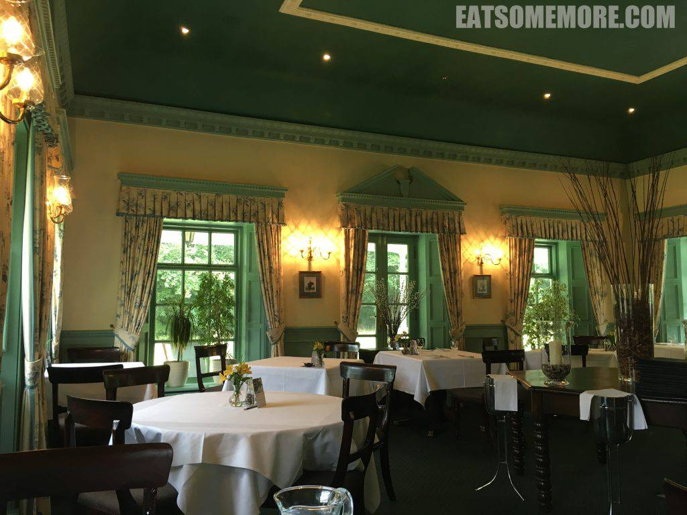
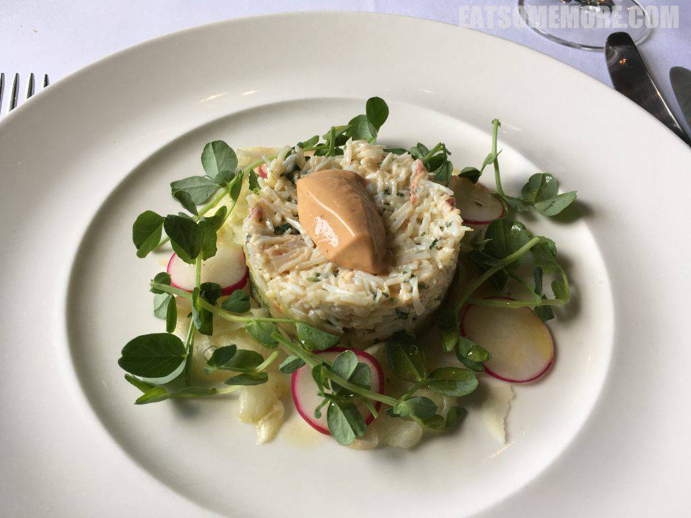
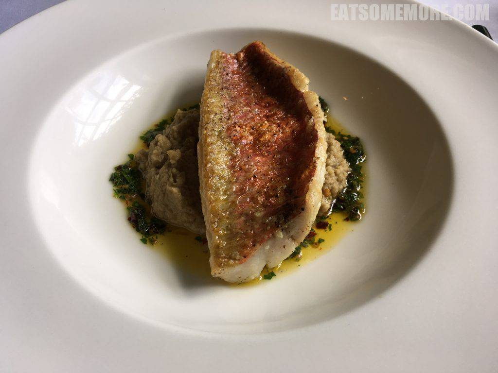
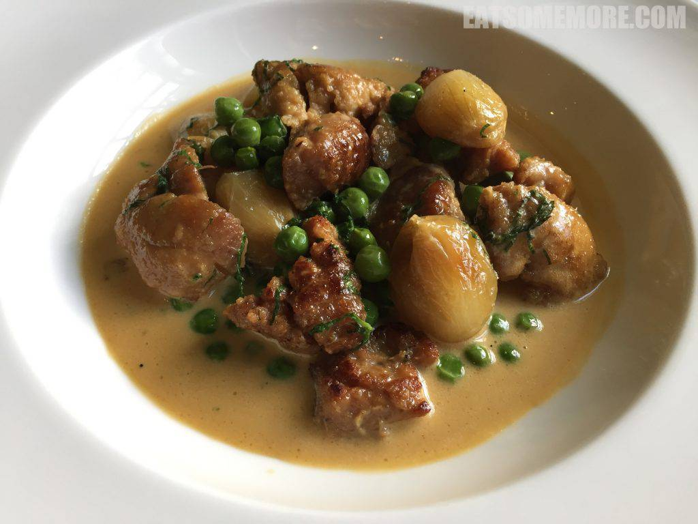
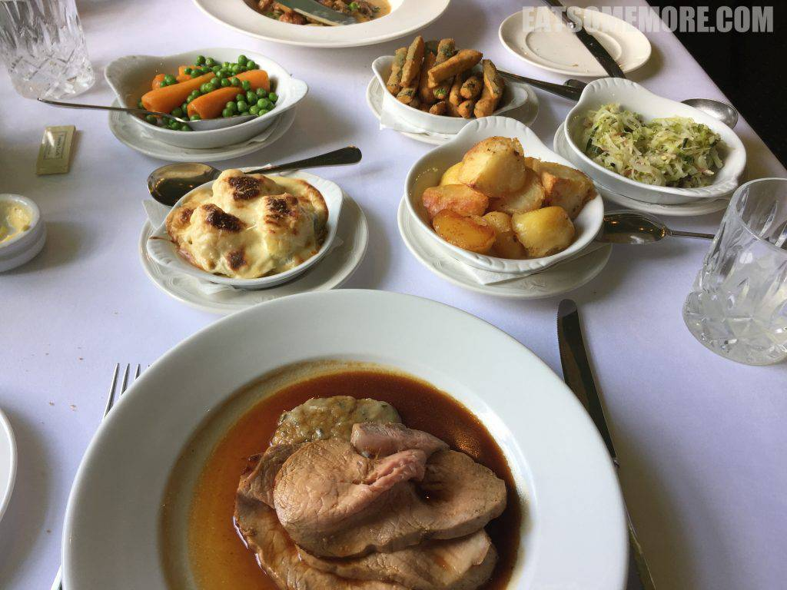

北威尔士风景名胜雪窦尼亚国家公园东南麓的乡村里有一间猫途鹰Tripadvisor网站卓越奖得主，米其林一星餐厅Tyddyn Llan。

餐前小点的素质就已经出类拔萃。油炸芝士外脆内滑，奶油三文鱼卷幼滑咸鲜，炸饼香酥，苏格兰蛋香甜弹牙。

餐厅陈设清新雅致、复古大气。

英国的夏天，凉凉的海边，将这样的温度、气息和感觉入菜，最恰当莫过蟹肉沙拉——取康郡面包蟹肉佐以蟹黄慕斯、豌豆苗、甜茴香、樱桃萝卜和牛油果泥。沙拉当中既有海味、鲜味，又有清香、奶香，一夏的回忆都在这道菜里啦！

蒜油茄子泥顶香烤红鲻鱼。

洋葱青豆炖内脏。

米其林一星的周日烤肉烹调恰到好处，外缘有嚼头，内里柔嫩多汁。多种配菜当中，油炸节瓜好吃到飞起。食材切得手指形状，裹粉细腻，外皮炸得香酥，节瓜脆甜，一根接一根，根本停不下来。

网站：[https://www.tyddynllan.co.uk/north-wales-restaurant](https://www.tyddynllan.co.uk/north-wales-restaurant)

价格：周五、六、日午餐定食£35起，晚餐三道菜定食£70，六道菜定食£85，八道菜定食£95。

地址：Bryan and Susan Webb, Tyddyn Llan, Llandrillo, nr. Corwen, Denbighshire, North Wales LL21 0ST