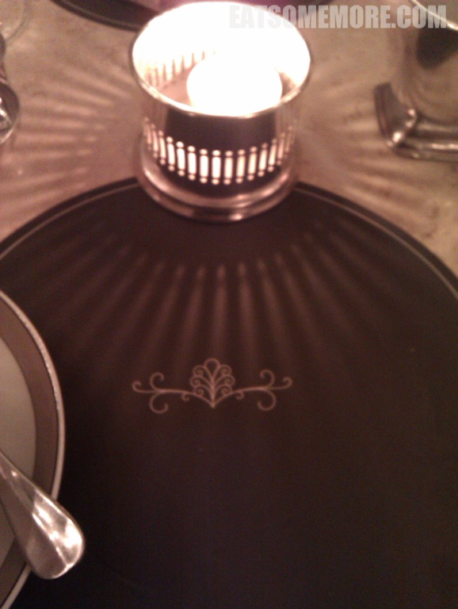

>皮卡迪利明珠 The Wolseley 是一间英式与欧风结合、全日营业的大咖啡馆，不仅受到米其林推荐，更是连续四年猫途鹰Tripadvisor网站卓越奖的得主。这里的用餐氛围让我想起了广州有名的早茶酒楼陶陶居——颇具气质的环境加上熙熙攘攘的气氛，舒适又自在。

>英式下午茶必备的温热松软的司空饼，搭配酸甜的草莓果酱和香甜的奶油，和阿萨姆红茶真是绝配呢。

>马卡龙酥松甜蜜，杏仁香与空气感兼有。

网站：[https://www.thewolseley.com/](https://www.thewolseley.com/)

地址：160 Piccadilly, London, W1J 9EB

